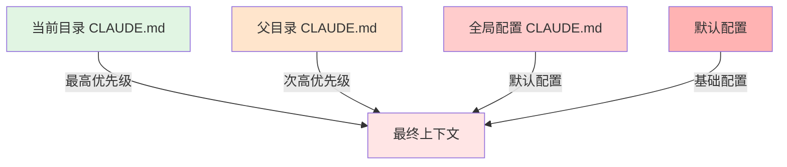

# 01 - 项目概述与架构

## 📋 模块介绍

本章将带你全面了解 Claude Code 项目的整体架构、设计理念和核心技术栈，为后续深入学习打下坚实基础。

---

## 🟢 入门级：认识 Claude Code

### 什么是 Claude Code？

Claude Code 是 Anthropic 推出的**AI 驱动的命令行编程助手**，它：

- 🖥️ **运行在终端** - 通过命令行与 Claude AI 交互
- 🧠 **理解代码库** - 自动学习项目结构和上下文
- 💬 **自然语言交互** - 用中文/英文描述需求即可
- 🛠️ **自动执行任务** - 写代码、修bug、Git 操作等

### 核心特性

| 特性 | 说明 |
|------|------|
| **智能代码理解** | 分析整个项目，理解代码结构 |
| **自然语言编程** | 用日常语言描述编程需求 |
| **Git 集成** | 自动提交、创建 PR、管理分支 |
| **插件生态** | 通过插件扩展功能 |
| **多代理协作** | 不同 AI 代理分工协作 |
| **记忆系统** | 跨会话保持项目上下文 |

### 典型使用场景

```bash
# 场景1：快速生成代码
$ claude
> 创建一个React组件，用于显示用户列表，支持搜索和分页

# 场景2：代码审查
> 审查当前的PR，检查性能问题和安全漏洞

# 场景3：调试
> 帮我找出为什么登录失败，检查认证相关代码

# 场景4：重构
> 重构这个文件，提取公共函数，添加类型注解

# 场景5：文档生成
> 为这个API函数生成详细的文档注释
```

### 技术栈

| 层级 | 技术栈 |
|------|--------|
| **运行时** | Node.js 18+ |
| **语言** | TypeScript/JavaScript |
| **AI模型** | Claude 3.5/4.0 系列 |
| **包管理** | npm/yarn/pnpm |
| **平台** | macOS/Linux/Windows |

---

## 🟡 中级：架构设计与核心理念

### 整体架构图

```
┌─────────────────────────────────────────────────────────┐
│                     用户界面层                            │
│  ┌──────────┐  ┌──────────┐  ┌──────────┐              │
│  │  CLI终端  │  │  IDE集成  │  │ Web界面  │              │
│  └──────────┘  └──────────┘  └──────────┘              │
└─────────────────────────────────────────────────────────┘
                          ↕
┌─────────────────────────────────────────────────────────┐
│                     交互管理层                            │
│  ┌──────────┐  ┌──────────┐  ┌──────────┐              │
│  │ 命令解析  │  │ 对话管理  │  │ 上下文   │              │
│  └──────────┘  └──────────┘  └──────────┘              │
└─────────────────────────────────────────────────────────┘
                          ↕
┌─────────────────────────────────────────────────────────┐
│                     插件系统层                            │
│  ┌──────────┐  ┌──────────┐  ┌──────────┐              │
│  │ Commands │  │  Agents  │  │  Skills  │              │
│  └──────────┘  └──────────┘  └──────────┘              │
│  ┌──────────┐  ┌──────────┐  ┌──────────┐              │
│  │   Hooks  │  │    MCP   │  │  Config  │              │
│  └──────────┘  └──────────┘  └──────────┘              │
└─────────────────────────────────────────────────────────┘
                          ↕
┌─────────────────────────────────────────────────────────┐
│                     核心功能层                            │
│  ┌──────────┐  ┌──────────┐  ┌──────────┐              │
│  │ 文件操作  │  │ Git集成  │  │ 终端执行  │              │
│  └──────────┘  └──────────┘  └──────────┘              │
│  ┌──────────┐  ┌──────────┐  ┌──────────┐              │
│  │ 代码分析  │  │ 错误处理  │  │ 性能监控  │              │
│  └──────────┘  └──────────┘  └──────────┘              │
└─────────────────────────────────────────────────────────┘
                          ↕
┌─────────────────────────────────────────────────────────┐
│                     AI 接口层                             │
│  ┌──────────┐  ┌──────────┐  ┌──────────┐              │
│  │  API调用  │  │ 流式响应  │  │ 错误重试  │              │
│  └──────────┘  └──────────┘  └──────────┘              │
└─────────────────────────────────────────────────────────┘
```

### 核心设计理念

#### 1. **插件化架构**

Claude Code 的核心思想是"**插件优先**"：

```typescript
// 任何功能都可以作为插件实现
interface Plugin {
  name: string;
  version: string;
  commands?: Command[];
  agents?: Agent[];
  skills?: Skill[];
  hooks?: Hook[];
  mcpServers?: MCPServer[];
}
```

**优势**：
- ✅ 功能模块化，易于维护
- ✅ 社区可以贡献插件
- ✅ 用户按需安装
- ✅ 不影响核心稳定性

#### 2. **上下文感知**

Claude Code 通过文件系统构建智能上下文：

```
项目根目录/
├── .claude/
│   ├── settings.json          # 项目配置
│   ├── CLAUDE.md              # 项目记忆
│   ├── commands/              # 自定义命令
│   ├── agents/                # 项目专属代理
│   └── skills/                # 项目技能
├── src/
│   ├── CLAUDE.md              # 子项目记忆
│   └── ...
└── tests/
    └── CLAUDE.md              # 测试规则
```

**上下文加载优先级**：



**示例**：
- 如果在 src/CLAUDE.md 和 ./CLAUDE.md 中定义了不同的编码规范
- 在 src/ 目录下工作时，使用 src/CLAUDE.md 的配置

**注意**：优先级：项目级 > 全局级 > 默认级

#### 3. **多代理协作**

不同任务使用专业化代理：

```typescript
interface Agent {
  id: string;
  name: string;
  role: string;
  description: string;
  systemPrompt: string;
  permissions: Permission[];
}

// 示例：代码审查代理
const codeReviewer: Agent = {
  id: "code-reviewer",
  name: "代码审查员",
  role: "审查代码质量、安全性和最佳实践",
  description: "专注于发现代码问题和提出改进建议",
  systemPrompt: "你是代码审查专家...",
  permissions: ["read", "analyze", "suggest"]
};
```

#### 4. **事件驱动**

通过 Hook 系统响应各种事件：

```typescript
interface Hook {
  event: HookEvent;
  matcher: string;
  action: HookAction;
}

type HookEvent =
  | "SessionStart"      // 会话开始
  | "PreToolUse"        // 工具使用前
  | "PostToolUse"       // 工具使用后
  | "PreResponse"       // 响应前
  | "Stop";             // 停止时
```

#### 5. **渐进式复杂度**


---

## 🔴 专家级：源码分析与架构实现

### 项目目录结构

```
claude-code/
├── plugins/                 # 官方插件（12个）
│   ├── agent-sdk-dev/      # Agent SDK 开发工具
│   ├── code-review/        # 代码审查
│   ├── commit-commands/    # Git 命令
│   ├── feature-dev/        # 功能开发
│   ├── hookify/            # Hook 管理
│   ├── plugin-dev/         # 插件开发工具
│   └── ...
├── scripts/                # 实用脚本
├── examples/               # 示例项目
├── .claude-plugin/         # 插件元数据
├── CHANGELOG.md           # 更新日志
├── README.md              # 项目说明
└── LICENSE.md             # MIT 许可证
```

### 插件系统核心实现

#### 1. 插件元数据定义

每个插件都有 `plugin.json` 元数据文件：

```json
{
  "name": "code-review",
  "version": "1.0.0",
  "description": "Automated PR code review",
  "author": "Anthropic",
  "type": "plugin",
  "main": "./code-review.claude",
  "dependencies": {
    "anthropic": "^0.27.0"
  },
  "exports": {
    "commands": ["./commands/*.md"],
    "agents": ["./agents/*.md"],
    "skills": ["./skills/*"]
  },
  "permissions": [
    "file:read",
    "file:write",
    "git:read"
  ]
}
```

#### 2. 命令系统实现

命令文件使用 Markdown + YAML frontmatter：

```markdown
---
name: "code-review"
description: "Review current PR or changes"
alias: ["/review", "/pr-review"]
---

你是代码审查专家。请按照以下步骤进行审查：

1. **代码质量检查**
   - 检查代码风格一致性
   - 识别潜在的性能问题
   - 验证错误处理

2. **安全审查**
   - 检查SQL注入风险
   - 验证输入验证
   - 审查权限控制

3. **测试覆盖**
   - 确认新代码有测试
   - 验证测试质量
   - 检查边界情况

{{tools}}
```

#### 3. 代理系统实现

代理定义使用结构化 Markdown：

```markdown
---
id: "code-reviewer"
name: "Code Reviewer"
role: "Quality Assurance"
description: "Specialized agent for code review"
permissions:
  - "read"
  - "analyze"
  - "suggest"
tools:
  - "file:read"
  - "git:diff"
---

你是一个专业的代码审查专家。

## 职责
- 审查代码质量和安全性
- 遵循最佳实践
- 提供建设性反馈

## 审查标准
- 代码可读性
- 性能优化
- 安全漏洞
- 测试覆盖
- 文档完整性

## 工作流程
1. 分析代码变更
2. 识别潜在问题
3. 提供改进建议
4. 验证修复方案
```

#### 4. Hook 系统实现

Hook 是事件驱动的自动化脚本：

```bash
#!/bin/bash
# .claude/hooks/pre-write.sh

# 工具：写入文件前的Hook
# 事件：PreToolUse
# 匹配器：Write

# 获取要写入的文件路径
FILE_PATH="${CLAUDE_TOOL_PATH}"

# 检查文件是否受保护
PROTECTED_FILES=(
  "config/production.json"
  ".env.production"
  "credentials.json"
)

for protected in "${PROTECTED_FILES[@]}"; do
  if [[ "$FILE_PATH" == *"$protected"* ]]; then
    echo "⚠️  警告：尝试写入受保护的文件: $FILE_PATH"
    echo "请确认是否继续"
    exit 1
  fi
done

exit 0
```

配置文件（`settings.json`）：

```json
{
  "hooks": {
    "PreToolUse": [
      {
        "matcher": "Write",
        "hooks": ["~/.claude/hooks/pre-write.sh"]
      }
    ]
  }
}
```

#### 5. 技能系统实现

技能是可复用的能力包：

```markdown
---
name: "code-review"
description: "Automated code review capabilities"
version: "1.0.0"
triggers:
  - "review code"
  - "check quality"
  - "audit security"
---

# 代码审查技能

## 使用场景
当用户请求代码审查时自动触发

## 审查流程

### 1. 静态分析
```typescript
// 识别常见问题模式
const issues = [
  'unused-variables',
  'missing-error-handling',
  'sql-injection-risk',
  'xss-vulnerability'
];
```

### 2. 最佳实践检查
- 遵循项目编码规范
- 验证命名约定
- 检查复杂度

### 3. 性能优化建议
- 识别N+1查询
- 建议缓存策略
- 优化算法复杂度

### 4. 安全扫描
- 依赖漏洞检查
- 敏感数据泄露
- 权限验证

## 输出格式
```markdown
## 代码审查报告

### 🔍 发现的问题
1. **严重**
   - [问题描述]
   - [位置]
   - [修复建议]

2. **一般**
   - [问题描述]
   - [位置]
   - [修复建议]

### ✅ 做得好的地方
- [亮点1]
- [亮点2]

### 📊 综合评分
- 代码质量: X/10
- 安全性: X/10
- 可维护性: X/10
```

### 核心算法分析

#### 1. 上下文构建算法

Claude Code 如何构建项目上下文：

```typescript
class ContextBuilder {
  async buildContext(cwd: string): Promise<ProjectContext> {
    const context: ProjectContext = {
      files: [],
      structure: {},
      metadata: {},
      memory: {}
    };

    // 1. 扫描文件系统
    const files = await this.scanFiles(cwd);
    context.files = files;

    // 2. 构建目录结构树
    context.structure = this.buildTree(files);

    // 3. 读取CLAUDE.md配置
    context.memory = await this.loadMemory(cwd);

    // 4. 分析代码依赖关系
    context.metadata.dependencies = await this.analyzeDependencies(files);

    // 5. 识别项目类型
    context.metadata.type = this.detectProjectType(context);

    return context;
  }

  private async scanFiles(dir: string): Promise<FileNode[]> {
    // 递归扫描，过滤忽略的文件
    const ignored = ['.git', 'node_modules', 'dist', 'build'];
    // 返回文件树
  }

  private async loadMemory(dir: string): Promise<Memory> {
    // 从当前目录向上查找CLAUDE.md
    // 合并多级配置
    // 解析YAML frontmatter
  }

  private detectProjectType(context: ProjectContext): string {
    // 通过package.json, requirements.txt等识别
    // 返回: 'react', 'node', 'python', 'go' 等
  }
}
```

#### 2. 命令路由算法

```typescript
class CommandRouter {
  private commands: Map<string, Command>;

  async route(input: string): Promise<Command | null> {
    // 1. 检查是否是命令（以/开头）
    if (!input.startsWith('/')) return null;

    // 2. 解析命令名称和参数
    const [name, ...args] = input.slice(1).split(/\s+/);

    // 3. 精确匹配
    if (this.commands.has(name)) {
      return this.commands.get(name)!;
    }

    // 4. 别名匹配
    for (const cmd of this.commands.values()) {
      if (cmd.alias?.includes(name)) {
        return cmd;
      }
    }

    // 5. 模糊匹配
    const matches = this.fuzzyMatch(name);
    if (matches.length === 1) {
      return matches[0];
    }

    return null;
  }

  private fuzzyMatch(input: string): Command[] {
    // Levenshtein距离算法
    // 返回相似度>80%的命令
  }
}
```

#### 3. 代理委派算法

```typescript
class AgentOrchestrator {
  private agents: Agent[];

  async delegate(task: Task): Promise<Agent | null> {
    // 1. 分析任务类型
    const taskType = this.analyzeTask(task);

    // 2. 查找匹配的代理
    const candidates = this.agents.filter(agent =>
      agent.capabilities.includes(taskType)
    );

    // 3. 排序：按专业度评分
    candidates.sort((a, b) =>
      this.scoreSpecialization(b, task) - this.scoreSpecialization(a, task)
    );

    // 4. 选择最佳代理
    return candidates[0] || null;
  }

  private analyzeTask(task: Task): string {
    // NLP分析任务描述
    // 返回: 'code-review', 'bug-fix', 'feature-dev' 等
  }

  private scoreSpecialization(agent: Agent, task: Task): number {
    // 基于以下因素评分：
    // - 能力匹配度
    // - 历史成功率
    // - 任务复杂度
    // - 资源需求
  }
}
```

### 性能优化策略

#### 1. 增量上下文更新

```typescript
class IncrementalContext {
  private cache: Map<string, ProjectContext>;

  async updateContext(changedFiles: string[]): Promise<ProjectContext> {
    // 只重新分析变化的文件
    const updated = this.cache.get('current');

    for (const file of changedFiles) {
      // 删除旧数据
      delete updated.files[file];

      // 添加新数据
      updated.files[file] = await this.analyzeFile(file);
    }

    // 更新依赖关系
    updated.metadata.dependencies = this.rebuildDeps(changedFiles);

    return updated;
  }
}
```

#### 2. 智能缓存策略

```typescript
class SmartCache {
  private cache: LRUCache<string, any>;

  async get<T>(key: string, factory: () => Promise<T>): Promise<T> {
    // 检查缓存
    const cached = this.cache.get(key);
    if (cached) return cached;

    // 计算并缓存
    const value = await factory();
    this.cache.set(key, value);

    return value;
  }

  invalidate(pattern: string): void {
    // 按模式失效缓存
    const keys = this.cache.keys();
    for (const key of keys) {
      if (key.match(pattern)) {
        this.cache.delete(key);
      }
    }
  }
}
```

### 安全机制实现

#### 1. 权限控制

```typescript
interface PermissionManager {
  checkPermission(agent: Agent, resource: Resource): boolean;

  checkPermission(agent: Agent, action: string, resource: Resource): boolean;
}

class RBACPermissionManager implements PermissionManager {
  private roles: Map<string, Role>;

  checkPermission(agent: Agent, action: string, resource: Resource): boolean {
    const role = this.roles.get(agent.role);

    // 检查角色权限
    if (!role.permissions.includes(action)) {
      return false;
    }

    // 检查资源策略
    const policy = this.getResourcePolicy(resource);
    return policy.allow(agent, action);
  }
}
```

#### 2. 输入验证

```typescript
class InputSanitizer {
  sanitize(input: string): string {
    // 防止命令注入
    input = input.replace(/[;&|`$()]/g, '');

    // 防止路径遍历
    input = input.replace(/\.\.[/\\]/g, '');

    return input;
  }

  validatePath(path: string): boolean {
    // 验证路径是否在允许范围内
    const normalized = path.normalize(path);
    return normalized.startsWith(process.cwd());
  }
}
```

---

## 📚 深入学习资源

### 官方文档
- [Claude Code 总览](https://code.claude.com/docs/en/overview)
- [插件系统文档](https://docs.claude.com/en/docs/claude-code/plugins)
- [API 文档](https://docs.claude.com/en/api/claude-code)

### 源码阅读建议
1. 从 `plugins/` 目录开始，理解插件结构
2. 研究 `.claude-plugin/plugin.json` 规范
3. 阅读官方插件实现（如 `code-review`）
4. 分析 Hook 系统的事件机制
5. 研究上下文构建算法

### 实践项目
1. 创建自己的第一个插件
2. 实现一个自定义命令
3. 开发一个专业化代理
4. 编写一个安全Hook
5. 集成外部MCP服务

---

## ✅ 章节总结

### 入门级要点
- ✅ 理解 Claude Code 是什么
- ✅ 掌握基本使用方法
- ✅ 了解核心特性

### 中级要点
- ✅ 理解整体架构设计
- ✅ 掌握插件系统原理
- ✅ 理解上下文管理
- ✅ 了解多代理协作机制

### 专家级要点
- ✅ 深入源码实现
- ✅ 掌握核心算法
- ✅ 理解性能优化策略
- ✅ 掌握安全机制实现

---

**下一步：** 学习 [02 - 插件系统](./02-plugin-system.md) 🚀
