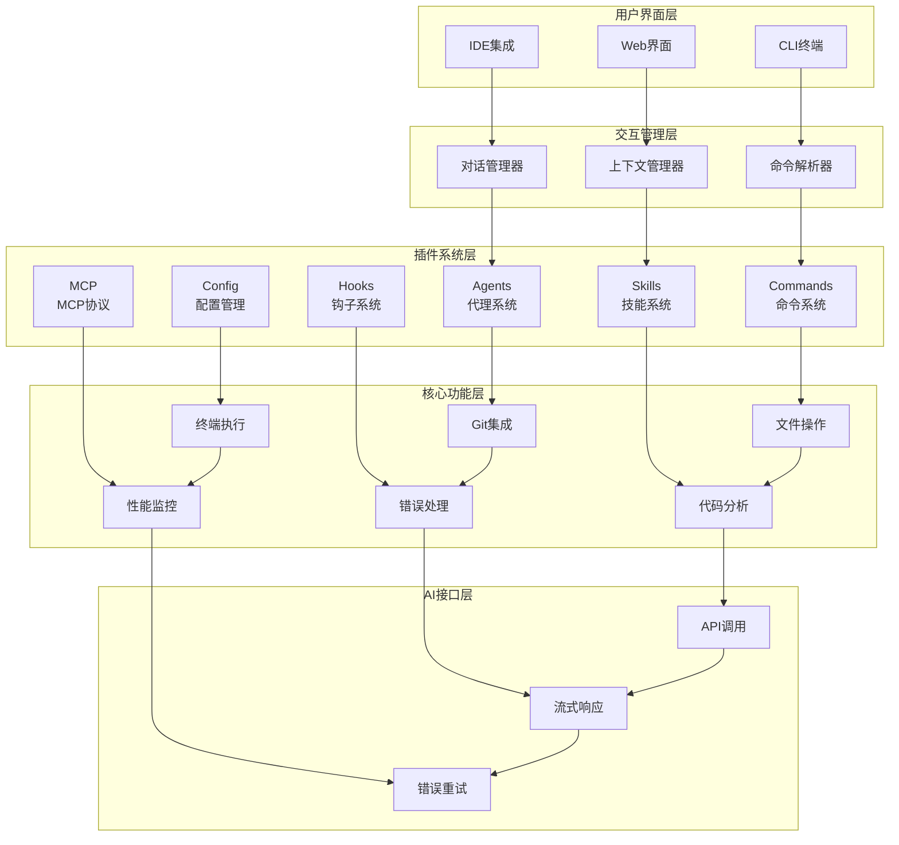
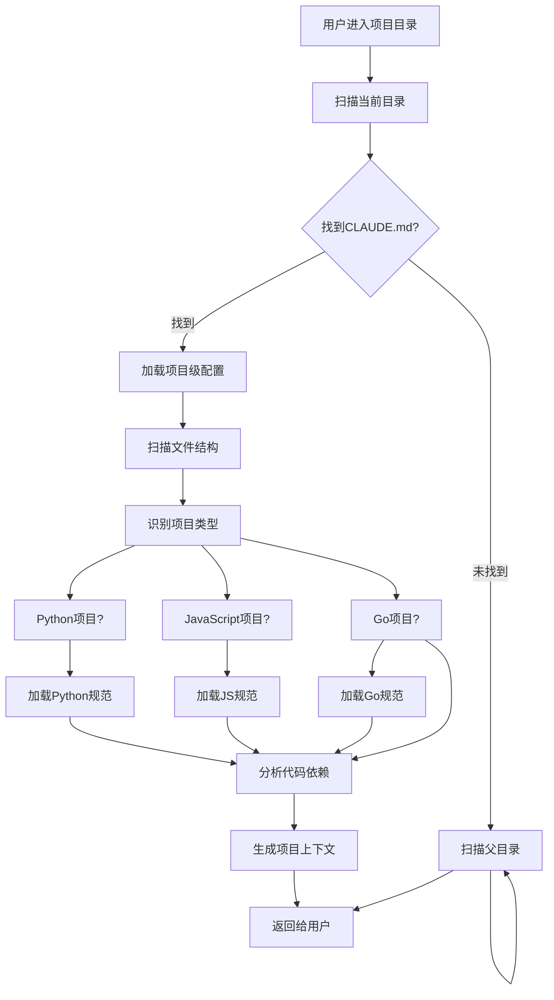
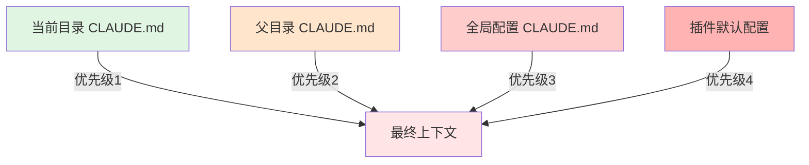
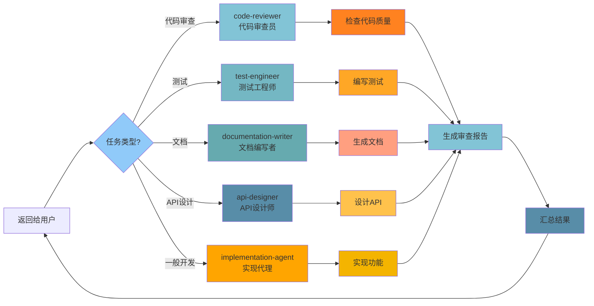
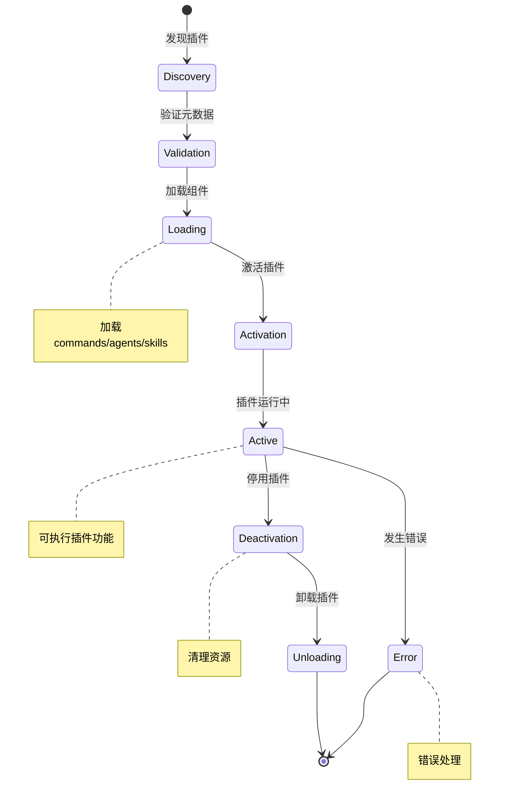
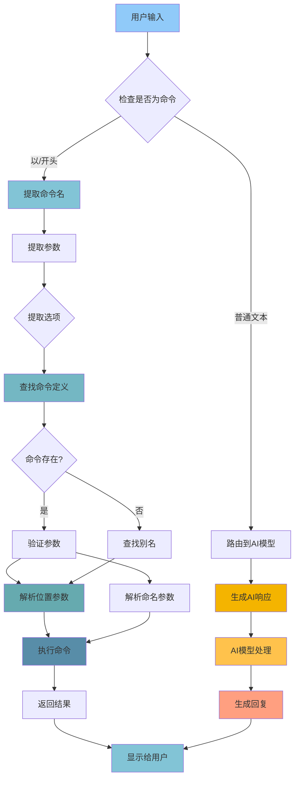
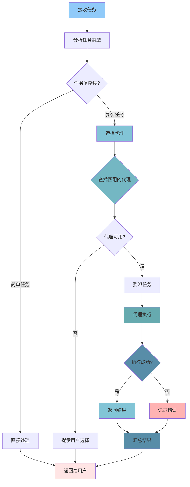
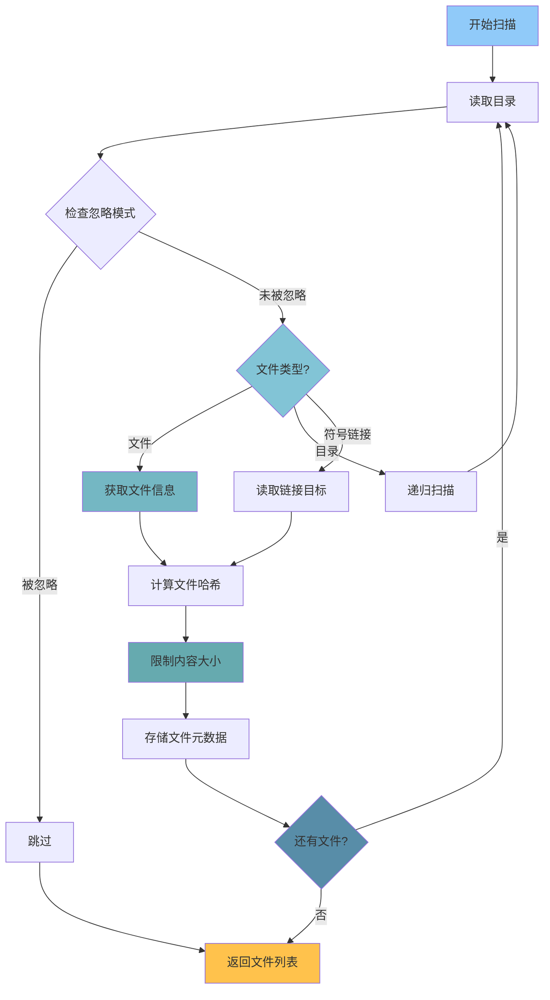

# 01 - 项目概述与架构

## 📋 模块介绍

欢迎来到 Claude Code 的世界！这一章就像一张地图，帮你了解 Claude Code 是什么、它能做什么、以及它是如何工作的。无论你是刚接触Claude Code的新手，还是想深入了解的老手，本章都会给你清晰的答案。

---

## 🟢 入门级：认识 Claude Code

### 🤔 什么是 Claude Code？

#### 简单来说

**Claude Code 就像你的个人AI编程助手**，但它运行在终端里，不仅能帮你写代码，还能理解你的整个项目。

#### 形象一下...

```
传统开发流程：
你：要写一个用户注册功能
  ↓
打开IDE → 新建文件 → 写代码 → 保存
  ↓
打开终端 → git add → git commit → git push
  ↓
打开PR页面 → 填写描述 → 创建PR
  ↓
等待审查 → 修改 → 合并
```

**使用 Claude Code 后：**
```
你：帮我写一个用户注册功能
Claude：好的！我来帮你...
  ↓
[自动完成：代码创建、测试、提交、PR]
```

#### 更具体的定义

**Claude Code 是 Anthropic 推出的 AI 驱动的命令行编程助手**，它具备以下特点：

- 🖥️ **运行在终端** - 通过命令行与 Claude AI 交互
- 🧠 **理解代码库** - 自动学习你的项目结构和代码
- 💬 **自然语言对话** - 用日常语言描述需求，无需记住复杂命令
- 🛠️ **自动执行任务** - 写代码、修bug、Git 操作一气呵成

---

### 🎯 Claude Code 能做什么？

#### 📝 常见使用场景

**场景1：快速生成代码**

```bash
$ claude
> 帮我创建一个React组件，用于显示用户列表，支持搜索和分页
```

**Claude 会：**
1. 分析你的需求（React组件、用户列表、搜索、分页）
2. 创建组件文件 `UserList.tsx`
3. 实现搜索功能
4. 实现分页功能
5. 添加必要的类型定义
6. 创建示例使用代码

**场景2：代码审查**

```bash
> 审查当前PR的代码质量，检查性能问题和安全漏洞
```

**Claude 会：**
1. 获取PR的代码变更
2. 逐个文件审查
3. 检查代码规范
4. 识别性能瓶颈
5. 扫描安全漏洞
6. 生成详细的审查报告

**场景3：调试问题**

```bash
> 帮我找出为什么登录总是失败，检查认证相关的代码
```

**Claude 会：**
1. 分析登录流程代码
2. 识别可能的错误点
3. 检查错误处理逻辑
4. 查看日志输出
5. 提供修复建议

**场景4：重构代码**

```bash
> 重构这个文件，提取公共函数，添加类型注解
```

**Claude 会：**
1. 分析现有代码
2. 识别可复用的逻辑
3. 提取公共函数
4. 添加 TypeScript 类型
5. 保持功能不变

**场景5：生成文档**

```bash
> 为这个API函数生成详细的文档注释，包括参数、返回值和示例
```

**Claude 会：**
1. 分析函数签名
2. 识别参数和返回值
3. 生成规范的文档注释
4. 添加使用示例

---

### 🏗️ 核心特性

| 特性 | 说明 | 好处 |
|------|------|------|
| **智能代码理解** | 分析整个项目，理解代码结构和关系 | 不用手动解释代码结构 |
| **自然语言编程** | 用日常语言描述编程需求 | 无需学习复杂命令语法 |
| **Git 集成** | 自动提交、创建 PR、管理分支 | 简化 Git 工作流 |
| **插件生态** | 通过插件扩展功能 | 按需添加特定功能 |
| **多代理协作** | 不同 AI 代理分工协作 | 专业化处理复杂任务 |
| **记忆系统** | 跨会话保持项目上下文 | 记住你的项目偏好 |

---

### 🌟 支持的技术栈

Claude Code 支持多种编程语言和技术栈：

#### 编程语言

| 语言 | 支持程度 | 特殊功能 |
|------|----------|----------|
| **Python** | ⭐⭐⭐⭐⭐ | Django/Flask/FastAPI 集成 |
| **JavaScript/TypeScript** | ⭐⭐⭐⭐⭐ | React/Vue/Angular 集成 |
| **Go** | ⭐⭐⭐⭐ | Gin/Echo 框架集成 |
| **Java** | ⭐⭐⭐ | Spring Boot 集成 |
| **Rust** | ⭐⭐⭐ | Actix/Rocket 集成 |
| **Ruby** | ⭐⭐⭐⭐ | Rails 集成 |
| **PHP** | ⭐⭐⭐ | Laravel 集成 |
| **C/C++** | ⭐⭐ | 原生高性能 |
| **Shell** | ⭐⭐⭐⭐ | 脚本自动化 |

#### 框架和工具

| 类别 | 支持 | 示例 |
|------|------|------|
| **前端框架** | React, Vue, Angular, Svelte | SPA开发 |
| **后端框架** | Express, FastAPI, Django, Gin | API开发 |
| **数据库** | PostgreSQL, MySQL, MongoDB | 数据存储 |
| **容器化** | Docker, Kubernetes | 部署 |
| **测试** | Jest, Pytest, JUnit | 自动化测试 |
| **构建工具** | Webpack, Vite, npm scripts | 前端构建 |

---

### 💻 系统要求

#### 最低配置

| 组件 | 要求 | 说明 |
|------|------|------|
| **操作系统** | macOS 10.15+, Ubuntu 18.04+, Windows 10+ | 主流操作系统 |
| **内存** | 4GB RAM | 基本运行 |
| **磁盘** | 1GB 可用空间 | 存储配置和缓存 |
| **网络** | 稳定的互联网连接 | 调用AI模型 |
| **Node.js** | 18.x LTS 或更高 | 运行时 |

#### 推荐配置

| 组件 | 要求 | 说明 |
|------|------|------|
| **内存** | 8GB+ RAM | 流畅运行 |
| **磁盘** | SSD + 10GB+ | 更快的文件操作 |
| **网络** | 宽带网络 | 加速模型调用 |

---

### 🤔 如何判断是否适合使用 Claude Code？

#### ✅ 适合以下情况

- 你是开发者，需要频繁编写代码
- 你的项目结构复杂，需要理解整体架构
- 你经常需要在终端中执行各种操作
- 你希望自动化重复性任务

#### ❌ 可能不适合

- 你主要使用图形界面IDE（VS Code、IntelliJ）
- 你的项目非常小，没有复杂依赖
- 你不需要自动化，喜欢手动操作

---

## 🟡 中级：架构设计与核心理念

### 🏗️ 整体架构设计

Claude Code 采用了分层的架构设计，每层负责不同的职责。



#### 各层职责说明

**用户界面层**
- CLI终端：命令行交互
- IDE集成：与VS Code等IDE集成
- Web界面：网页版界面

**交互管理层**
- 命令解析：解析斜杠命令
- 对话管理：管理对话状态
- 上下文管理：维护项目上下文

**插件系统层**
- Commands：自定义命令
- Agents：专业化代理
- Skills：可复用技能
- Hooks：事件驱动
- MCP：外部服务集成
- Config：配置管理

**核心功能层**
- 文件操作：读写文件
- Git集成：版本控制
- 终端执行：运行命令
- 代码分析：理解代码
- 错误处理：异常处理
- 性能监控：性能优化

**AI接口层**
- API调用：与Claude模型交互
- 流式响应：流式输出
- 错误重试：自动重试机制

---

### 🔑 核心设计理念

Claude Code 的设计遵循以下核心理念：

#### 1️⃣ 插件化架构

**理念**："插件优先，核心保持精简"

```typescript
// Claude Code 的核心理念
// 任何功能都可以作为插件实现
interface Plugin {
  name: string;              // 插件名称
  version: string;           // 版本号
  description: string;       // 描述
  components?: Component[];   // 插件组件
  
  // 组件类型
  commands?: Command[];      // 命令
  agents?: Agent[];         // 代理
  skills?: Skill[];         // 技能
  hooks?: Hook[];           // 钩子
  mcpServers?: MCPServer[];  // MCP服务器
}
```

**优势分析**：

| 优势 | 说明 | 示例 |
|------|------|------|
| **模块化** | 每个插件独立开发、维护 | code-review 插件 |
| **可扩展** | 社区可以贡献插件 | 社区插件市场 |
| **按需使用** | 用户只安装需要的插件 | 网站开发用webhook插件 |
| **稳定性** | 插件故障不影响核心 | 核心不受影响 |
| **易测试** | 独立测试每个插件 | 插件单元测试 |

**实际应用**：

```
开发Web应用时：
1. 安装 webhook 插件（处理webhook）
2. 安装 deployment 插件（自动部署）
3. 安装 security 插件（安全检查）

不需要的功能就不安装，保持系统轻量！
```

#### 2️⃣ 上下文感知

**理念**：Claude Code 通过文件系统构建智能上下文



**上下文加载优先级**：



**实际示例**：

**场景：在 React 项目中使用 Python 后端**

```
项目结构：
/my-project/
├── frontend/          # React前端
│   ├── CLAUDE.md      # React开发规范
│   └── package.json
├── backend/           # Python后端
│   ├── CLAUDE.md      # Python开发规范
│   └── requirements.txt
└── shared/
    └── CLAUDE.md      # 共享接口定义
```

**上下文优先级**：
- 在 `frontend/` 目录 → 使用 `frontend/CLAUDE.md`（React规范）
- 在 `backend/` 目录 → 使用 `backend/CLAUDE.md`（Python规范）
- 在 `shared/` 目录 → 使用 `shared/CLAUDE.md`（共享接口）

#### 3️⃣ 多代理协作

**理念**：不同任务使用专业化代理，提高质量和效率



**实际示例：开发新功能**

```bash
$ claude
> 开发用户认证功能

Claude 自动协调多个代理：
1. @code-architect - 设计认证架构
2. @implementation-agent - 实现代码
3. @test-engineer - 编写测试
4. @code-reviewer - 审查代码
5. @documentation-writer - 生成文档

每个代理专注于自己的领域，质量更高！
```

**代理专业化优势**：

| 代理 | 专长 | 带来的好处 |
|------|------|------------|
| code-reviewer | 代码审查 | 更专业的代码质量检查 |
| test-engineer | 测试编写 | 更高的测试覆盖率 |
| security-auditor | 安全审计 | 更全面的安全检查 |
| api-designer | API设计 | 更规范的接口设计 |

#### 4️⃣ 渐进式复杂度

**理念**：从简单到复杂，逐步解锁高级功能


**各层功能详解**：

**第1层：基础对话**
- 功能：自然语言交互
- 示例："帮我写一个函数"
- 适用：快速查询、简单任务

**第2层：命令系统**
- 功能：快捷命令
- 示例：`/commit`, `/review`, `/test`
- 适用：频繁操作、工作流自动化

**第3层：记忆系统**
- 功能：项目上下文
- 示例：CLAUDE.md 配置
- 适用：项目规范、编码规范

**第4层：插件系统**
- 功能：自定义扩展
- 示例：自定义命令、代理、技能
- 适用：特殊需求、专业化场景

**第5层：高级特性**
- 功能：MCP、多代理、Hook
- 示例：外部服务集成、复杂自动化
- 适用：高级用户、复杂场景

---

## 🔴 专家级：源码分析与架构实现

### 📁 项目目录结构

```
claude-code/
├── plugins/                 # 官方插件（12个）
│   ├── agent-sdk-dev/      # Agent SDK 开发工具
│   ├── code-review/        # 代码审查
│   ├── commit-commands/    # Git 命令
│   ├── feature-dev/        # 功能开发
│   ├── hookify/            # Hook 管理
│   ├── plugin-dev/         # 插件开发工具
│   ├── pr-review-toolkit/   # PR 工具包
│   └── ...
├── scripts/                # 实用脚本
├── examples/               # 示例项目
├── .claude-plugin/         # 插件元数据
├── CHANGELOG.md           # 更新日志
├── README.md              # 项目说明
└── LICENSE.md             # MIT 许可证
```

---

### 🔌 插件系统核心实现

#### 插件生命周期



**关键代码实现**：

```typescript
class PluginLoader {
  async load(pluginPath: string): Promise<Plugin> {
    // 1. 读取插件元数据
    const manifestPath = path.join(pluginPath, '.claude-plugin', 'plugin.json');
    const manifest = await this.readManifest(manifestPath);
    
    // 2. 验证插件
    this.validate(manifest);
    
    // 3. 加载组件
    const components = await this.loadComponents(manifest, pluginPath);
    
    // 4. 创建插件对象
    const plugin: Plugin = {
      ...manifest,
      components,
      path: pluginPath,
      state: 'loaded'
    };
    
    return plugin;
  }
  
  private async loadComponents(
    manifest: PluginManifest,
    pluginPath: string
  ): Promise<Components> {
    const components: Components = {
      commands: [],
      agents: [],
      skills: [],
      hooks: []
    };
    
    // 加载命令
    for (const pattern of manifest.exports.commands || []) {
      const files = glob(pattern, { cwd: pluginPath });
      for (const file of files) {
        components.commands.push(
          await this.parseCommand(file)
        );
      }
    }
    
    // 加载代理
    for (const pattern of manifest.exports.agents || []) {
      const files = glob(pattern, { cwd: pluginPath });
      for (const file of files) {
        components.agents.push(
          await this.parseAgent(file)
        );
      }
    }
    
    // 加载技能
    for (const pattern of manifest.exports.skills || []) {
      const files = glob(pattern, { cwd: pluginPath });
      for (const file of files) {
        components.skills.push(
          await this.parseSkill(file)
        );
      }
    }
    
    // 加载钩子
    for (const pattern of manifest.exports.hooks || []) {
      const files = glob(pattern, { cwd: pluginPath });
      for (const file of files) {
        components.hooks.push(
          await this.parseHook(file)
        );
      }
    }
    
    return components;
  }
}
```

#### 插件沙箱隔离

```typescript
class PluginSandbox {
  createSandbox(plugin: Plugin): SandboxContext {
    const context: SandboxContext = {
      // 受限的 API
      fs: this.createRestrictedFS(plugin),
      http: this.createRestrictedHTTP(plugin),
      child_process: this.createRestrictedProcess(plugin),
      
      // 插件专用存储
      storage: this.createPluginStorage(plugin.id),
      
      // 事件总线
      events: this.createEventBus(plugin),
      
      // 日志
      logger: this.createLogger(plugin.id)
    };
    
    return context;
  }
  
  private createRestrictedFS(plugin: Plugin): any {
    // 定义允许的文件路径
    const allowedPaths = this.getAllowedPaths(plugin);
    
    return {
      readFile: (path: string) => {
        // 检查路径是否允许
        if (!this.isPathAllowed(path, allowedPaths)) {
          throw new Error('Access denied');
        }
        return fs.readFile(path);
      },
      
      writeFile: (path: string, data: any) => {
        // 检查路径是否允许
        if (!this.isPathAllowed(path, allowedPaths)) {
          throw new Error('Access denied');
        }
        return fs.writeFile(path, data);
      }
    };
  }
}
```

---

### ⌨ 命令系统核心实现

#### 命令解析流程



#### 命令模板引擎

```typescript
class TemplateEngine {
  async render(template: string, context: Context): Promise<string> {
    // 1. 解析模板
    const ast = this.parse(template);
    
    // 2. 渲染AST
    return this.renderAST(ast, context);
  }
  
  private renderAST(ast: ASTNode[], context: Context): string {
    let result = '';
    
    for (const node of ast.nodes) {
      switch (node.type) {
        case 'text':
          result += node.content;
          break;
          
        case 'variable':
          result += this.evaluateVariable(node.path, context);
          break;
          
        case 'if':
          if (this.evaluateCondition(node.condition, context)) {
            result += this.renderAST(node.consequent, context);
          } else if (node.alternate) {
            result += this.renderAST(node.alternate, context);
          }
          break;
          
        case 'each':
          const items = this.evaluateVariable(node.collection, context);
          for (const item of items) {
            const itemContext = { ...context, [node.item]: item };
            result += this.renderAST(node.body, itemContext);
          }
          break;
          
        case 'tool-call':
          const result = await this.executeTool(node.tool, node.args, context);
          result += result;
          break;
      }
    }
    
    return result;
  }
}
```

---

### 🤖 代理系统核心实现

#### 代理委派流程



#### 代理注册系统

```typescript
class AgentRegistry {
  register(agent: Agent): void {
    // 1. 注册代理基本信息
    this.agents.set(agent.id, agent);
    
    // 2. 索引能力
    for (const capability of agent.capabilities) {
      if (!this.capabilities.has(capability)) {
        this.capabilities.set(capability, []);
      }
      this.capabilities.get(capability)!.push(agent);
    }
  }
  
  findBestAgent(task: Task): Agent | null {
    // 1. 分析任务类型
    const taskType = this.analyzeTaskType(task);
    
    // 2. 查找匹配的代理
    const candidates = this.capabilities
      .get(taskType)
      .map(cap => this.capabilities.get(capability)!)
      .filter(agent => agent.permissions.includes('execute'));
    
    // 3. 评分排序
    candidates.sort((a, b) => {
      const scoreA = this.score(a, task);
      const scoreB = this.score(b, task);
      return scoreB - scoreA;
    });
    
    // 4. 返回最佳代理
    return candidates[0] || null;
  }
  
  private score(agent: Agent, task: Task): number {
    let score = 0;
    
    // 能力匹配度（40%）
    const matched = agent.capabilities.filter(
      cap => task.requiredCapabilities.includes(cap)
    );
    score += (matched.length / agent.capabilities.length) * 40;
    
    // 历史成功率（30%）
    score += agent.stats.successRate * 30;
    
    // 任务复杂度匹配（20%）
    if (agent.maxComplexity >= task.complexity) {
      score += 20;
    } else if (agent.maxComplexity >= task.complexity * 0.8) {
      score += 15;
    }
    
    // 可用性（10%）
    if (agent.status === 'available') {
      score += 10;
    }
    
    return score;
  }
}
```

---

### 🎯 上下文构建核心算法

#### 智能文件扫描



**文件扫描伪代码**：

```typescript
async function scanFiles(
  dir: string,
  ignorePatterns: string[] = []
): Promise<FileInfo[]> {
  const files: FileInfo[] = [];
  
  async function traverse(currentDir: string) {
    const entries = await fs.readdir(currentDir);
    
    for (const entry of entries) {
      const fullPath = path.join(currentDir, entry.name);
      
      // 检查是否应该忽略
      if (shouldIgnore(entry.name, ignorePatterns)) {
        continue;
      }
      
      const stats = await fs.stat(fullPath);
      
      if (stats.isDirectory()) {
        // 递归扫描子目录
        await traverse(fullPath);
      } else {
        // 文件处理
        const content = await fs.readFile(fullPath, 'utf-8');
        files.push({
          path: fullPath,
          size: stats.size,
          modified: stats.mtime,
          content: content.slice(0, 10000), // 限制内容大小
          hash: computeHash(content)
        });
      }
    }
  }
  
  await traverse(dir);
  return files;
}
```

#### 上下文加载算法

```typescript
async function loadContext(cwd: string): Promise<Context> {
  const context: Context = {
    files: [],
    memory: {},
    metadata: {}
  };
  
  // 1. 扫描文件
  context.files = await scanFiles(cwd);
  
  // 2. 加载记忆文件（CLAUDE.md）
  let currentDir = cwd;
  while (currentDir !== '/') {
    const memoryPath = path.join(currentDir, 'CLAUDE.md');
    if (await fs.pathExists(memoryPath)) {
      context.memory[currentDir] = await fs.readFile(memoryPath, 'utf-8');
    }
    currentDir = path.dirname(currentDir);
  }
  
  // 3. 分析项目类型
  context.metadata.type = detectProjectType(context.files);
  
  // 4. 解析依赖关系
  context.metadata.dependencies = await analyzeDependencies(context.files);
  
  // 5. 提取类型信息
  context.metadata.types = await extractTypes(context.files);
  
  return context;
}
```

---

## 📚 实战案例

### 案例1：创建第一个插件

**目标**：创建一个简单的 "hello world" 插件

**步骤1：创建插件目录**

```bash
mkdir -p my-first-plugin/.claude-plugin
mkdir -p my-first-plugin/commands
```

**步骤2：编写插件元数据**

```json
{
  "name": "my-first-plugin",
  "version": "1.0.0",
  "description": "我的第一个插件",
  "author": "Your Name",
  "type": "plugin",
  "exports": {
    "commands": ["./commands/*.md"]
  }
}
```

**步骤3：创建命令**

```markdown
# .claude-plugin/commands/hello.md
---
name: "hello"
description: "Say hello world"
---

你好！这是我的第一个 Claude Code 插件。

## 功能
- 显示欢迎信息
- 提供使用提示

## 使用方法
```bash
claude> /hello
```

## 输出
```
🎉 欢迎使用我的插件！
这是一个简单的示例插件。
```
```

**步骤4：测试插件**

```bash
$ claude
claude> /hello

🎉 欢迎使用我的插件！
这是一个简单的示例插件。
```

**成功！** 你的第一个插件可以工作了！

---

### 案例2：理解上下文优先级

**场景**：在不同目录下使用不同的配置

**项目结构：**
```
/my-project/
├── frontend/
│   └── CLAUDE.md      # React开发规范
├── backend/
│   ├── CLAUDE.md      # Python开发规范
│   └── api/
│       └── CLAUDE.md  # API接口规范
└── CLAUDE.md              # 项目整体配置
```

**实验：**

```bash
# 在 frontend/ 目录下
$ cd frontend
$ claude> 生成一个组件
# 使用 frontend/CLAUDE.md 的React规范

# 在 backend/api/ 目录下
$ cd backend/api
$ claude> 创建一个API接口
# 使用 backend/api/CLAUDE.md 的API规范

# 在根目录下
$ claude> 创建数据库表
# 使用根目录 CLAUDE.md 的通用规范
```

**结果：**
- 在 frontend/ 生成的代码遵循 React 规范
- 在 backend/api/ 生成的接口遵循 API 规范
- 在根目录的操作遵循通用规范

**学习要点**：
- CLAUDE.md 会按照目录层级自动加载
- 子目录的配置会覆盖父目录
- 每层都有对应的规范

---

## ✅ 章节总结

### 入门级要点
- ✅ 理解 Claude Code 是什么
- ✅ 掌握基本使用方法
- ✅ 了解核心特性和使用场景

### 中级要点
- ✅ 理解整体架构设计
- ✅ 掌握插件化架构
- ✅ 理解上下文感知机制
- ✅ 理解多代理协作

### 专家级要点
- ✅ 深入插件系统实现
- ✅ 掌握命令解析流程
- ✅ 理解代理委派机制
- ✅ 掌握上下文构建算法

### 📊 相关图表

- 🏗️ **整体架构图**：展示5层架构的完整结构
- 🎯 **插件生命周期状态图**：展示插件的完整生命周期
- 📋 **上下文加载优先级图**：展示配置加载的优先级
- 🤖 **代理委派流程图**：展示代理选择和委派过程
- 🔄 **命令解析流程图**：展示命令的解析和执行流程
- ⌨️ **上下文构建流程图**：展示文件扫描和上下文构建过程
- 🧠 **文件扫描算法图**：展示文件系统的扫描逻辑

**详细图表**：[📊 可视化图表集](./VISUAL_GUIDE.md)

---

**下一步：** 学习 [02 - 插件系统](./02-plugin-system.md) 🚀
