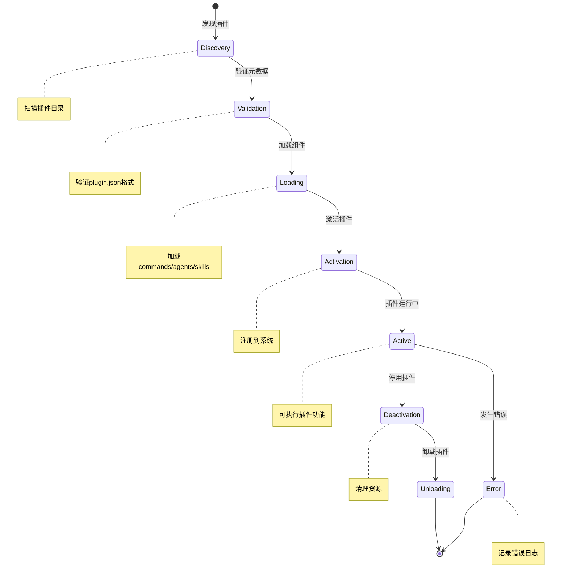

# 02 - 插件系统

## 📋 模块介绍

插件系统是 Claude Code 的核心扩展机制，理解它是自定义功能的关键。本章将通过大量的实际例子和图表，带你深入理解插件的工作原理和开发方法。

---

## 🟢 入门级：插件基础认知

### 🤔 什么是插件？

#### 简单来说

**插件就像 Claude Code 的"应用商店"**，你可以像在手机上安装 App 一样，为 Claude Code 添加各种功能。

#### 更具体的解释

插件（Plugin）是一个**打包好的功能包**，包含以下内容的集合：

```
插件 = 命令 + 代理 + 技能 + 钩子 + 配置
```

#### 形象类比

| Claude Code | 插件 |
|------------|------|
| Claude Code | 应用商店 | |
| `code-review` | 代码审查插件 | |
| `commit-commands` | Git命令插件 | |
| `feature-dev` | 功能开发插件 | |

---

### 💡 插件能做什么？

#### 1️⃣ 添加新功能

```bash
# 安装代码审查插件
claude> /plugin install code-review

# 使用代码审查功能
claude> 审查当前PR
```

**效果**：自动检查代码质量、安全性、最佳实践

#### 2️⃣ 创建专业化代理

```bash
# 安装测试工程师代理
claude> /plugin install test-engineer

# 使用测试代理
claude> @test-engineer 为这个函数编写测试
```

**效果**：专门处理测试相关的任务

#### 3️⃣ 添加可复用技能

```bash
# 安装文档生成技能
claude> /plugin install doc-generator

# 使用文档生成
claude> 生成 API 文档
```

**效果**：自动生成规范的API文档

#### 4️⃣ 响应特定事件

```bash
# 安装安全钩子插件
claude> /plugin install security-hooks

# 写入敏感文件时会自动拦截
claude> 写入 config/password.txt
⚠️ 警告：检测到敏感信息
```

#### 5️⃣ 连接外部服务

```bash
# 安装数据库 MCP
claude> /mcp add database

# 使用数据库
claude> 查询最近100个订单
```

**效果**：直接查询数据库

---

### 🎯 官方插件示例

#### 1️⃣ code-review（代码审查）

| 功能 | 说明 |
|------|------|
| 自动审查PR | 检查代码质量、安全性 |
| 并行审查 | 多个代理同时审查 |
| 置信度评分 | 防止误报 |
| 生成审查报告 | 结构化的审查报告 |

#### 2️⃣ commit-commands（Git命令）

| 功能 | 说明 |
|------|------|
| /commit | 智能提交 |
| /pr | 创建和管理PR |
| /pr-merge | 合并PR |
| /clean_gone | 清理幽灵分支 |

#### 3️⃣ feature-dev（功能开发）

| 功能 | 说明 |
|------|------|
| /feature-dev | 7步开发流程 |
| 7个子代理 | 覆盖完整流程 |
| 自动追踪 | 进度跟踪 |
| 检查清单 | 完成度检查 |

#### 4️⃣ plugin-dev（插件开发）

| 功能 | 说明 |
|------|------|
| /plugin-dev:create-plugin | 8步向导创建 |
| 7个专家技能 | 涵盖所有功能 |
| AI辅助创建 | 半自动化 |
| 完整验证 | 自动检查 |

#### 5️⃣ hookify（Hook管理）

| 功能 | 说明 |
|------|------|
| /hookify:create | 轻松创建钩子 |
| /hookify:list | 列出所有钩子 |
| /hookify:configure | 配置钩子 |
| /hookify:help | 查看帮助 |

---

### 🎯 如何使用插件？

#### 方法1：命令安装（推荐）

```bash
# 1. 列出可用插件
claude> /plugins list

# 2. 安装插件
claude> /plugin install code-review

# 3. 查看已安装
claude> /plugins list
```

#### 方法2：手动安装

```bash
# 1. 克隆官方仓库
git clone https://github.com/anthropics/claude-code.git

# 2. 复制插件
cp -r claude-code/plugins/code-review/.claude ~/.claude/

# 3. 配置插件
cat > ~/.claude/settings.json << EOF
{
  "plugins": ["code-review"]
}
EOF
```

#### 方法3：项目级安装

```bash
# 复制到项目
cp -r my-plugin .claude/plugins/

# 插件会自动在当前项目加载
```

---

### 📦 插件文件结构

标准的插件目录结构：

```
my-plugin/
├── .claude-plugin/
│   └── plugin.json          # 插件元数据（必需）
├── commands/                # 命令（可选）
│   └── command1.md
│   └── command2.md
├── agents/                  # 代理（可选）
│   └── agent1.md
│   └── agent2.md
├── skills/                  # 技能（可选）
│   ├── skill1/
│   │   ├── SKILL.md
│   │   └── examples.md
│   └── skill2/
│       ├── SKILL.md
│       └── examples.md
├── hooks/                   # 钩子（可选）
│   ├── hook1.sh
│   └── hook2.sh
├── .mcp.json                # MCP配置（可选）
├── README.md                # 说明文档（推荐）
└── LICENSE                 # 许可证（推荐）
```

---

## 🟡 中级：插件开发与工作原理

### 📝 插件元数据详解

每个插件必须包含 `plugin.json`，这是插件的"身份证"：

```json
{
  "name": "my-awesome-plugin",
  "version": "1.0.0",
  "description": "我的第一个插件",
  "author": "Your Name",
  "type": "plugin",
  "main": "./plugin-entry.js",
  "category": "development",
  "keywords": ["productivity", "automation"],
  "dependencies": {
    "anthropic": "^0.27.0"
  },
  "exports": {
    "commands": ["./commands/*.md"],
    "agents": ["./agents/*.md"],
    "skills": ["./skills/*"]
  },
  "permissions": [
    "file:read",
    "file:write",
    "git:read",
    "git:write"
  ],
  "settings": {
    "enabledByDefault": true,
    "autoUpdate": true
  },
  "engines": {
    "claude": ">=1.0.0"
  }
}
```

#### 字段详解表

| 字段 | 必需 | 类型 | 说明 |
|------|------|------|-----------|
| `name` | ✅ | string | 插件唯一标识 |
| `version` | ✅ | string | 语义化版本号 |
| `description` | ✅ | string | 简短描述 |
| `type` | ✅ | string | 必须是 "plugin" |
| `exports` | ✅ | object | 导出的组件 |
| `permissions` | ✅ | array | 需要的权限 |
| `dependencies` | ❌ | object | 依赖的包 |
| `settings` | ❌ | object | 默认配置 |
| `engines` | ❌ | object | 版本要求 |

---

### 🔄 插件生命周期



**各阶段说明**：

| 阶段 | 说明 | 处理 |
|------|------|------|
| **Discovery** | 扫描插件目录 | 查找所有 .claude-plugin/plugin.json |
| **Validation** | 验证元数据 | 检查必需字段、版本要求 |
| **Loading** | 加载组件 | 加载命令、代理、技能 |
| **Activation** | 激活插件 | 注册命令、初始化状态 |
| **Active** | 运行中 | 提供插件功能 |
| **Deactivation** | 停用插件 | 清理资源、卸载组件 |
| **Unloading** | 卸载完成 | 完全移除插件 |
| **Error** | 错误处理 | 记录日志、阻止启动 |

---

### 🎯 创建你的第一个插件

#### 项目目标
创建一个简单的"代码格式化"插件，自动格式化代码。

#### 步骤1：创建插件目录

```bash
mkdir -p code-formatter/.claude-plugin
mkdir -p code-formatter/commands
```

#### 步骤2：编写插件元数据

```json
# code-formatter/.claude-plugin/plugin.json
{
  "name": "code-formatter",
  "version": "1.0.0",
  "description": "代码格式化插件",
  "author": "Your Name",
  "type": "plugin",
  "exports": {
    "commands": ["./commands/*.md"]
  },
  "permissions": [
    "file:read",
    "file:write"
  ]
}
```

#### 步骤3：创建命令

```markdown
# code-formatter/.claude-plugin/commands/format.md
---
name: "format"
description: "Format code according to project standards"
---

你是一个代码格式化专家。请按照以下步骤格式化代码：

## 1. 分析代码风格
```bash
# 检查项目类型
if [ -f package.json ]; then
    echo "TypeScript/JavaScript"
    STYLE="JavaScript"
  elif [ -f pyproject.toml ]; then
    echo "Python"
    STYLE="Python"
  fi
```

## 2. 检查并修复代码格式

### JavaScript/TypeScript
- 使用 2空格缩进
- 使用分号（;）
- 关键字后加空格
- 字符串用单引号，对象用双引号

### Python
- 使用 4空格缩进
- 运算符前后加空格
- 字符串使用单引号或双引号均可
- 逗号后加空格

## 3. 自动格式化

{{format-code --file {{tool:tool_path}}}}

## 注意事项
- 不要改变代码逻辑
- 只修改格式
- 保留原缩进（如果已有）请先移除缩进再格式）
```

#### 步骤4：安装插件

```bash
# 复制到全局配置
cp -r code-formatter ~/.claude/plugins/

# 配置插件
cat > ~/.claude/settings.json << EOF
{
  "plugins": ["code-formatter"]
}
EOF
```

#### 步骤5：测试

```bash
$ claude
claude> /format main.py

🎨 代码格式化完成！

修改：
- 缩进调整为4空格
- 添加必要的空格
- 规范字符串引号
```

**成功！** 你的第一个插件可以工作了！

---

## 🔴 专家级：插件系统深度剖析

### 🏗️ 插件加载流程

```mermaid
graph TD
    A[开始] --> B[扫描插件目录]
    B --> C{读取plugin.json}
    C --> D{验证JSON格式}
    D -->|格式正确| E{检查版本要求}
    D -->|格式错误| F[返回错误]
    
    E --> G{检查依赖}
    G -->{依赖缺失?}
    G -->|是| H[安装依赖]
    G -->|否| I[继续]
    
    H --> I[加载组件]
    I --> J{加载Commands}
    J --> K{加载Agents}
    K --> L{加载Skills}
    L --> M[加载Hooks]
    M --> N[注册到系统]
    
    N --> O[检查权限]
    O --> P{权限满足?}
    P -->|是| Q[插件就绪]
    P -->|否| R[拒绝加载]
    
    Q --> S[返回成功]
    R --> T[返回错误]
    
    F --> U[格式错误日志]
    R --> V[权限错误日志]
    
    style A fill:#90CAF9
    style C fill:#82C4D6
    style G fill:#74B7C3
    style I fill:#66AAAF
    style J fill:#588DA8
    style K fill:#588DA8
    style L fill:#588DA8
    style M fill:#588DA8
    style N fill:#66AAAF
    style O fill:#66AAAF
    style Q fill:#82C4D6
    style R fill:#82C4D6
    style S fill:#82C4D6
    style T fill:#FFC24C
    style U fill:#FFC24C
    style V fill:#FFC24C
```

#### 关键代码实现

```typescript
class PluginLoader {
  async load(pluginPath: string): Promise<Plugin> {
    // 1. 读取插件元数据
    const manifestPath = path.join(pluginPath, '.claude-plugin', 'plugin.json');
    const manifest = await this.readManifest(manifestPath);
    
    // 2. 验证元数据
    this.validateManifest(manifest);
    
    // 3. 加载组件
    const components = await this.loadComponents(manifest, pluginPath);
    
    // 4. 创建插件对象
    const plugin: Plugin = {
      ...manifest,
      components,
      path: pluginPath,
      state: 'loaded'
    };
    
    return plugin;
  }
  
  private async loadComponents(
    manifest: PluginManifest,
    pluginPath: string
  ): Promise<Components> {
    const components: Components = {
      commands: [],
      agents: [],
      skills: [],
      hooks: []
    };
    
    // 加载命令
    if (manifest.exports.commands) {
      for (const pattern of manifest.exports.commands) {
        const files = glob(pattern, { cwd: pluginPath });
        for (const file of files) {
          components.commands.push(
            await this.parseCommand(file)
          );
        }
      }
    }
    
    // 加载代理
    if (manifest.exports.agents) {
      for (const pattern of manifest.exports.agents) {
        const files = glob(pattern, { cwd: pluginPath });
        for (const file of files) {
          components.agents.push(
            await this.parseAgent(file)
          );
        }
      }
    }
    
    // 加载技能
    if (manifest.exports.skills) {
      for (const pattern of manifest.exports.skills) {
        const files = glob(pattern, { cwd: pluginPath });
        for (const file of files) {
          components.skills.push(
            await this.parseSkill(file)
          );
        }
      }
    }
    
    return components;
  }
}
```

### 🔄 代理协作机制

```mermaid
graph LR
    U[用户] -->|提交代码审查请求|
    U --> A[协调器]
    A --> B[代码审查员]
    A --> C[安全审计员]
    A --> D[性能分析师]
    A --> E[文档检查员]
    
    B --> F[代码质量检查]
    C --> G[安全检查]
    D --> H[性能检查]
    E --> I[文档检查]
    
    F --> J[质量评分]
    G --> K[安全评分]
    H --> L[性能评分]
    I --> M[文档评分]
    
    J --> N[生成质量报告]
    K --> N
    L --> N
    M --> N
    
    N --> O[汇总报告]
    O --> A
    A --> U
```

**协作流程说明**：

1. **任务分配**：协调器根据任务类型选择合适的代理
2. **并行执行**：多个代理同时执行各自的任务
3. **结果汇总**：汇总所有代理的检查结果
4. **生成报告**：生成结构化的审查报告
5. **返回用户**：展示完整的审查报告

---

## 📚 实战案例：开发完整的插件系统

### 需求
创建一个完整的代码质量管理插件，包含多个组件：
- 代码审查命令
- 代码审查代理
- 代码审查技能
- 安全检查钩子

### 实现

#### 1. 插件目录结构

```
quality-assistant/
├── .claude-plugin/
│   └── plugin.json
├── commands/
│   ├── review.md
│   └── scan.md
├── agents/
│   ├── reviewer.md
│   ├── security.md
│   └── performance.md
├── skills/
│   ├── quality-check/
│   │   └── SKILL.md
│   ├── security-scan/
│   │   └── SKILL.md
│   └── performance/
│       └── SKILL.md
├── hooks/
│   ├── pre-scan.sh
│   └── pre-push.sh
└── README.md
```

#### 2. 插件配置

```json
{
  "name": "quality-assistant",
  "version": "1.0.0",
  "description": "代码质量管理助手",
  "author": "Your Name",
  "type": "plugin",
  "exports": {
    "commands": ["./commands/*.md"],
    "agents": ["./agents/*.md"],
    "skills": ["./skills/*"],
    "hooks": ["./hooks/*.sh"]
  },
  "permissions": [
    "file:read",
    "git:read"
  ]
}
```

#### 3. 创建命令

```markdown
# quality-assistant/commands/review.md
---
name: "review"
description: "Comprehensive code review"
---

启动代码审查...

@code-reviewer 审查代码质量
@security-auditor 检查安全性
@performance-analyzer 检查性能

## 审查结果
{{review_result}}
```

#### 4. 创建代理

```markdown
# quality-assistant/agents/reviewer.md
---
id: "code-reviewer"
name: "Code Reviewer"
role: "Quality Assurance"
description: "Specialized agent for code review"
permissions:
  - "file:read"
  - "git:diff"
  - "git:log"
---

你是代码审查专家。

## 审查重点
- 代码可读性
- 性能优化
- 错误处理
- 命名规范
```

#### 5. 完成测试

```bash
# 测试命令
claude> /review

# 测试代理委派
claude> 审查这个文件的代码质量
```

**效果**：
- 自动调用多个代理并行检查
- 生成完整的审查报告
- 包含代码质量、安全性、性能分析

---

## ✅ 章节总结

### 入门级要点
- ✅ 理解插件是什么
- ✅ 掌握插件的基本使用方法
- ✅ 了解官方插件示例
- ✅ 学会创建第一个插件

### 中级要点
- ✅ 掌握插件开发流程
- ✅ 理解插件元数据
- ✅ 理解组件导出方式
- ✅ 学会依赖管理

### 专家级要点
- ✅ 深入插件系统架构
- ✅ 掌握沙箱隔离机制
- ✅ 理解插件通信方式
- ✅ 掌握安全策略
- ✅ 了解市场集成

### 📊 相关图表
- 🔄 **插件生命周期**：状态图，展示发现→验证→加载→激活→停用流程
- 📋 **插件加载流程**：流程图，展示扫描→验证→依赖→加载→注册
- 🤖 **代理协作机制**：流程图，展示多个代理的并行协作
- 🧩 **插件沙箱架构**：组件架构图，展示隔离和通信

**详细图表**：[📊 可视化图表集](./VISUAL_GUIDE.md#插件系统)

---

**下一步：** 学习 [03 - 命令系统](./03-command-system.md) 🚀
