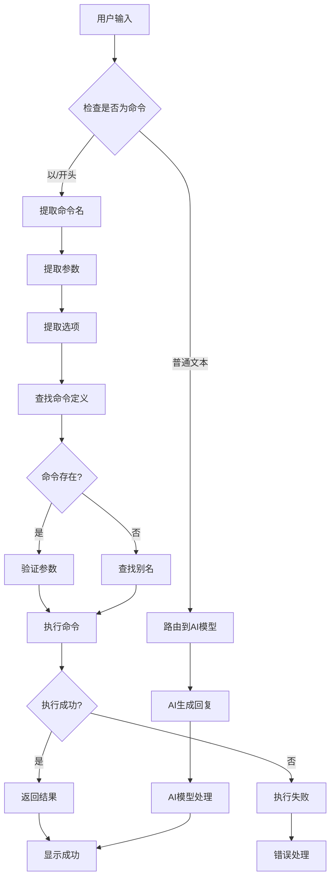

# 03 - 命令系统（Slash Commands）

## 📋 模块介绍

命令系统是 Claude Code 的"快捷键"，让你通过斜杠命令快速执行常用操作。本章将详细介绍命令的设计、创建方法和使用技巧。

---

## 🟢 入门级：命令基础

### 🤔 什么是命令？

#### 简单理解

**命令（Command）就是 Claude Code 的"快捷键"**，通过 `/` 开头的简短指令快速执行特定功能。

**类比理解**：
- 📱 像像手机App的快捷方式
- ⌨️ 像像 VS Code 的快捷键
- 🔧 像像 Chrome 浏览器的快捷键

#### 具体例子

```bash
# 快捷命令 vs 传统方式

# 传统方式（多步操作）
1. 查看git状态
2. 运行git status
3. 查看变更的文件
4. 运行git add .
5. 运行git commit -m "消息"
6. 运行git push

# 使用命令（一步完成）
claude> /commit 修复登录bug
```

**优势**：
- ⚡ **快速** - 一条命令完成多步操作
- 🎯 **精准** - 专门针对特定任务
- 🔁 **可复用** - 可以保存常用的命令
- 💬 **智能** - 自动分析和处理

---

### 🎯 命令类型

#### 1️⃣ 快捷操作类

| 命令 | 功能 | 示例 |
|------|------|------|
| `/commit` | 智能Git提交 | `/commit 修复bug` |
| `/review` | 代码审查 | `/review main.py` |
| `/test` | 运行测试 | `/test --watch` |
| `/deploy` | 部署应用 | `/deploy staging` |

#### 2️⃣ 信息查询类

| 命令 | 功能 | 示例 |
|------|------|------|
| `/help` | 显示帮助 | `/help` |
| `/version` | 显示版本 | `/version` |
| `/status` | 显示状态 | `/status` |
| `/plugins list` | 列出插件 | `/plugins list` |

#### 3️⃣ 开发工具类

| 命令 | 功能 | 示例 |
|------|------|------|
| `/plugin install` | 安装插件 | `/plugin install code-review` |
| `/plugin list` | 列出插件 | `/plugin list` |
| `/config show` | 显示配置 | `/config show` |

---

### 🎨 命令格式结构

```markdown
---
name: "命令名称"
description: "命令描述"
alias: ["/别名1", "/别名2"]  # 可选
options:          # 选项定义
  - name: "option1"
    type: string|number|boolean
    default: "默认值"
    required: false
    description: "选项说明"
  - name: "option2"
    type: string
    description: "选项说明"
---

命令内容...

{{args}}            # 位置参数
{{options}}         # 选项参数
{{file:read file}}    # 工具调用
{{bash:run cmd}}    # 命令执行
---

{{tools}}           # 可用工具列表
- file:read  - 读取文件
- file:write - 写入文件
- git:status - Git状态
- bash:run  - 执行命令
```

---

### 🔄 命令解析流程



**解析步骤说明**：

1. **识别**：判断输入是否以 `/` 开头
2. **解析**：提取命令名、参数、选项
3. **查找**：在已注册的命令中查找
4. **验证**：验证参数和选项是否正确
5. **执行**：执行命令逻辑
6. **返回**：返回执行结果或错误信息

---

## 🟡 命令参数详解

### 1. 位置参数

```bash
# 使用空格分隔多个参数
claude> /format src/app.ts tests/app.spec.ts

# 在命令中访问
{{args.0}}  # 第一个参数 → src/app.ts
{{args.1}}  # 第二个参数 → tests/app.spec.ts
{{args.2}}  # 第三个参数 → ...
```

### 2. 命名参数（选项）

```bash
# 使用 -- 或 - 指定选项名
claude> /format --file README.md

# 使用 = 指定等号
claude> /format --mode comprehensive

# 使用短选项
claude> /format -f README.md

# 组合使用
claude> /format --file README.md --mode comprehensive
```

**常用选项类型**：

| 类型 | 说明 | 示例 |
|------|------|------|
| string | 文本或路径 | `--file README.md` |
| number | 数字 | `--limit 10` |
| boolean | 开关 | `--verbose`, `--force` |
| array | 列表 | `--tags main,backend` |

### 3. 混合使用

```bash
claude> /format --file README.md --tags web,backend --limit 20
```

---

## 🧪 创建自定义命令

### 步骤1：创建命令文件

```bash
mkdir -p .claude/commands
```

### 步骤2：编写命令

```markdown
# .claude/commands/backup.md
---
name: "backup"
description: "Create project backup"
alias: ["/bk", "/backup"]
options:
  - name: "compress"
    type: "type
    default: "false"
    description: "压缩备份"
  - name: "upload"
    type: "boolean"
    default: "false"
    description: "上传到云存储"
---

你是一个备份专家。请按照以下步骤创建备份：

## 1. 收集项目信息
- 获取项目名称：{{ask:项目名称}}
- 获取项目路径：`pwd`
- 获取Git分支：{{git:branch --show-current}}

## 2. 确认备份信息
```

### 步骤3：安装命令

```bash
# 查看当前命令
claude> /commands list

# 测试命令
claude> /backup
```

---

## 🔴 专家级：命令系统深度剖析

### 🎯 命令执行引擎架构

```mermaid
sequenceDiagram
    participant User as 用户
    participant CLI as 命令行界面
    participant Router as 命令路由器
    Commander as 命令处理器
    TemplateEngine as 模板引擎
    ToolExecutor as 工具执行器
    Claude as AI模型
    Output as 输出

    User->>CLI: 输入 /format file.md
    CLI->>Router: 解析命令
    Router->>Command: 查找命令定义
    Command->>Router: 返回配置
    Router->>TemplateEngine: 加载模板
    
    TemplateEngine->>Claude: 解析上下文
    Claude->>ToolExecutor: 执行工具
    ToolExecutor->>ToolExecutor: 读取文件
    ToolExecutor->>Claude: 返回文件内容
    Claude->>TemplateEngine: 渲染模板
    TemplateEngine->>CLI: 返回结果
    CLI->>User: 显示格式化结果
```

**关键组件说明**：

| 组件 | 功能 | 说明 |
|------|------|------|
| **Router** | 命令路由 | 查找和匹配命令 |
| **Command** | 命令定义 | 命令的元数据和逻辑 |
| **TemplateEngine** | 模板引擎 | 渲染模板（Handlebars风格） |
| **ToolExecutor** | 工具执行器 | 执行文件、Git、Bash操作 |

---

### 命令解析器实现

```typescript
class CommandParser {
  parse(input: string): ParseResult {
    // 1. 检查是否是命令
    if (!input.startsWith('/')) {
      return { type: 'chat', content: input };
    }
    
    // 2. 分割命令
    const parts = input.slice(1).split(/\s+/);
    const commandName = parts[0];
    const rawArgs = parts.slice(1);
    
    // 3. 查找命令
    const command = this.findCommand(commandName);
    if (!command) {
      return { type: 'error', message: 'Unknown command' };
    }
    
    // 4. 解析参数和选项
    const { args, options } = this.parseArguments(rawArgs, command);
    
    return {
      type: 'command',
      command,
      args,
      options
    };
  }
  
  private parseArguments(
    rawArgs: string[],
    command: Command
  ): { args: string[], options: Record<string, any> } {
    const args: string[] = [];
    const options: Record<string, any> = {};
    
    for (const arg of rawArgs) {
      // 检查是否是选项
      if (arg.startsWith('--') {
        const optionName = arg.slice(2);
        const option = command.options.find(opt => 
          opt.name === optionName
        );
        
        if (option) {
          let value: any;
          
          if (option.type === 'boolean') {
            value = true;
          } else if (option.type === 'number') {
            value = parseFloat(args[index + 1]) || option.default;
          } else {
            value = args[index + 1] || option.default;
          }
          
          options[option.name] = value;
        }
      }
    }
    
    return { args, options };
  }
}
```

---

### 模板引擎实现

```typescript
class TemplateEngine {
  render(template: string, context: Context): string {
    // 1. 解析模板
    const ast = this.parse(template);
    
    // 2. 渲染AST
    return this.renderAST(ast, context);
  }
  
  private parse(template: string): ASTNode[] {
    // 简化的模板解析
    const nodes: ASTNode[] = [];
    let pos = 0;
    
    while (pos < template.length) {
      if (template[pos] === '{' && template[pos + 1] === '{') {
        // 变量插值
        const end = template.indexOf('}', pos + 2);
        const expr = template.slice(pos + 2, end);
        const value = this.evaluateExpression(expr, context);
        nodes.push({ type: 'text', content: value });
        pos = end + 1;
      } else if (template.startsWith('#', pos) && template.includes('\n')) {
        // 多行注释
        const end = template.indexOf('\n', pos + 1);
        nodes.push({ type: 'comment', content: template.substring(1, end) });
        pos = end + 1;
      } else {
        // 普通文本
        nodes.push({ type: 'text', content: template.substring(pos, pos + 1) });
        pos = pos + 1;
      }
    }
    
    return nodes;
  }
  
  private evaluateExpression(expr: string, context: Context): string {
    // 简化的表达式求值
    const parts = expr.split('.');
    let value: any = context;
    
    for (const part of parts) {
      if (part === 'args') {
        value = context.args;
      } else if (part === 'options') {
        value = context.options;
      } else {
        value = value?.[part] || null;
      }
    }
    
    return String(value);
  }
}
```

---

## 📚 实战案例：高级命令系统

### 案例：智能部署命令

创建一个智能部署命令，自动完成构建、测试、部署流程。

```markdown
# .claude/commands/deploy.md
---
name: "deploy"
description: "Intelligent deployment command"
options:
  - name: "env"
    type: "string"
    description: "部署环境"
    default: "staging"
    enum: ["staging", "production"]
  - name: "test"
    type: "boolean"
    description: "运行测试"
    default: true
  - name: "monitor"
    type: "boolean"
    description: "部署后监控"
    default: true
---

你是一个部署专家。请按照以下流程部署应用：

## 前置检查
1. 检查环境变量：{{env.GITHUB_TOKEN}}
2. 检查Docker服务状态
3. 检查数据库连接

## 部署流程
{{# 1. 构建}
echo "🏗️ 构建应用..."
npm run build

# 2. 运行测试
{{#if options.test}}
echo "🧪 运行测试..."
npm test
{{/if}}

# 3. 部署
echo "🚀 开始部署..."
kubectl apply deployment.yaml

# 4. 验证
echo "🔍 验证部署..."
kubectl rollout status {{options.env}}

# 5. 监控
{{#if options.monitor}}
echo "📊 监控中..."
kubectl logs -l app={{options.env}}
{{/if}}

## 完成
✅ 部署成功！
```

**使用示例**：

```bash
# 部署到staging
claude> /deploy

# 部署到production并跳过测试
claude> /deploy --env production --no-test

# 部署并启动监控
claude> /deploy --env production --monitor
```

---

## ✅ 章节总结

### 入门级要点
- ✅ 理解命令的概念
- ✅ 掌握命令的基本用法
- ✅ 了解参数和选项
- ✅ 学会创建自定义命令

### 中级要点
- ✅ 掌握命令格式结构
- 理解参数和选项处理
- 理解模板语法
- 学会创建复杂命令

### 专家级要点
- ✅ 深入命令解析算法
- 掌握模板引擎实现
- 理解命令执行引擎
- 掌握错误处理机制

### 📊 相关图表

- 🔍 **命令解析流程图**：展示用户输入→解析→执行的完整流程
- ⏱️ **命令执行时序图**：展示用户→CLI→Command→Tool→Claude的交互过程
- 🎛 **命令解析流程图**：展示命令类型、参数、选项的路由流程

**详细图表**：[📊 可视化图表集](./VISUAL_GUIDE.md#命令系统)

---

**下一步：** 学习 [04 - 代理系统](./04-agent-system.md) 🚀
