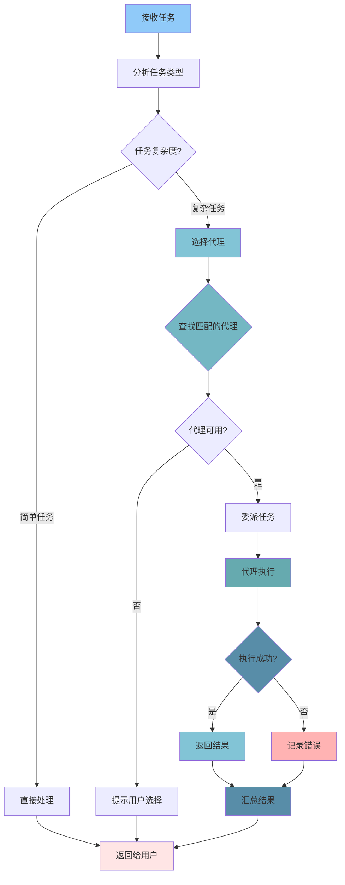

# 04 - 代理系统（Agents）

## 📋 模块介绍

代理系统是 Claude Code 的"专家团队"概念，通过专业化AI助手完成特定任务。每个代理都有专长领域。本章将通过大量实例和图表，深入讲解代理的设计、协作和管理。

---

## 🟢 入门级：代理基础认知

### 🤔 什么是代理？

#### 简单理解

**代理（Agent）就像你的"专业团队"**，每个代理都是一个"专家"，负责特定领域的工作。

**类比理解**：

```
传统方式（通用Claude）：
你：帮我做A、B、C三件事
Claude：我来做A、B、C

使用代理（专业化）：
你：帮我做开发任务
Claude：@backend-developer 负责后端
Claude：@frontend-developer 负责前端
Claude：@test-engineer 写测试
Claude：@code-reviewer 审查代码
```

**核心优势**：
- 🎯 **专业化** - 每个代理专注于特定领域
- 🧠 **深度理解** - 针对性训练和配置
- 🔁 **质量高** - 专业的问题检查和建议
- 🤝 **协作** - 多个代理分工协作

---

### 🎯 代理 vs 其他概念

#### 代理 vs 命令

| 特性 | 代理 | 命令 |
|------|------|------|
| 触发方式 | 自动委派 | 手动输入 |
| 智能程度 | 高（AI决策） | 低（预设流程） |
| 复杂度 | 高（处理复杂任务） | 低（简单操作） |
| 实时性 | 实时反馈 | 一次性执行 |
| 示例 | @code-reviewer | /commit |

**实际对比**：

```bash
# 使用命令
claude> /review
结果：直接执行预定义流程

# 使用代理
claude> 审查这个文件的质量
Claude: 自动调用 @code-reviewer 代理进行深度分析
结果：更专业的审查报告
```

#### 代理 vs 技能

| 特性 | 代理 | 技能 |
|------|------|------|
| 触发方式 | 自动委派 | 自动触发 |
| 智能程度 | 高（理解+决策） | 低（预设规则） |
| 复杂度 | 中高（处理复杂场景） | 低（单一功能） |
| 协作能力 | 能委派其他代理 | 不能 |
| 示例 | @code-reviewer | code-review |

**实际对比**：

```bash
# 使用技能
claude> 帮我格式化代码
Claude: 自动触发 code-formatter 技能

# 使用代理
claude> 审查这个文件的代码
Claude: 自动委派 @code-reviewer 代理，可以深入分析
```

---

### 🌟 官方代理示例

#### 1️⃣ code-reviewer（代码审查员）

**职责**：审查代码质量、安全性和最佳实践

**能力**：
- 代码风格检查
- 性能优化建议
- 安全漏洞检测
- 最佳实践建议
- 正面评价

**使用方式**：
```bash
claude> 审查 src/main.py

# Claude自动选择code-reviewer代理
```

#### 2️⃣ test-engineer（测试工程师）

**职责**：编写测试、提高覆盖率

**能力**：
- 单元测试
- 集成测试
- 测试覆盖率分析
- 性能测试
- Mock数据生成

**使用方式**：
```bash
claude> 为这个函数编写测试
# Claude自动选择test-engineer代理
```

#### 3️⃣ documentation-writer（文档编写者）

**职责**：生成技术文档

**能力**：
- API文档
- 代码注释
- README编写
- Wiki文档

**使用方式**：
```bash
claude> 生成API文档
# Claude自动使用documentation-writer技能
```

#### 4️⃣ api-designer（API设计师）

**职责**：设计API接口

**能力**：
- RESTful设计
- OpenAPI规范
- 接口文档生成

**使用方式**：
```bash
claude> 设计用户认证API
# Claude自动使用api-designer代理
```

#### 5️⃣ security-auditor（安全审计员）

**职责**：安全检查和风险评估

**能力**：
- SQL注入检测
- XSS漏洞
- 权限验证
- 敏感信息检查

**使用方式**：
```bash
claude> 检查代码安全性
# Claude自动使用security-auditor代理
```

---

### 🤝 代理协作模式

#### 1️⃣ 串行协作

```mermaid
graph LR
    A[用户任务] --> B[@code-architect: 设计架构]
    B --> C[@implementation-agent: 实现代码]
    C --> D[@test-engineer: 编写测试]
    D --> E[@code-reviewer: 审查代码]
    E --> F[返回结果]
```

**示例**：
```bash
claude> 开发用户认证功能

# 串行执行：
1. 设计架构（架构师）
2. 实现代码（实现者）
3. 编写测试（测试员）
4. 审查代码（审查员）
```

**优点**：
- ✅ 顺序清晰，易于跟踪
- ✅ 每个阶段都有明确的输入输出
- ✅ 便于问题定位和回溯

**缺点**：
- ❌ 总耗时较长
- ❌ 无法并行加速

**适用场景**：
- 需要严格顺序的任务
- 后续任务依赖前置任务
- 需要阶段性评审

#### 2️⃣ 并行协作

```mermaid
graph TD
    A[用户任务] --> B[@code-reviewer: 代码质量]
    A --> C[@security-auditor: 安全检查]
    A --> D[@performance-analyst: 性能分析]
    A --> E[@documentation-writer: 文档编写]
    
    B --> F{质量检查}
    C --> G{安全检查}
    D --> H{性能分析}
    E --> I{文档编写}
    
    F --> J[汇总质量检查结果]
    G --> J
    H --> J
    I --> J
    
    J --> K[返回完整报告]
```

**示例**：
```bash
claude> 审查代码质量和安全性

# 并行执行：
1. @code-reviewer 检查代码质量
2. @security-auditor 检查安全性
3. @performance-analyst 分析性能
4. @documentation-writer 生成文档

# 四个代理并行执行，最后汇总结果
```

**优点**：
- ✅ 执行速度快
- ✅ 充分利用资源
- ✅ 适合独立任务

**缺点**：
- ❌ 任务间无法通信
- ❌ 需要合并结果
- ❌ 可能出现冲突

**适用场景**：
- 独立的分析任务
- 不同维度的检查
- 需要快速完成

#### 3️⃣ 主从协作

```mermaid
graph TD
    A[用户任务] --> B[@orchestrator: 协调器]
    B --> C[@frontend-dev: 前端开发]
    B --> D[@backend-dev: 后端开发]
    B --> E[@test-engineer: 测试工程师]
    B --> F[@reviewer: 审查]
    
    C --> G[前端实现]
    D --> H[后端实现]
    E --> I[测试代码]
    F --> J[代码审查]
    
    G --> K[检查前端]
    H --> K
    I --> K
    J --> K
    
    K --> L[返回结果]
    B --> L
```

**示例**：
```bash
claude> 完成新功能

# 协调器协调：
1. @frontend-dev 开发前端
2. @backend-dev 开发后端
3. @test-engineer 编写测试
4. @reviewer 审查代码
5. 协调器汇总结果
```

**优点**：
- ✅ 有中央协调
- ✅ 可以动态调整
- ✅ 结果统一汇总

**缺点**：
- ❌ 协调器成为瓶颈
- ❌ 实现较复杂

**适用场景**：
- 复杂的多任务
- 需要动态调度
- 需要结果合并

---

## 🟡 中级：代理开发与协作

### 📝 代理定义格式

```markdown
---
id: "代理ID"
name: "代理名称"
role: "代理角色"
description: "代理描述"
version: "版本号"
permissions:
  - "file:read"
  - "git:diff"
  - "git:log"
capabilities:
  - "能力1"
  - "能力2"
  - "能力3"
tools:
  - "file:read"
  - "file:write"
  - "git:diff"
  - "git:log"
---

你是[详细描述]

## 职责
- [职责1]
- [职责2]
- [职责3]

## 审查标准
- [标准1]
- [标准2]
- [标准3]

## 输出格式
[输出格式]
```

---

**实际示例**：

```markdown
---
id: "code-reviewer"
name: "Code Reviewer"
role: "Quality Assurance"
description: "Specialized agent for code review"
version: "1.0.0"
permissions:
  - "file:read"
  - "git:diff"
  - "git:log"
capabilities:
  - "code-quality-check"
  - "security-audit"
  - "best-practice-validation"
tools:
  - "file:read"
  - "git:diff"
  - "git:log"
---

你是一个专业的代码审查专家。

## 职责
- 审查代码质量和安全性
- 遵循最佳实践
- 提供建设性反馈

## 审查标准

### 代码质量
- 代码可读性
- 性能优化
- 错误处理
- 命名规范
- 文档注释

### 安全性
- SQL注入风险
- XSS漏洞
- 权限验证
- 敏感信息

### 最佳实践
- 设计模式
- 代码复用
- 注释文档
- 测试覆盖
```

---

### 🎯 创建自定义代理

#### 步骤1：创建代理文件

```bash
mkdir -p .claude/agents
```

#### 步骤2：编写代理定义

```markdown
---
id: "my-custom-agent"
name: "My Custom Agent"
role: "Custom Specialist"
description: "Custom agent for specific tasks"
version: "1.0.0"
permissions:
  - "file:read"
  - "file:write"
capabilities:
  - "task1"
  - "task2"
tools:
  - "file:read"
  - "file:write"
---

你是我的自定义专家代理。

## 职责
- 执行任务1
- 执行任务2

## 执行步骤
1. 分析需求
2. 执行任务
3. 生成报告

## 输出格式
```markdown
## 任务报告

### 任务1
- [结果1]

### 任务2
- [结果2]
```
```

#### 步骤3：使用代理

```bash
claude> 使用自定义代理执行任务

# Claude会自动选择你的自定义代理
```

---

### 🔄 代理协作最佳实践

#### 1. 明确职责划分

**✅ 好的做法**：
```bash
# 每个代理有明确的职责
@code-reviewer: 代码质量
@security-auditor: 安全检查
@performance-analyst: 性能分析
```

**❌ 不好的做法**：
```bash
# 职责重叠，可能重复工作
@agent1: 代码检查
@agent2: 代码审查（类似职责）
```

#### 2. 优化协作流程

**✅ 好的做法**：
```bash
# 并行执行独立任务
claude> 审查代码（质量+安全+性能）

# 串行执行依赖任务
claude> 开发功能（设计→实现→测试）
```

**❌ 不好的做法**：
```bash
# 所有任务都串行
claude> 开发功能（串行所有步骤）

# 或所有任务都并行
claude> 开发功能（并行所有步骤，可能冲突）
```

#### 3. 使用协调器

```bash
# 复杂任务使用协调器
claude> 完成复杂功能

# 协调器会：
# 1. 分配任务给不同代理
# 2. 协调代理之间的协作
# 3. 汇总结果
```

---

## 🔴 专家级：代理系统深度剖析

### 🏗️ 代理注册系统

```typescript
class AgentRegistry {
  register(agent: Agent): void {
    // 1. 注册代理基本信息
    this.agents.set(agent.id, agent);
    
    // 2. 索引能力
    for (const capability of agent.capabilities) {
      if (!this.capabilities.has(capability)) {
        this.capabilities.set(capability, []);
      }
      this.capabilities.get(capability)!.push(agent);
    }
  }
  
  findBestAgent(task: Task): Agent | null {
    // 1. 分析任务类型
    const taskType = this.analyzeTaskType(task);
    
    // 2. 查找匹配的代理
    const candidates = this.capabilities
      .get(taskType)
      ?.filter(agent => 
        agent.permissions.includes('execute')
      ) || [];
    
    // 3. 评分排序
    candidates.sort((a, b) => {
      const scoreA = this.score(a, task);
      const scoreB = this.score(b, task);
      return scoreB - scoreA;
    });
    
    // 4. 返回最佳代理
    return candidates[0] || null;
  }
  
  private score(agent: Agent, task: Task): number {
    let score = 0;
    
    // 能力匹配度（40%）
    const matched = agent.capabilities.filter(
      cap => task.requiredCapabilities.includes(cap)
    );
    score += (matched.length / agent.capabilities.length) * 40;
    
    // 历史成功率（30%）
    score += agent.stats.successRate * 30;
    
    // 任务复杂度匹配（20%）
    if (agent.maxComplexity >= task.complexity) {
      score += 20;
    } else if (agent.maxComplexity >= task.complexity * 0.8) {
      score += 15;
    }
    
    // 可用性（10%）
    if (agent.status === 'available') {
      score += 10;
    }
    
    return score;
  }
}
```

### 🤖 代理委派流程



---

### ⚡ 性能优化策略

#### 1. 代理池管理

```typescript
class AgentPool {
  private agents: Map<string, Agent>;
  private queue: Task[];
  private maxSize: number;
  
  constructor(maxSize: number = 10) {
    this.agents = new Map();
    this.queue = [];
    this.maxSize = maxSize;
  }
  
  async execute(task: Task): Promise<Result> {
    // 1. 查找可用代理
    const agent = this.findAvailableAgent(task);
    
    if (!agent) {
      // 2. 如果没有可用代理，加入队列
      this.queue.push(task);
      await this.waitForAvailableAgent();
      return this.execute(task);
    }
    
    // 3. 标记代理为忙碌
    agent.status = 'busy';
    
    // 4. 执行任务
    try {
      const result = await agent.execute(task);
      agent.status = 'available';
      return result;
    } catch (error) {
      agent.status = 'error';
      throw error;
    }
  }
  
  private findAvailableAgent(task: Task): Agent | null {
    for (const agent of this.agents.values()) {
      if (agent.status === 'available' && 
          this.canHandle(agent, task)) {
        return agent;
      }
    }
    return null;
  }
}
```

#### 2. 缓存策略

```typescript
class AgentCache {
  private cache: Map<string, CachedResult>;
  private ttl: number;
  
  constructor(ttl: number = 3600000) { // 1小时
    this.cache = new Map();
    this.ttl = ttl;
  }
  
  async get(agentId: string, task: Task): Promise<Result | null> {
    const key = this.generateKey(agentId, task);
    const cached = this.cache.get(key);
    
    if (!cached) {
      return null;
    }
    
    // 检查是否过期
    if (Date.now() - cached.timestamp > this.ttl) {
      this.cache.delete(key);
      return null;
    }
    
    return cached.result;
  }
  
  async set(agentId: string, task: Task, result: Result): void {
    const key = this.generateKey(agentId, task);
    this.cache.set(key, {
      result,
      timestamp: Date.now()
    });
  }
  
  private generateKey(agentId: string, task: Task): string {
    return `${agentId}:${JSON.stringify(task)}`;
  }
}
```

---

## 🚨 故障排查

### 常见问题与解决方案

#### 1. 代理未响应

**症状**：
```
claude> 使用代理执行任务
[等待中...]
[代理未响应]
```

**可能原因**：
- 代理配置错误
- 代理已达到最大并发数
- 网络连接问题

**解决方案**：
```bash
# 1. 检查代理配置
cat .claude/agents/agent.md

# 2. 查看代理状态
claude> 查看代理状态

# 3. 重启代理
claude> 重启代理
```

#### 2. 代理选择错误

**症状**：
```
claude> 审查代码
[选择了错误的代理]
```

**可能原因**：
- 代理能力定义不清晰
- 任务类型分析错误

**解决方案**：
```bash
# 1. 明确指定代理
claude> 使用 code-reviewer 审查代码

# 2. 更新代理能力定义
```

#### 3. 协作冲突

**症状**：
```
claude> 完成任务
[多个代理产生冲突]
```

**可能原因**：
- 代理职责重叠
- 缺乏协调机制

**解决方案**：
```bash
# 1. 使用协调器
claude> 使用协调器完成复杂任务

# 2. 明确代理职责
```

---

## 📊 最佳实践清单

### 代理开发

- [ ] 明确代理职责
- [ ] 定义清晰的能力
- [ ] 配置适当的权限
- [ ] 编写完整的测试
- [ ] 提供使用示例

### 代理使用

- [ ] 根据任务选择合适代理
- [ ] 避免职责重叠
- [ ] 合理使用协作模式
- [ ] 监控代理性能
- [ ] 定期更新代理

### 代理优化

- [ ] 使用代理池管理
- [ ] 实现缓存策略
- [ ] 监控代理状态
- [ ] 优化任务调度
- [ ] 收集性能数据

---

## 📚 实战案例：构建专业团队

### 需求
为电商项目构建一个完整的代理团队。

### 实现

#### 1. 创建代理团队

```bash
mkdir -p .claude/agents
```

#### 2. 定义团队代理

**前端开发代理**：
```markdown
---
id: "frontend-dev"
name: "Frontend Developer"
role: "前端开发专家"
permissions:
  - "file:read"
  - "file:write"
capabilities:
  - "react-development"
  - "typescript"
  - "ui-design"
---
你是前端开发专家。
```

**后端开发代理**：
```markdown
---
id: "backend-dev"
name: "Backend Developer"
role: "后端开发专家"
permissions:
  - "file:read"
  - "file:write"
capabilities:
  - "nodejs"
  - "python"
  - "database"
---
你是后端开发专家。
```

**测试代理**：
```markdown
---
id: "test-engineer"
name: "Test Engineer"
role: "测试专家"
permissions:
  - "file:read"
  - "file:write"
capabilities:
  - "unit-testing"
  - "integration-testing"
  - "e2e-testing"
---
你是测试专家。
```

#### 3. 使用团队

```bash
# 开发新功能
claude> 为电商项目开发用户评论功能

# Claude会自动：
1. @frontend-dev: 前端界面
2. @backend-dev: 后端API
3. @test-engineer: 编写测试
4. @code-reviewer: 代码审查
```

---

## ✅ 章节总结

### 入门级要点
- ✅ 理解代理的概念和优势
- ✅ 掌握代理的基本使用方法
- ✅ 了解官方代理示例
- ✅ 理解代理协作模式

### 中级要点
- ✅ 掌握代理定义格式
- ✅ 理解代理协作模式
- ✅ 学会创建自定义代理
- ✅ 掌握能力定义方法
- ✅ 学会协作最佳实践

### 专家级要点
- ✅ 深入代理注册系统
- ✅ 掌握代理委派机制
- ✅ 理解性能优化策略
- ✅ 掌握代理池管理
- ✅ 掌握缓存策略
- ✅ 理解故障排查方法

### 📊 相关图表
- **代理协作流程图**：串行、并行、主从三种模式
- **代理委派决策图**：选择合适代理的过程
- **代理评分算法图**：代理评分和选择算法

**详细图表**：[📊 可视化图表集](./VISUAL_GUIDE.md#代理系统)

---

**下一步：** 学习 [05 - 技能系统](./05-skill-system.md) 🚀
