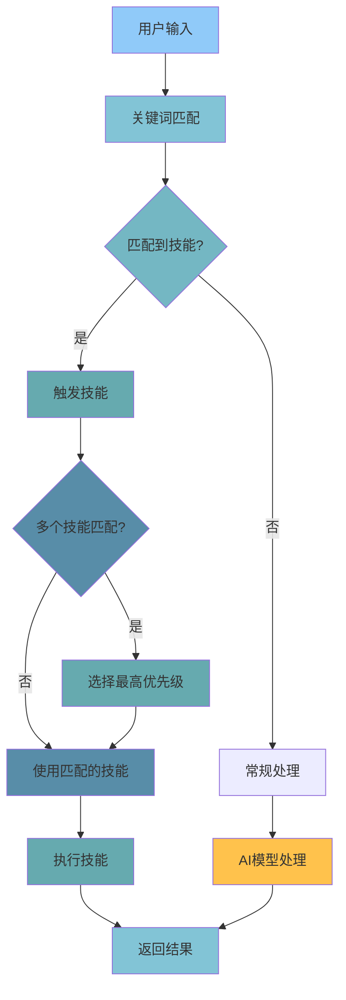

# 05 - 技能系统（Skills）

## 📋 模块介绍

技能系统是 Claude Code 的"工具箱"，提供可复用的能力包，可在需要时自动调用。本章将详细介绍技能的设计、开发方法和最佳实践。

---

## 🟢 入门级：技能基础认知

### 🤔 什么是技能？

#### 简单理解

**技能（Skill）就像"专业技能"或"工具箱"**，封装了特定的专业能力。

**类比理解**：

| Claude Code | 插件 | 技能 |
|------------|------|------|
| 完整功能包 | 完整的App | 特定能力 |
| 功能集合 | 命令的集合 | 技能的集合 |
| 一次性调用 | 一次性执行 | 按需调用 |

**核心特点**：
- 🎯 **按需调用** - 根据需求自动触发
- 🔄 **可复用** - 可以在多个场景使用
- 🔧 **独立工作** - 完整的上下文和配置
- 📦 **独立测试** - 可以单独测试验证

---

### 💡 技能 vs 插件 vs 代理

| 特性 | 技能 | 插件 | 代理 |
|------|------|------|------|
| 颗粒度 | 小（单一能力） | 大（完整功能） | 中（专家角色） |
| 触发方式 | 自动 | 手动/自动 | 手动/委派 |
| 智能程度 | 低（预设规则） | 高（完整逻辑） | 极高（AI决策） |
| 复杂度 | 单一功能 | 多个功能 | 复杂任务 |
| 协作能力 | 不能 | 能 | 能 |
| 示例 | code-review | code-review插件 | code-reviewer代理 |

**实际对比**：

```bash
# 使用技能
claude> 帮我格式化代码
Claude: 自动触发 code-formatter 技能
效果：快速格式化

# 使用插件
claude> 使用 code-review 插件
Claude: 加载插件，执行完整流程
效果：完整的代码审查

# 使用代理
claude> 审查这个文件的代码
Claude: 自动委派 @code-reviewer 代理
效果：深入分析，专业建议
```

---

### 🎯 官方技能示例

#### 1️⃣ code-review（代码审查技能）

- **功能**：审查代码质量、安全性、最佳实践
- **触发**：提到"审查"、"检查质量"、"代码"等关键词
- **效果**：自动检查代码、生成报告

**使用示例**：
```bash
claude> 帮我审查代码质量
# 自动触发 code-review 技能
# 自动：检查质量、安全、最佳实践
# 返回：详细的审查报告
```

#### 2️⃣ test-generation（测试生成技能）

- **功能**：生成测试代码
- **触发**：提到"测试"、"生成测试"、"写测试"等关键词
- **效果**：自动生成单元测试、集成测试

**使用示例**：
```bash
claude> 为这个函数生成测试
# 自动触发 test-generation 技能
# 自动：分析函数签名、参数、返回值
# 返回：完整的测试代码
```

#### 3️⃣ documentation（文档生成技能）

- **功能**：生成技术文档
- **触发**：提到"文档"、"API文档"、"注释"等关键词
- **效果**：自动生成规范的文档

**使用示例**：
```bash
claude> 为这个函数生成API文档
# 自动触发 documentation 技能
# 自动：提取函数签名、参数、返回值
# 返回：规范的API文档
```

#### 4️⃣ refactoring（代码重构技能）

- **功能**：重构代码结构
- **触发**：提到"重构"、"优化"、"性能"等关键词
- **效果**：自动提取函数、优化性能

**使用示例**：
```bash
claude> 重构这个函数提高性能
# 自动触发 refactoring 技能
# 自动：识别可优化点
# 返回：优化后的代码
```

#### 5️⃣ debugging（调试技能）

- **功能**：诊断和修复代码问题
- **触发**：提到"调试"、"bug"、"错误"等关键词
- **效果**：自动定位错误、提供修复建议

**使用示例**：
```bash
claude> 帮我调试这段代码
# 自动触发 debugging 技能
# 自动：分析错误、定位问题
# 返回：修复建议
```

---

### 🎯 技能触发机制

#### 自动触发

Claude Code 会分析用户输入，自动判断是否需要使用技能。

```
用户输入 → 关键词匹配 → 技能触发 → 返回结果
```

**示例：**

| 用户输入 | 触发的技能 | 效果 |
|----------|----------|------|
| "帮我格式化代码" | code-formatter | 格式化代码 |
| "审查这个文件" | code-review | 代码审查 |
| "写个测试" | test-generation | 生成测试 |
| "生成文档" | documentation | 生成文档 |
| "优化性能" | refactoring | 优化代码 |
| "调试代码" | debugging | 修复bug |

#### 手动指定

```bash
# 显式指定技能
claude> 使用 test-generation 技能为这个函数生成测试
```

#### 技能优先级



---

## 🟡 中级：技能开发与设计

### 📋 技能定义结构

```markdown
---
name: "技能名称"
description: "技能描述"
version: "版本号"
category: "分类"
triggers:
  - "触发词1"
  - "触发词2"
permissions:
  - "file:read"
  - "file:write"
  - "git:read"
  - "git:diff"
author: "作者"
---

# 技能描述

## 使用场景
技能在什么情况下会被触发？

## 技能内容
[技能的具体内容]

## 使用方法
[如何使用这个技能]

## 输出格式
[输出格式]

## 示例
[实际使用示例]
```

---

**实际示例**：

```markdown
---
name: "log-analyzer"
description: "分析应用日志"
version: "1.0.0"
category: "analysis"
triggers:
  - "分析日志"
  - "检查日志"
  - "审查日志"
  - "日志统计"
permissions:
  - "file:read"
author: "Your Name"
---

# 日志分析技能

## 使用场景
当用户需要分析应用日志时自动触发

## 技能内容
- 识别错误日志
- 统计错误类型
- 分析趋势
- 生成报告

## 输出格式
```markdown
## 日志分析报告

### 错误统计
| 错误类型 | 次数 |
|----------|------|
| ERROR | 5 |
| WARN | 3 |
| FATAL | 1 |

### 趋势分析
- **性能**: 错误主要集中在登录模块
- **频率**: 晚上错误较少
- **建议**: 优化登录验证
```

## 使用方法
在Claude Code中提到"分析日志"或"查看错误"时自动触发

## 示例
```
用户: 分析日志文件
Claude: [自动触发 log-analyzer 技能]
Claude: 正在分析日志...
Claude: [返回分析报告]
```
```

---

### 🎨 技能开发模式

#### 1. 分析式技能（推荐）

**适用**：明确的、单一的领域

```markdown
---
name: "security-scan"
description: "安全扫描技能"
---

# 安全扫描

## 功能
- 扫描SQL注入
- 检测XSS漏洞
- 检查硬编码密钥

## 扫描范围
- 所有源代码文件
- 配置文件
- 环境变量文件

## 扫描规则
1. 检查SQL查询语句
2. 检查XSS漏洞模式
3. 检查硬编码密钥模式
```

**优点**：
- ✅ 逻辑清晰
- ✅ 易于维护
- ✅ 适合简单技能

**缺点**：
- ❌ 不够灵活
- ❌ 难以扩展

#### 2. 组合式技能（推荐）

**适用**：复杂场景，多个相关能力

```markdown
---
name: "code-comprehensive"
description: "代码综合处理技能"
---

# 技能组
- code-review 代码审查
- test-generation 测试生成
- documentation 文档生成
- refactoring 代码重构

## 协作方式
- 串行：code-review → test-generation
- 并行：documentation 和 refactoring 并行执行
```

**优点**：
- ✅ 功能完整
- ✅ 可扩展
- ✅ 适合复杂场景

**缺点**：
- ❌ 实现复杂
- ❌ 性能开销较大

#### 3. 交互式技能

**适用**：需要用户输入的场景

```markdown
---
name: "interactive-formatter"
description: "交互式代码格式化"
---

# 代码格式化

## 步骤
1. 分析代码风格
2. 确认格式化选项
3. 执行格式化
4. 显示变更

## 用户交互
- 询问格式化风格
- 确认要格式化的文件
- 显示预览
- 确认变更
```

**优点**：
- ✅ 灵活性高
- ✅ 用户体验好

**缺点**：
- ❌ 实现复杂
- ❌ 需要处理用户输入

---

### 🔧 技能最佳实践

#### 1. 技能命名

**✅ 好的做法**：
```markdown
name: "code-formatter"  # 清晰、描述性
name: "test-generation"  # 描述功能
name: "security-scan"   # 明确用途
```

**❌ 不好的做法**：
```markdown
name: "skill1"          # 不清晰
name: "helper"          # 太模糊
name: "code-thing"      # 不明确
```

#### 2. 触发词选择

**✅ 好的做法**：
```markdown
triggers:
  - "代码格式化"       # 直接
  - "格式化代码"       # 变体
  - "代码风格"         # 相关
```

**❌ 不好的做法**：
```markdown
triggers:
  - "做某事"           # 太模糊
  - "帮忙"             # 太宽泛
  - "代码"             # 不够具体
```

#### 3. 输出格式

**✅ 好的做法**：
```markdown
## 输出格式
```markdown
## [标题]
[结构化的内容]
```
```

**❌ 不好的做法**：
```markdown
## 输出格式
随便输出什么都行
```

---

## 🔴 专家级：技能系统深度剖析

### 🧠 技能匹配算法

```typescript
class SkillMatcher {
  private skills: Map<string, Skill>;
  private patterns: Map<string, RegExp>;
  
  match(input: string): Skill[] {
    const matchedSkills: Skill[] = [];
    
    // 1. 精确匹配
    for (const [name, skill] of this.skills) {
      if (skill.triggers.includes(input)) {
        matchedSkills.push(skill);
      }
    }
    
    // 2. 模糊匹配
    if (matchedSkills.length === 0) {
      for (const [name, skill] of this.skills) {
        if (this.fuzzyMatch(input, skill.triggers)) {
          matchedSkills.push(skill);
        }
      }
    }
    
    // 3. 按优先级排序
    matchedSkills.sort((a, b) => {
      return (b.priority || 0) - (a.priority || 0);
    });
    
    return matchedSkills;
  }
  
  private fuzzyMatch(input: string, triggers: string[]): boolean {
    const normalized = input.toLowerCase();
    
    for (const trigger of triggers) {
      const pattern = new RegExp(trigger.toLowerCase().replace(/\s+/g, '.*'));
      if (pattern.test(normalized)) {
        return true;
      }
    }
    
    return false;
  }
}
```

---

### ⚡ 性能优化策略

#### 1. 技能缓存

```typescript
class SkillCache {
  private cache: Map<string, CachedResult>;
  private ttl: number;
  
  constructor(ttl: number = 3600000) { // 1小时
    this.cache = new Map();
    this.ttl = ttl;
  }
  
  async execute(skill: Skill, input: string): Promise<Result> {
    const key = this.generateKey(skill, input);
    const cached = this.cache.get(key);
    
    if (cached && !this.isExpired(cached)) {
      return cached.result;
    }
    
    const result = await skill.execute(input);
    this.cache.set(key, {
      result,
      timestamp: Date.now()
    });
    
    return result;
  }
  
  private isExpired(cached: CachedResult): boolean {
    return Date.now() - cached.timestamp > this.ttl;
  }
}
```

#### 2. 技能预加载

```typescript
class SkillPreloader {
  async preload(skills: Skill[]): Promise<void> {
    const preloadTasks = skills.map(skill => 
      skill.load?.()
    );
    
    await Promise.all(preloadTasks);
  }
}
```

---

### 🔄 技能链式执行

```typescript
class SkillChain {
  async execute(
    skills: Skill[],
    input: string
  ): Promise<ChainResult> {
    const results: SkillResult[] = [];
    let currentInput = input;
    
    for (const skill of skills) {
      const result = await skill.execute(currentInput);
      results.push(result);
      
      // 将上一个技能的输出作为下一个的输入
      currentInput = result.output;
      
      // 检查是否需要停止
      if (result.stop) {
        break;
      }
    }
    
    return {
      results,
      finalOutput: currentInput
    };
  }
}
```

---

## 🚨 故障排查

### 常见问题与解决方案

#### 1. 技能未触发

**症状**：
```
claude> 帮我格式化代码
[技能未触发]
```

**可能原因**：
- 触发词不匹配
- 技能未正确加载
- 优先级被其他技能覆盖

**解决方案**：
```bash
# 1. 检查触发词
cat .claude/skills/code-formatter/SKILL.md

# 2. 显式指定技能
claude> 使用 code-formatter 技能格式化代码

# 3. 检查技能是否加载
claude> 列出所有技能
```

#### 2. 技能执行错误

**症状**：
```
claude> 生成测试
[技能执行失败]
```

**可能原因**：
- 技能配置错误
- 权限不足
- 依赖缺失

**解决方案**：
```bash
# 1. 检查技能配置
cat .claude/skills/test-generation/SKILL.md

# 2. 检查权限
claude> 检查技能权限

# 3. 查看详细错误
claude> 调试技能执行
```

#### 3. 多个技能冲突

**症状**：
```
claude> 分析代码
[多个技能匹配，选择错误]
```

**可能原因**：
- 触发词重复
- 优先级设置不当

**解决方案**：
```bash
# 1. 明确指定技能
claude> 使用 code-review 技能分析代码

# 2. 调整优先级
```

---

## 📊 最佳实践清单

### 技能开发

- [ ] 明确技能职责
- [ ] 定义清晰的触发词
- [ ] 配置适当的权限
- [ ] 编写完整的测试
- [ ] 提供使用示例

### 技能使用

- [ ] 根据任务选择合适技能
- [ ] 避免触发词冲突
- [ ] 合理设置优先级
- [ ] 监控技能性能
- [ ] 定期更新技能

### 技能优化

- [ ] 使用缓存策略
- [ ] 优化匹配算法
- [ ] 实现预加载
- [ ] 监控执行时间
- [ ] 收集使用数据

---

## 📚 实战案例：构建完整技能集

### 需求
为Python开发项目创建完整的技能集。

### 实现

#### 1. 创建技能目录

```bash
mkdir -p .claude/skills
```

#### 2. 创建基础技能

**代码格式化技能**：
```markdown
---
name: "python-formatter"
description: "Python代码格式化"
category: "python"
triggers:
  - "格式化python"
  - "python格式"
  - "black格式"
---
```

**测试生成技能**：
```markdown
---
name: "python-test-generator"
description: "Python测试生成"
category: "python"
triggers:
  - "生成python测试"
  - "pytest生成"
  - "python单元测试"
---
```

**文档生成技能**：
```markdown
---
name: "python-doc-generator"
description: "Python文档生成"
category: "python"
triggers:
  - "生成python文档"
  - "python API文档"
  - "docstring生成"
---
```

#### 3. 创建高级技能

**Python代码分析技能**：
```markdown
---
name: "python-code-analyzer"
description: "Python代码综合分析"
category: "python"
triggers:
  - "分析python代码"
  - "python代码检查"
  - "python代码审查"
---

# Python代码分析

## 子技能
- 代码格式化
- 测试生成
- 文档生成
- 代码审查

## 分析流程
1. 代码质量检查
2. 安全性检查
3. 性能分析
4. 最佳实践检查
```

#### 4. 使用技能集

```bash
# 开发Python项目
claude> 分析这个Python文件

# Claude会自动：
1. python-code-analyzer 综合分析
2. python-formatter 格式化代码
3. python-test-generator 生成测试
4. python-doc-generator 生成文档
```

---

## ✅ 章节总结

### 入门级要点
- ✅ 理解技能的概念
- ✅ 掌握技能的基本使用方法
- ✅ 了解官方技能示例
- ✅ 理解技能触发机制

### 中级要点
- ✅ 掌握技能定义格式
- ✅ 理解技能触发机制
- ✅ 学会创建自定义技能
- ✅ 掌握技能组合方式
- ✅ 学会技能开发模式
- ✅ 掌握技能最佳实践

### 专家级要点
- ✅ 深入技能加载机制
- ✅ 掌握技能匹配算法
- ✅ 理解技能性能优化
- ✅ 掌握技能缓存策略
- ✅ 理解技能链式执行
- ✅ 掌握故障排查方法

### 📊 相关图表

- **技能触发机制图**：展示如何根据用户输入触发技能
- **技能匹配算法图**：展示技能匹配和选择过程
- **技能组合架构图**：展示技能的组合方式

**详细图表**：[📊 可视化图表集](./VISUAL_GUIDE.md#技能系统)

---

**下一步：** 学习 [06 - 钩子系统](./06-hook-system.md) 🚀
