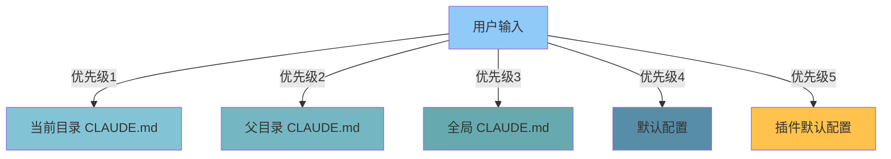

# 08 - 配置系统

## 📋 模块介绍

配置系统管理 Claude Code 的所有设置，包括全局配置、项目配置和用户偏好。本章将详细讲解配置的层级、加载机制和使用技巧。

---

## 🟢 入门级：配置基础认知

### 🤔 什么是配置？

#### 简单理解

**配置就像Claude Code的"设置"**，可以控制它的各种行为和功能。

**类比理解**：
```
设置手机：
- 静音/震动/铃声/壁纸
- 通知/勿扰/待机时间
- 权限管理/存储空间/应用设置

Claude Code 配置：
- AI模型选择
- 最大Token数
- 插件列表
- 文件读写权限
- 终端执行权限
- Git 操作权限
- 钩子配置
- 代理设置
```

---

### 📦 配置层级



### 配置优先级

```
1. 当前目录CLAUDE.md > 父目录CLAUDE.md > 全局CLAUDE.md
2. 全局CLAUDE.md > 默认配置
3. 用户输入 > 所有配置
```

---

### 🎯 常用配置项

#### 1. AI模型配置

```json
{
  "model": "claude-sonnet-4",
  "maxTokens": 8192,
  "temperature": 0.7
}
```

**配置说明**：

| 参数 | 说明 | 默认值 | 推荐范围 |
|------|------|--------|---------|
| `model` | 模型选择 | `claude-sonnet-4` | 根据需求选择 |
| `maxTokens` | 最大token数 | 8192 | 4096-16384 |
| `temperature` | 创意度 | 0.7 | 0.0-1.0 |

**使用建议**：
- **代码生成**：temperature 0.3-0.5（更精确）
- **创意写作**：temperature 0.7-0.9（更有创意）
- **分析任务**：temperature 0.1-0.3（更确定性）

#### 2. 插件列表

```json
{
  "plugins": [
    "code-review",
    "commit-commands",
    "feature-dev",
    "security-guidance"
  ]
}
```

**配置说明**：
- `plugins`: 启用的插件列表
- 顺序很重要：后面插件的会覆盖前面的
- 全局插件：所有项目都会使用
- 项目插件：只在该项目有效

#### 3. 钩子配置

```json
{
  "hooks": {
    "PreToolUse": [
      {
        "matcher": "Write",
        "hooks": [".claude/hooks/pre-write.sh"]
      }
    ]
  }
}
```

**配置说明**：
- `hooks`: 钩子配置
- 事件类型：`SessionStart`, `PreToolUse`, `PostToolUse`, `Stop`
- `matcher`: 匹配模式
- `hooks`: 要执行的钩子脚本

#### 4. 权限控制

```json
{
  "permissions": {
    "file:read": true,
    "file:write": ["./src/**", "./tests/**"],
    "bash:run": true
  }
}
```

**配置说明**：
- `file:read`: 文件读取权限
- `file:write`: 文件写入权限（可限制路径）
- `bash:run`: 命令执行权限
- `git:read`: Git读取权限
- `git:write`: Git写入权限

---

## 🟡 中级：配置管理与进阶用法

### 🔧 全局配置详解

#### 1. 设置个人偏好

编辑 `~/.claude/CLAUDE.md`：

```markdown
# 个人偏好配置

## 编码风格
- 偏好简洁的代码
- 使用类型注解
- 添加必要注释
- 遵循项目规范

## 沟通方式
- 直接对话告诉Claude
- 逐步建立个人偏好
- 反馈不满意的地方

## 学习模式
- 喜欢详细解释
- 生成完整示例
- 边学边练

## 工具选择
- 优先使用内置工具
- 谨慎使用外部命令
- 检查命令安全性

## 输出偏好
- 详细的步骤说明
- 代码注释完整
- 提供使用示例
```

#### 2. 全局工具配置

```json
{
  "tools": {
    "git": {
      "enabled": true,
      "autoCommit": false,
      "defaultBranch": "main"
    },
    "npm": {
      "enabled": true,
      "autoInstall": true
    },
    "python": {
      "enabled": true,
      "autoVenv": true
    }
  }
}
```

---

### 🔧 项目级配置详解

#### 1. 项目类型检测

```json
{
  "projectType": {
    "typescript": {
      "framework": "React",
      "version": "18.2"
    },
    "python": {
      "framework": "Django",
      "version": "4.2"
    },
    "go": {
      "framework": "Gin",
      "version": "1.21"
    }
  }
}
```

**自动检测逻辑**：
- `package.json` 存在 → JavaScript/TypeScript
- `requirements.txt` 存在 → Python
- `go.mod` 存在 → Go
- `Cargo.toml` 存在 → Rust

#### 2. Git 工作流配置

```json
{
  "git": {
    "workflow": "feature-branch",
    "commit": {
      "format": "conventional",
      "enforce": true
    },
    "branch": {
      "naming": "feature/*",
      "enforce": true
    },
    "pr": {
      "autoCreate": true,
      "template": "default"
    }
  }
}
```

**工作流类型**：
- `feature-branch`: 功能分支工作流
- `gitflow`: Git Flow工作流
- `trunk-based`: 主干开发工作流

#### 3. 测试配置

```json
{
  "test": {
    "framework": "jest",
    "command": "jest",
    "coverage": 80,
    "watchMode": true
  }
}
```

**支持的测试框架**：
- `jest`: JavaScript/TypeScript
- `pytest`: Python
- `go test`: Go
- `cargo test`: Rust

---

### 🔧 环境变量配置

#### 1. 使用环境变量

```json
{
  "env": {
    "API_KEY": "${API_KEY}",
    "DATABASE_URL": "${DATABASE_URL}",
    "NODE_ENV": "${NODE_ENV:-development}"
  }
}
```

**环境变量来源**：
- 系统环境变量
- `.env` 文件
- 项目配置文件

#### 2. 安全配置

```json
{
  "security": {
    "allowedDomains": ["*.example.com"],
    "blockedDomains": ["malicious.com"],
    "apiKey": "${API_KEY}",
    "encryptSensitive": true
  }
}
```

---

## 🔴 专家级：配置系统深度剖析

### ⚙️ 配置加载算法

```typescript
class ConfigLoader {
  async load(cwd: string): Promise<Config> {
    // 1. 从默认配置开始
    let config = this.getDefaultConfig();
    
    // 2. 加载全局配置
    const globalConfig = await this.loadGlobalConfig();
    config = this.merge(config, globalConfig);
    
    // 3. 加载项目配置
    const projectConfig = await this.loadProjectConfig(cwd);
    config = this.merge(config, projectConfig);
    
    // 4. 加载环境变量覆盖
    config = this.applyEnvOverrides(config);
    
    // 5. 验证配置
    this.validate(config);
    
    return config;
  }
  
  private getDefaultConfig(): Config {
    return {
      model: 'claude-sonnet-4',
      maxTokens: 8192,
      temperature: 0.7,
      plugins: [],
      permissions: {
        file: { read: true, write: true },
        bash: { run: true },
        git: { read: true, write: true }
      }
    };
  }
  
  private async loadGlobalConfig(): Promise<Partial<Config>> {
    const configPath = path.join(os.homedir(), '.claude', 'settings.json');
    
    if (await fs.pathExists(configPath)) {
      const content = await fs.readFile(configPath, 'utf-8');
      return JSON.parse(content);
    }
    
    return {};
  }
  
  private async loadProjectConfig(cwd: string): Promise<Partial<Config>> {
    const configPaths = [
      path.join(cwd, '.claude', 'settings.json'),
      path.join(cwd, 'claude.json'),
      path.join(cwd, 'CLAUDE.md')
    ];
    
    for (const configPath of configPaths) {
      if (await fs.pathExists(configPath)) {
        const ext = path.extname(configPath);
        
        if (ext === '.json') {
          const content = await fs.readFile(configPath, 'utf-8');
          return JSON.parse(content);
        } else if (ext === '.md') {
          return this.parseMarkdownConfig(configPath);
        }
      }
    }
    
    return {};
  }
  
  private merge(target: any, source: any): any {
    for (const key of Object.keys(source)) {
      if (source[key] && typeof source[key] === 'object' && !Array.isArray(source[key])) {
        target[key] = { ...target[key], ...source[key] };
      } else if (Array.isArray(source[key])) {
        target[key] = [...(target[key] || []), ...source[key]];
      } else {
        target[key] = source[key];
      }
    }
    return target;
  }
  
  private applyEnvOverrides(config: Config): Config {
    const result = JSON.parse(JSON.stringify(config));
    
    // 替换环境变量
    const replaceEnv = (obj: any): any => {
      if (typeof obj === 'string') {
        return obj.replace(/\$\{([^}]+)\}/g, (_, key) => {
          const [varName, defaultValue] = key.split(':');
          return process.env[varName] || defaultValue || '';
        });
      } else if (Array.isArray(obj)) {
        return obj.map(replaceEnv);
      } else if (typeof obj === 'object' && obj !== null) {
        const result: any = {};
        for (const [k, v] of Object.entries(obj)) {
          result[k] = replaceEnv(v);
        }
        return result;
      }
      return obj;
    };
    
    return replaceEnv(result);
  }
  
  private validate(config: Config): void {
    // 验证必需字段
    if (!config.model) {
      throw new Error('Model is required');
    }
    
    // 验证模型名称
    const validModels = [
      'claude-sonnet-4',
      'claude-opus-4',
      'claude-haiku-4'
    ];
    
    if (!validModels.includes(config.model)) {
      throw new Error(`Invalid model: ${config.model}`);
    }
    
    // 验证maxTokens
    if (config.maxTokens && (config.maxTokens < 1 || config.maxTokens > 128000)) {
      throw new Error('maxTokens must be between 1 and 128000');
    }
    
    // 验证temperature
    if (config.temperature && (config.temperature < 0 || config.temperature > 1)) {
      throw new Error('temperature must be between 0 and 1');
    }
  }
}
```

---

### 🔐 动态配置更新

```typescript
class ConfigWatcher {
  private watchers: Map<string, FSWatcher>;
  
  async watch(configPath: string): Promise<void> {
    const watcher = chokidar.watch(configPath, {
      ignoreInitial: false,
      awaitWrite: true
    });
    
    watcher.on('change', async (path) => {
      console.log(`配置文件已更新: ${path}`);
      const newConfig = await this.load(path);
      this.config = newConfig;
      this.notifyChange(newConfig);
    });
    
    this.watchers.set(configPath, watcher);
  }
  
  async notifyChange(newConfig: Config): Promise<void> {
    console.log('配置已更新');
    
    // 通知其他组件重新加载
    this.emit('config:updated', newConfig);
  }
  
  stop(): void {
    for (const watcher of this.watchers.values()) {
      watcher.close();
    }
    this.watchers.clear();
  }
}
```

---

### 🔐 配置验证与测试

```typescript
class ConfigValidator {
  validate(config: Config): ValidationResult {
    const errors: string[] = [];
    const warnings: string[] = [];
    
    // 验证AI模型
    if (!config.model) {
      errors.push('AI模型未配置');
    } else if (!this.isValidModel(config.model)) {
      warnings.push(`未知模型: ${config.model}`);
    }
    
    // 验证权限
    if (config.permissions) {
      if (!config.permissions.file && !config.permissions.bash) {
        warnings.push('未配置任何权限');
      }
    }
    
    // 验证插件
    if (config.plugins && config.plugins.length > 20) {
      warnings.push('插件数量过多，可能影响性能');
    }
    
    // 验证钩子
    if (config.hooks) {
      for (const [event, hooks] of Object.entries(config.hooks)) {
        if (!this.isValidHookEvent(event)) {
          warnings.push(`未知钩子事件: ${event}`);
        }
      }
    }
    
    return {
      valid: errors.length === 0,
      errors,
      warnings
    };
  }
  
  private isValidModel(model: string): boolean {
    const validModels = [
      'claude-sonnet-4',
      'claude-opus-4',
      'claude-haiku-4'
    ];
    return validModels.includes(model);
  }
  
  private isValidHookEvent(event: string): boolean {
    const validEvents = [
      'SessionStart',
      'PreToolUse',
      'PostToolUse',
      'PreResponse',
      'Stop'
    ];
    return validEvents.includes(event);
  }
}
```

---

### 🔐 性能优化策略

```typescript
class ConfigOptimizer {
  private cache: Map<string, CachedConfig> = new Map();
  
  async get<T>(key: string, factory: () => Promise<T>): Promise<T> {
    // 检查缓存
    const cached = this.cache.get(key);
    if (cached && !this.isExpired(cached)) {
      return cached.value;
    }
    
    // 计算并缓存
    const value = await factory();
    this.cache.set(key, {
      value,
      timestamp: Date.now(),
      ttl: 60000  // 60秒缓存
    });
    
    return value;
  }
  
  private isExpired(cached: CachedConfig): boolean {
    return Date.now() - cached.timestamp > cached.ttl;
  }
}
```

---

## 🚨 故障排查

### 常见问题与解决方案

#### 1. 配置未生效

**症状**：
```
claude> 使用配置
[配置未生效]
```

**可能原因**：
- 配置文件格式错误
- 配置路径不正确
- 优先级被覆盖

**解决方案**：
```bash
# 1. 检查配置文件语法
cat .claude/settings.json | jq .

# 2. 检查配置路径
pwd
ls -la .claude/

# 3. 检查配置优先级
claude> 查看配置优先级
```

#### 2. 环境变量未替换

**症状**：
```
claude> 检查配置
${API_KEY} 未被替换
```

**可能原因**：
- 环境变量未设置
- 语法错误

**解决方案**：
```bash
# 1. 检查环境变量
echo $API_KEY

# 2. 检查语法
cat settings.json | grep API_KEY

# 3. 设置环境变量
export API_KEY="your-key"
```

#### 3. 配置验证失败

**症状**：
```
claude> 加载配置
[配置验证失败]
```

**可能原因**：
- 配置格式错误
- 参数值无效

**解决方案**：
```bash
# 1. 验证配置语法
claude> 验证配置文件

# 2. 查看详细错误
claude> 显示配置验证详情

# 3. 修复错误
编辑配置文件
```

---

## 📊 最佳实践清单

### 配置管理

- [ ] 使用清晰的配置结构
- [ ] 实现配置继承
- [ ] 添加配置验证
- [ ] 提供配置示例
- [ ] 支持环境变量

### 配置优化

- [ ] 使用配置缓存
- [ ] 实现热重载
- [ ] 监控配置变化
- [ ] 优化配置加载
- [ ] 记录配置变更

### 配置安全

- [ ] 敏感信息使用环境变量
- [ ] 不要硬编码密钥
- [ ] 使用配置加密
- [ ] 限制配置权限
- [ ] 定期轮换密钥

---

## 📚 实战案例：配置管理系统

### 需求
创建一个智能配置管理系统，支持环境切换、项目切换、配置热更新。

### 实现

#### 1. 环境切换功能

```typescript
// config/env-switcher.ts
class ConfigManager {
  private currentEnv: 'development' | 'staging' | 'production';
  
  async switchEnvironment(env: 'development' | 'staging' | 'production'): Promise<void> {
    const envs = ['development', 'staging', 'production'];
    const currentIndex = envs.indexOf(env);
    const nextIndex = (currentIndex + 1) % envs.length;
    
    console.log(`切换环境: ${env} -> ${envs[nextIndex]}`);
    
    this.currentEnv = envs[nextIndex] as any;
    await this.applyConfig(this.currentEnv);
  }
  
  async applyConfig(env: string): Promise<void> {
    const configs: Record<string, Config> = {
      development: {
        model: 'claude-sonnet-4',
        maxTokens: 4096,
        temperature: 0.3
      },
      staging: {
        model: 'claude-sonnet-4',
        maxTokens: 8192,
        temperature: 0.5
      },
      production: {
        model: 'claude-opus-4',
        maxTokens: 16384,
        temperature: 0.7
      }
    };
    
    const config = configs[env];
    this.config = config;
    console.log(`应用配置: ${env}模式`);
  }
}
```

#### 2. 项目切换功能

```typescript
// config/project-switcher.ts
class ProjectConfigManager {
  async switchProject(projectName: string): Promise<void> {
    const projects = ['frontend', 'backend', 'shared'];
    
    if (!projects.includes(projectName)) {
      throw new Error(`Unknown project: ${projectName}`);
    }
    
    console.log(`切换到项目: ${projectName}`);
    await this.switchProjectContext(projectName);
  }
  
  private async switchProjectContext(projectName: string): Promise<void> {
    // 加载项目配置
    const projectPath = this.getProjectPath(projectName);
    const projectConfig = await this.loadProjectConfig(projectPath);
    
    // 应用项目配置
    this.config.project = projectConfig;
    console.log(`项目配置已应用: ${projectName}`);
  }
}
```

---

## ✅ 章节总结

### 入门级要点
- ✅ 理解配置的层级结构
- ✅ 掌握常用配置项
- ✅ 学会项目级配置
- ✅ 学会环境变量配置

### 中级要点
- ✅ 掌握配置加载顺序
- ✅ 理解环境变量覆盖
- ✅ 学会Git工作流配置
- ✅ 学会测试配置
- ✅ 掌握项目类型检测

### 专家级要点
- ✅ 深入配置加载机制
- ✅ 掌握动态配置更新
- ✅ 掌握性能优化策略
- ✅ 理解配置管理系统
- ✅ 掌握配置验证方法
- ✅ 掌握故障排查技巧

### 📊 相关图表

- **配置加载流程图**：展示从默认→全局→项目→环境的加载过程
- **配置优先级图**：展示不同配置的覆盖关系
- **动态配置更新流程图**：展示热更新机制

**详细图表**：[📊 可视化图表集](./VISUAL_GUIDE.md#配置系统)

---

**下一步：** 学习 [09 - 文件操作与上下文管理](./09-file-context.md) 🚀
