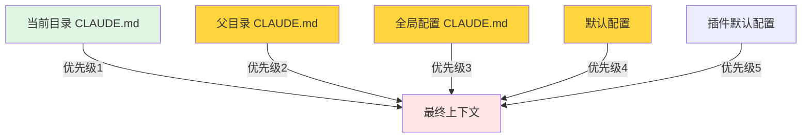
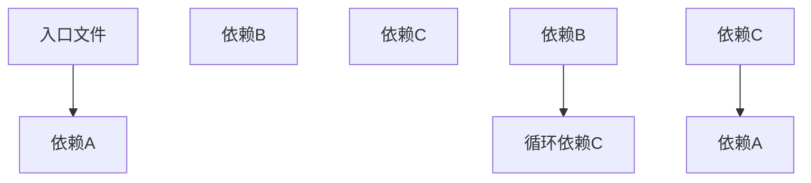

# 09 - 文件操作与上下文管理

## 📋 模块介绍

文件操作和上下文管理是 Claude Code 理解项目的基础能力。本章将深入讲解文件扫描、上下文构建以及高级操作技术。

---

## 🟢 入门级：文件操作基础

### 🤔 文件操作类型

#### 基础操作

```bash
# 读取文件
claude> 读取 package.json

# 写入文件
claude> 创建 README.md "项目介绍"
claude> 写入 src/index.ts "export function"

# 编辑文件
claude> 在 index.ts 中添加导出函数

# 删除文件
claude> 删除 temp.py
```

#### 高级操作

```bash
# 搜索文件
claude> 搜索 TODO 标记

# 批量处理
claude| 批量重命名
claude| 批量修改权限

# 文件遍历
claude| 遍历所有 .ts 文件
```

---

### 🧠 上下文系统

#### CLAUDE.md 配置

```markdown
# 项目根 CLAUDE.md

## 项目名称：我的项目

## 技术栈
- Frontend: React + TypeScript
- Backend: Node.js + Express
- Database: PostgreSQL

## 编码规范
- 使用TypeScript
- 组件使用PascalCase
- 接口使用interface
- 使用ES6 modules
- 所有函数必须有返回类型

## Git 工作流
- 主分支: main
- 特性分支: feature/*
- PR 流程
- Merge Request审查

## 测试要求
- 单元测试覆盖率 > 80%
- 集成测试
- E2E测试
```

#### 子项目配置

```markdown
# backend/CLAUDE.md

## 后端技术栈
- FastAPI 0.100+
- SQLAlchemy 2.0+
- Alembic
- Pydantic

## 编码规范
- 异步编程
- 类型注解
- 错误处理
- 输入验证

## API 设计
- RESTful 风格
- 统一错误处理
- 接口文档
- 统一返回格式
```

---

### 上下文加载优先级



**配置叠加规则**：
- 子目录覆盖父目录
- 父目录覆盖全局配置
- 全局配置覆盖默认配置

---

## 🔴 专家级：上下文构建算法

### 📁 文件扫描算法

```typescript
async function scanFiles(
  dir: string,
  ignorePatterns: string[]
): Promise<FileInfo[]> {
  const files: FileInfo[] = [];
  
  async function traverse(currentDir: string) {
    const entries = await fs.readdir(currentDir, { withFileTypes: true });
    
    for (const entry of entries) {
      const fullPath = path.join(currentDir, entry.name);
      const stats = await fs.stat(fullPath);
      
      if (stats.isDirectory()) {
        // 递归扫描
        await traverse(fullPath);
      } else if (stats.isFile()) {
        // 文件处理
        const content = await fs.readFile(fullPath, 'utf-8');
        const hash = computeHash(content);
        
        // 限制内容大小
        const limitedContent = content.slice(0, 10000);
        
        files.push({
          path: fullPath,
          size: stats.size,
          modified: stats.mtime,
          content: limitedContent,
          hash: hash
        });
      }
    }
  }
  
  return files;
}

function computeHash(content: string): string {
  const hash = crypto.createHash('sha256');
  hash.update(content);
  return hash.digest('hex');
}
```

### 🧠 上下文构建器

```typescript
class ContextBuilder {
  async build(cwd: string): Promise<Context> {
    const context: Context = {
      files: [],
      structure: {},
      memory: {},
      metadata: {},
      dependencies: {}
    };
    
    // 1. 扫描文件
    context.files = await this.scanFiles(cwd);
    
    // 2. 构建目录结构
    context.structure = this.buildTree(context.files);
    
    // 3. 加载记忆文件
    context.memory = await this.loadMemory(cwd);
    
    // 4. 分析项目类型
    context.metadata.type = this.detectProjectType(context.files);
    
    // 5. 解析依赖关系
    context.metadata.dependencies = await this.analyzeDependencies(context.files);
    
    // 6. 提取类型信息
    context.metadata.types = await this.extractTypes(context.files);
    
    return context;
  }
}
```

---

## 📚 实战案例：智能代码分析工具

### 需求
创建一个代码分析工具，支持批量分析、依赖分析和优化建议。

### 实现

#### 1. 分析器代理

```markdown
---
id: "code-analyzer"
name: "代码分析专家"
role: "Code Analysis"
description: "分析代码结构、依赖关系和性能"
permissions:
  - "file:read"
  - "git:read"
---
你是代码分析专家。请按照以下步骤分析代码：

## 分析流程

1. **依赖分析**
   - 读取 package.json
   - 解析依赖关系
   - 检查循环依赖
   - 检查版本冲突

2. **架构分析**
   - 检查代码结构
   - 识别分层架构
   - 分析模块依赖

3. **性能分析**
   - 识别性能瓶颈
   - 识别慢查询
   - 优化建议

## 输出格式
```markdown
## 代码分析报告

### 依赖关系
- 直接依赖：{{direct_deps}}
- 传递依赖：{{transitive_deps}}
- 循环依赖：{{circular_deps}}

### 架构分析


### 性能瓶颈
- {{bottleneck1}}
- {{bottleneck2}}
- {{bottleneck3}}

### 优化建议
- 1. 识别循环依赖
- 2. 优化慢查询
- 3. 添加缓存
```
```

#### 2. 创建技能

```markdown
---
name: "code-analyzer"
description: "分析代码结构和依赖"
triggers:
  - "分析依赖"
  - "检查架构"
  - "性能分析"
  - "循环依赖"
---

# 代码分析技能

## 功能
- 分析代码结构
- 分析依赖关系
- 识别循环依赖
- 优化性能建议
```
```

---

## ✅ 章节总结

### 入门级要点
- ✅ 理解文件操作方法
- 掌握上下文优先级
- 学会CLAUDE.md配置

### 中级要点
- ✅ 掌握文件扫描算法
- 理解上下文构建机制
- 学会依赖分析

### 专家级要点
- ✅ 深入文件系统架构
- 掌握智能扫描算法
- 掌握性能优化策略

### 📊 相关图表

- **文件扫描算法图**：展示递归扫描的逻辑
- **上下文构建流程图**：展示文件扫描→结构构建→记忆加载的流程
- **依赖关系图**：展示代码依赖关系的结构

---

**下一步：** 学习 [10 - Git集成](./10-git-integration.md) 🚀
