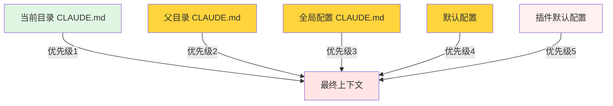
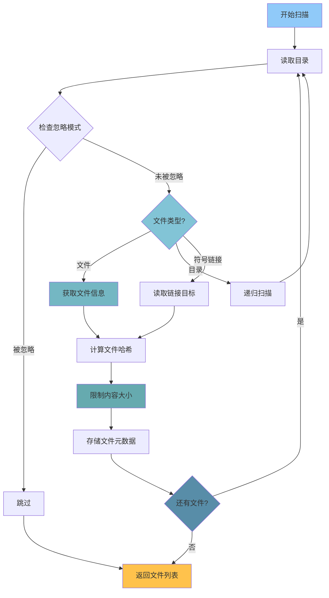
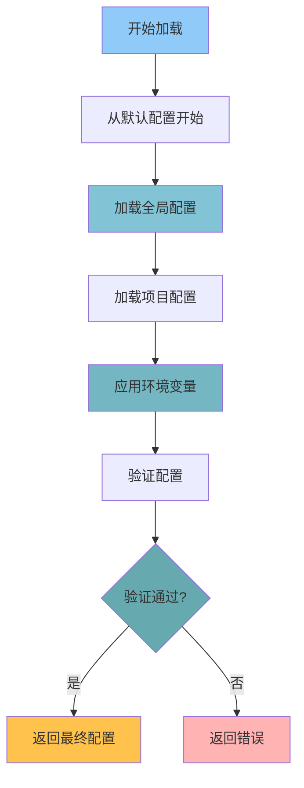
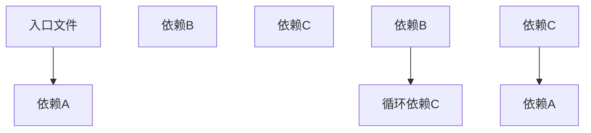

# 09 - 文件操作与上下文管理

## 📋 模块介绍

文件操作和上下文管理是 Claude Code 理解项目的基础能力。本章将深入讲解文件扫描、上下文构建以及高级操作技术。

---

## 🟢 入门级：文件操作基础

### 🤔 文件操作类型

#### 基础操作

```bash
# 读取文件
claude> 读取 package.json

# 写入文件
claude> 创建 README.md "项目介绍"
claude> 写入 src/index.ts "export function hello() {}"

# 编辑文件
claude> 在 index.ts 中添加导出函数

# 删除文件
claude> 删除 temp.py
```

#### 高级操作

```bash
# 搜索文件
claude> 搜索 TODO 标记

# 批量处理
claude> 批量重命名 .js 文件为 .ts
claude> 批量修改文件权限

# 文件遍历
claude> 遍历所有 .ts 文件

# 文件比较
claude> 比较 file1.txt 和 file2.txt
```

---

### 🧠 上下文系统

#### CLAUDE.md 配置

```markdown
# 项目根 CLAUDE.md

## 项目名称：我的项目

## 技术栈
- Frontend: React + TypeScript
- Backend: Node.js + Express
- Database: PostgreSQL

## 编码规范
- 使用TypeScript
- 组件使用PascalCase
- 接口使用interface
- 使用ES6 modules
- 所有函数必须有返回类型

## Git 工作流
- 主分支: main
- 特性分支: feature/*
- PR 流程
- Merge Request审查

## 测试要求
- 单元测试覆盖率 > 80%
- 集成测试
- E2E测试
```

#### 子项目配置

```markdown
# backend/CLAUDE.md

## 后端技术栈
- FastAPI 0.100+
- SQLAlchemy 2.0+
- Alembic
- Pydantic

## 编码规范
- 异步编程
- 类型注解
- 错误处理
- 输入验证

## API 设计
- RESTful 风格
- 统一错误处理
- 接口文档
- 统一返回格式
```

---

### 上下文加载优先级



**配置叠加规则**：
- 子目录覆盖父目录
- 父目录覆盖全局配置
- 全局配置覆盖默认配置

---

## 🟡 中级：文件扫描与上下文构建

### 📁 文件扫描算法

#### 智能扫描策略

```typescript
async function scanFiles(
  dir: string,
  ignorePatterns: string[]
): Promise<FileInfo[]> {
  const files: FileInfo[] = [];
  
  async function traverse(currentDir: string) {
    const entries = await fs.readdir(currentDir, { withFileTypes: true });
    
    for (const entry of entries) {
      const fullPath = path.join(currentDir, entry.name);
      
      // 检查是否应该忽略
      if (shouldIgnore(entry.name, ignorePatterns)) {
        continue;
      }
      
      const stats = await fs.stat(fullPath);
      
      if (stats.isDirectory()) {
        // 递归扫描
        await traverse(fullPath);
      } else if (stats.isFile()) {
        // 文件处理
        const content = await fs.readFile(fullPath, 'utf-8');
        const hash = computeHash(content);
        
        // 限制内容大小
        const limitedContent = content.slice(0, 10000);
        
        files.push({
          path: fullPath,
          size: stats.size,
          modified: stats.mtime,
          content: limitedContent,
          hash: hash
        });
      }
    }
  }
  
  return files;
}

function shouldIgnore(filename: string, patterns: string[]): boolean {
  return patterns.some(pattern => {
    const regex = new RegExp(
      pattern.replace(/\*\*/g, '.*').replace(/\*/g, '[^/]*')
    );
    return regex.test(filename);
  });
}

function computeHash(content: string): string {
  const hash = crypto.createHash('sha256');
  hash.update(content);
  return hash.digest('hex');
}
```

#### 文件扫描流程图



---

### 🧠 上下文构建器

```typescript
class ContextBuilder {
  async build(cwd: string): Promise<Context> {
    const context: Context = {
      files: [],
      structure: {},
      memory: {},
      metadata: {},
      dependencies: {}
    };
    
    // 1. 扫描文件
    context.files = await this.scanFiles(cwd);
    
    // 2. 构建目录结构
    context.structure = this.buildTree(context.files);
    
    // 3. 加载记忆文件
    context.memory = await this.loadMemory(cwd);
    
    // 4. 分析项目类型
    context.metadata.type = this.detectProjectType(context.files);
    
    // 5. 解析依赖关系
    context.metadata.dependencies = await this.analyzeDependencies(context.files);
    
    // 6. 提取类型信息
    context.metadata.types = await this.extractTypes(context.files);
    
    return context;
  }
  
  private buildTree(files: FileInfo[]): FileTree {
    const tree: FileTree = {};
    
    for (const file of files) {
      const parts = file.path.split(path.sep);
      let current = tree;
      
      for (let i = 0; i < parts.length; i++) {
        const part = parts[i];
        
        if (i === parts.length - 1) {
          // 文件
          current[part] = {
            type: 'file',
            size: file.size,
            modified: file.modified,
            hash: file.hash
          };
        } else {
          // 目录
          if (!current[part]) {
            current[part] = { type: 'directory', children: {} };
          }
          current = (current[part] as DirectoryNode).children;
        }
      }
    }
    
    return tree;
  }
  
  private detectProjectType(files: FileInfo[]): string {
    // 检查项目标识文件
    const packageJson = files.find(f => f.path.endsWith('package.json'));
    if (packageJson) {
      const content = JSON.parse(packageJson.content);
      if (content.dependencies?.react) return 'react';
      if (content.dependencies?.vue) return 'vue';
      return 'nodejs';
    }
    
    const requirementsTxt = files.find(f => f.path.endsWith('requirements.txt'));
    if (requirementsTxt) return 'python';
    
    const goMod = files.find(f => f.path.endsWith('go.mod'));
    if (goMod) return 'go';
    
    return 'unknown';
  }
  
  private async analyzeDependencies(files: FileInfo[]): Promise<Dependencies> {
    const deps: Dependencies = {};
    
    for (const file of files) {
      if (file.path.endsWith('package.json')) {
        const content = JSON.parse(file.content);
        deps[file.path] = {
          dependencies: content.dependencies || {},
          devDependencies: content.devDependencies || {}
        };
      }
    }
    
    return deps;
  }
  
  private async extractTypes(files: FileInfo[]): Promise<TypeInfo[]> {
    const types: TypeInfo[] = [];
    
    for (const file of files) {
      if (file.path.endsWith('.ts') || file.path.endsWith('.tsx')) {
        // 提取TypeScript类型信息
        const typeMatches = file.content.match(/(?:interface|type|class)\s+(\w+)/g);
        if (typeMatches) {
          types.push({
            file: file.path,
            types: typeMatches.map(m => m.split(' ')[1])
          });
        }
      }
    }
    
    return types;
  }
}
```

---

### 🔍 上下文加载算法



---

## 🔴 专家级：上下文管理深度剖析

### ⚡ 性能优化策略

#### 1. 文件缓存

```typescript
class FileCache {
  private cache: Map<string, CachedFile>;
  private maxSize: number;
  
  constructor(maxSize: number = 1000) {
    this.cache = new Map();
    this.maxSize = maxSize;
  }
  
  async get(path: string): Promise<FileContent | null> {
    const cached = this.cache.get(path);
    
    if (cached && !this.isExpired(cached)) {
      cached.lastAccessed = Date.now();
      return cached.content;
    }
    
    return null;
  }
  
  async set(path: string, content: FileContent): Promise<void> {
    // 检查缓存大小
    if (this.cache.size >= this.maxSize) {
      this.evictOldest();
    }
    
    this.cache.set(path, {
      content,
      createdAt: Date.now(),
      lastAccessed: Date.now()
    });
  }
  
  private isExpired(cached: CachedFile): boolean {
    return Date.now() - cached.createdAt > 3600000; // 1小时
  }
  
  private evictOldest(): void {
    let oldest = null;
    let oldestTime = Infinity;
    
    for (const [path, cached] of this.cache) {
      if (cached.lastAccessed < oldestTime) {
        oldest = path;
        oldestTime = cached.lastAccessed;
      }
    }
    
    if (oldest) {
      this.cache.delete(oldest);
    }
  }
}
```

#### 2. 增量扫描

```typescript
class IncrementalScanner {
  private previousState: Map<string, string>;
  
  async scan(dir: string): Promise<ScanResult> {
    const currentState = new Map<string, string>();
    const changes: FileChange[] = [];
    
    // 扫描当前状态
    const files = await this.scanAll(dir);
    for (const file of files) {
      currentState.set(file.path, file.hash);
    }
    
    // 比较变化
    for (const [path, hash] of currentState) {
      const previousHash = this.previousState.get(path);
      
      if (!previousHash) {
        // 新文件
        changes.push({ type: 'added', path, hash });
      } else if (previousHash !== hash) {
        // 修改的文件
        changes.push({ type: 'modified', path, hash });
      }
    }
    
    // 检查删除的文件
    for (const [path] of this.previousState) {
      if (!currentState.has(path)) {
        changes.push({ type: 'deleted', path, hash: '' });
      }
    }
    
    // 更新状态
    this.previousState = currentState;
    
    return { files, changes };
  }
}
```

---

### 🔄 上下文更新机制

```typescript
class ContextUpdater {
  private watchers: Map<string, FSWatcher>;
  
  watch(cwd: string, callback: UpdateCallback): void {
    const watcher = chokidar.watch(cwd, {
      ignored: /(^|[\/\\])\../, // 忽略点文件
      persistent: true
    });
    
    watcher.on('change', (path) => {
      callback({ type: 'modified', path });
    });
    
    watcher.on('add', (path) => {
      callback({ type: 'added', path });
    });
    
    watcher.on('unlink', (path) => {
      callback({ type: 'deleted', path });
    });
    
    this.watchers.set(cwd, watcher);
  }
  
  unwatch(cwd: string): void {
    const watcher = this.watchers.get(cwd);
    if (watcher) {
      watcher.close();
      this.watchers.delete(cwd);
    }
  }
}
```

---

### 🚨 故障排查

### 常见问题与解决方案

#### 1. 上下文加载失败

**症状**：
```
claude> 加载项目上下文
[上下文加载失败]
```

**可能原因**：
- CLAUDE.md 格式错误
- 配置文件权限问题
- 路径不存在

**解决方案**：
```bash
# 1. 检查CLAUDE.md格式
cat CLAUDE.md

# 2. 检查文件权限
ls -la CLAUDE.md

# 3. 验证路径
pwd
```

#### 2. 文件扫描缓慢

**症状**：
```
claude> 扫描文件
[扫描缓慢]
```

**可能原因**：
- 文件数量过多
- 网络文件系统
- 磁盘I/O瓶颈

**解决方案**：
```bash
# 1. 使用增量扫描
claude> 启用增量扫描

# 2. 限制扫描深度
claude> 限制扫描深度为3层

# 3. 排除不必要的目录
claude> 排除node_modules目录
```

#### 3. 上下文内存占用过高

**症状**：
```
claude> 检查内存占用
[内存占用过高]
```

**可能原因**：
- 缓存过多文件
- 大文件未限制
- 内存泄漏

**解决方案**：
```bash
# 1. 清理缓存
claude> 清理文件缓存

# 2. 限制文件大小
claude> 限制单个文件大小为10KB

# 3. 启用缓存淘汰
claude> 启用LRU缓存淘汰
```

---

## 📊 最佳实践清单

### 文件操作

- [ ] 使用增量扫描
- [ ] 限制文件大小
- [ ] 实现缓存策略
- [ ] 处理错误和重试
- [ ] 监控性能指标

### 上下文管理

- [ ] 使用清晰的配置结构
- [ ] 实现配置继承
- [ ] 添加配置验证
- [ ] 提供配置示例
- [ ] 支持热重载

### 性能优化

- [ ] 使用文件缓存
- [ ] 实现增量更新
- [ ] 限制扫描范围
- [ ] 优化内存使用
- [ ] 监控性能指标

---

## 📚 实战案例：智能代码分析工具

### 需求
创建一个代码分析工具，支持批量分析、依赖分析和优化建议。

### 实现

#### 1. 分析器代理

```markdown
---
id: "code-analyzer"
name: "代码分析专家"
role: "Code Analysis"
description: "分析代码结构、依赖关系和性能"
permissions:
  - "file:read"
  - "git:read"
---

你是代码分析专家。请按照以下步骤分析代码：

## 分析流程

1. **依赖分析**
   - 读取 package.json
   - 解析依赖关系
   - 检查循环依赖
   - 检查版本冲突

2. **架构分析**
   - 检查代码结构
   - 识别分层架构
   - 分析模块依赖

3. **性能分析**
   - 识别性能瓶颈
   - 识别慢查询
   - 优化建议

## 输出格式
```markdown
## 代码分析报告

### 依赖关系
- 直接依赖：{{direct_deps}}
- 传递依赖：{{transitive_deps}}
- 循环依赖：{{circular_deps}}

### 架构分析


### 性能瓶颈
- {{bottleneck1}}
- {{bottleneck2}}
- {{bottleneck3}}

### 优化建议
- 1. 识别循环依赖
- 2. 优化慢查询
- 3. 添加缓存
```
```

#### 2. 创建技能

```markdown
---
name: "code-analyzer"
description: "分析代码结构和依赖"
triggers:
  - "分析依赖"
  - "检查架构"
  - "性能分析"
  - "循环依赖"
---

# 代码分析技能

## 功能
- 分析代码结构
- 分析依赖关系
- 识别循环依赖
- 优化性能建议
```

#### 3. 使用

```bash
# 分析项目
claude> 分析这个项目的代码结构

# Claude会自动：
# 1. 扫描文件
# 2. 分析依赖
# 3. 生成报告
```

---

## ✅ 章节总结

### 入门级要点
- ✅ 理解文件操作方法
- ✅ 掌握上下文优先级
- ✅ 学会CLAUDE.md配置

### 中级要点
- ✅ 掌握文件扫描算法
- ✅ 理解上下文构建机制
- ✅ 学会依赖分析
- ✅ 掌握类型提取

### 专家级要点
- ✅ 深入文件系统架构
- ✅ 掌握智能扫描算法
- ✅ 掌握性能优化策略
- ✅ 理解缓存机制
- ✅ 掌握增量扫描
- ✅ 理解上下文更新机制
- ✅ 掌握故障排查方法

### 📊 相关图表

- **文件扫描算法图**：展示递归扫描的逻辑
- **上下文构建流程图**：展示文件扫描→结构构建→记忆加载的流程
- **依赖关系图**：展示代码依赖关系的结构
- **上下文加载算法图**：展示配置加载的完整流程
- **文件扫描流程图**：展示文件系统的扫描逻辑

**详细图表**：[📊 可视化图表集](./VISUAL_GUIDE.md#文件操作)

---

**下一步：** 学习 [10 - Git集成](./10-git-integration.md) 🚀
