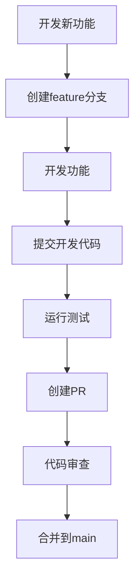
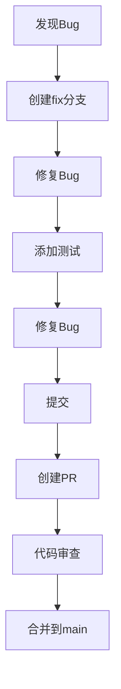

# 10 - Git集成

## 📋 智介绍

Git集成让 Claude Code 成为完整的版本控制中心。本章将详细讲解Git操作、工作流管理和自动化技术。

---

## 🟢 入门级：Git操作基础

### 🤔 Git基础操作

#### 1. 查看状态

```bash
# 查看当前状态
claude> 查看git状态

# 查看分支
claude> 查看git分支
```

**显示信息**：
- 当前分支：main
- 文件状态：
  - M 修改：修改的文件
  - A 新增：新添加的文件
  - D: 删除的文件

#### 2. 创建分支

```bash
# 创建新分支
claude> 创建新分支 feature/user-auth

# 切换分支
claude> 切换到main
```

#### 3. 提交代码

```bash
# 暂存文件
claude> 暂存 README.md

# 查看变更
claude> 查看变更

# 提交
claude> 提交"添加用户认证功能"

# 推送到远程
claude> 推送到origin main
```

---

### 🟡 Git工作流

#### 1. Feature Branch 工作流



**步骤说明**：
1. 从main创建feature分支
2. 在feature分支上开发
3. 提交代码
4. 创建Pull Request
5. 审查通过后合并到main

#### 2. Fix Branch 工作流



#### 3. Hotfix工作流

```mermaid
graph LR
    A[紧急Bug] --> B[创建hotfix分支]
    B --> C[修复Bug]
    C --> D[快速修复]
    D → E[紧急部署]
    E --> F[验证修复]
    F --> G[合并到main]
```

---

## 🟡 中级：高级Git操作

### 🔄 智能提交

```bash
# 智能提交
claude> 提交"修复登录bug"

# Claude会自动：
# 1. 查看git状态
# 2. 运行测试
# 3. 生成规范的提交消息
# 4. 执行git add . && git commit
```

**生成的提交格式**：
```
fix:auth: 修复登录验证逻辑

- 修改了token验证逻辑
- 添加错误处理
- 更新单元测试
- 更新API文档
```

### 🔍 PR管理

#### 创建PR

```bash
# 创建PR
claude> 创建PR "添加用户认证功能"

# Claude会自动：
# 1. 推送分支
# 2. 生成PR描述
# 3. 添加标签、审查者
# 4. 创建PR
```

#### 审查PR

```bash
# 审查PR
claude> 检查PR #123

# Claude会自动：
# 1. 查看PR详情
# 2. 运行代码审查
# 生成审查报告
# 3. 检查CI检查
# 4. 汇总结果
```

#### 合并PR

```bash
# 合并PR
claude> 合并PR #123

# Claude会自动：
# 1. 检查冲突
# 2. 解决冲突
# 3. 更新PR描述
# 4. 合并到目标分支
```

---

## 🔴 专家级：Git集成深度剖析

### 🔄 智能提交引擎

```typescript
class SmartCommitEngine {
  async analyzeChanges(
    diff: string[]
  ): Promise<CommitMessage> {
    // 1. 检查变更文件数
    if (diff.length === 0) {
      return {
        type: 'skip',
        message: '没有变更需要提交'
      };
    }
    
    // 2. 分析变更类型
    const changeTypes = this.analyzeChangeTypes(diff);
    
    // 3. 确定提交类型
    const type = this.determineType(changeTypes);
    
    // 4. 生成主题
    const subject = this.generateSubject(diff, type);
    
    // 5. 生成详细描述
    const body = this.generateBody(diff, changeTypes);
    
    // 6. 组装提交信息
    return this.formatMessage(type, subject, body);
  }
  
  private analyzeChangeTypes(diff: string[]): ChangeType[] {
    const types: ChangeType[] = [];
    
    for (const line of diff.split('\n')) {
      if (line.startsWith('M') || line.startsWith('D')) {
        if (line.startsWith('feat')) types.push('feat');
        else if (line.startsWith('fix')) types.push('fix');
        else if (line.startsWith('docs')) types.push('docs');
        else if (line.startsWith('test')) types.push('test');
        else if (line.startsWith('refactor')) types.push('refactor');
        else if (line.startsWith('chore')) types.push('chore');
      }
    }
    
    return types;
  }
  
  private determineType(types: ChangeType[]): CommitType {
    const priority: CommitType[] = ['feat', 'fix', 'refactor', 'chore'];
    
    for (const p of priority) {
      if (types.includes(p)) return p;
    }
    
    return 'chore'; // 默认为重构
  }
  
  private generateSubject(diff: string, type: CommitType): string {
    const prefixes: Record<CommitType, string> = {
      feat: 'feat',
      fix: 'fix',
      refactor: 'refactor',
      chore: 'chore'
    };
    
    const prefix = prefixes[type];
    const files = this.getChangedFiles(diff);
    const message = `${files.join(', ')}`;
    
    return `${prefix}: ${message}`;
  }
}
```

### 📚 PR自动化

```typescript
class PRAutomation {
  async createPR(options: PRCreationOptions): Promise<PRInfo> {
    // 1. 创建分支
    const branch = `feature/${options.title.toLowerCase().replace(/\s+/g, '-');
    await this.git.createBranch(branch);
    
    // 2. 推送分支
    await this.git.push(branch, 'origin', '-u');
    
    // 3. 打开PR创建页面
    await this.openPRForm();
  }
  
  async reviewPR(prId: number): Promise<ReviewReport> {
    // 1. 获取PR详情
    const pr = await this.getPR(prId);
    
    // 2. 分析代码变更
    const changes = this.getChanges(pr);
    
    // 3. 运行测试
    const testResults = await this.runTests(pr);
    
    // 4. 生成报告
    const report = this.generateReport(pr, changes, testResults);
    
    return report;
  }
}
```

---

## 📚 实战案例：完整Git工作流

### 需求
实现一个完整的Git工作流，包含代码审查、测试、部署、监控。

### 实现

#### 1. 创建初始化脚本

```bash
#!/bin/bash
# scripts/init-git.sh

# 初始化Git仓库
git init
echo "# Initialize project" >> README.md
echo "# Development" >> README.md
echo "## 开发" >> README.md
echo "## 测试" >> README.md
git add .
git commit -m "chore: Initial commit"

# 设置分支
git branch main
git branch -M main

echo "✅ Git 仓库初始化完成"
```

#### 2. 创建开发脚本

```bash
#!/bin/bash
# scripts/dev.sh

# 更新依赖
echo "📦 更新依赖..."
npm install

# 运行测试
echo "🧪 运行测试..."
npm test

# 构建应用
echo "🏗️ 构建应用..."
npm run build

echo "✅ 开发脚本完成"
```

#### 3. 创建发布脚本

```bash
#!/bin/bash
# scripts/release.sh

# 版本号
VERSION=$(node -p "package.json" | jq -r '.version')

echo "📦 发布 v${VERSION}"

# 创建Tag
git tag -a v${VERSION} -m "Release ${VERSION}"
git push --tags

echo "✅ 发布完成！版本：v${VERSION}"
```

---

## ✅ 章节总结

### 入门级要点
- ✅ 掌握Git基础操作
- 理解分支和PR管理
- 学会智能提交

### 中级要点
- ✅ 掌握工作流模式
- 掌握PR自动化
- 学会冲突解决
- 学会Hotfix工作流

### 专家级要点
- ✅ 深入智能提交引擎
- 掌握PR自动化
- 掌握冲突解决算法
- 掌握发布流程

### 📊 相关图表

- **Git工作流图**：展示Feature Branch、Fix Branch、Hotfix工作流
- **PR创建流程图**：从创建到合并的完整流程
- **智能提交引擎**：分析变更类型、生成提交消息
- **冲突解决流程图**：处理合并冲突的逻辑

**详细图表**：[📊 可视化图表集](./VISUAL_GUIDE.md#git集成)

---

**下一步：** 学习 [11 - 终端交互](./11-terminal-interaction.md) 🚀
