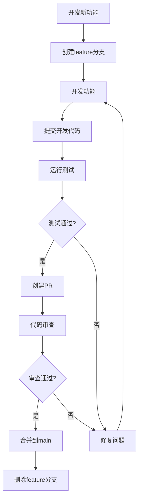
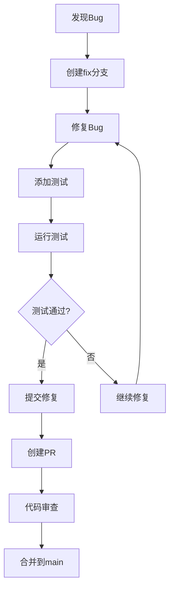

# 10 - Git集成

## 📋 模块介绍

Git集成让 Claude Code 成为完整的版本控制中心。本章将详细讲解Git操作、工作流管理和自动化技术。

---

## 🟢 入门级：Git操作基础

### 🤔 Git基础操作

#### 1. 查看状态

```bash
# 查看当前状态
claude> 查看git状态

# 查看分支
claude> 查看git分支

# 查看远程仓库
claude> 查看远程仓库
```

**显示信息**：
- 当前分支：main
- 文件状态：
  - M 修改：修改的文件
  - A 新增：新添加的文件
  - D: 删除的文件
  - ?? 未跟踪：未跟踪的文件

#### 2. 创建分支

```bash
# 创建新分支
claude> 创建新分支 feature/user-auth

# 切换分支
claude> 切换到main

# 删除分支
claude> 删除分支 feature/user-auth
```

#### 3. 提交代码

```bash
# 暂存文件
claude> 暂存 README.md

# 查看变更
claude> 查看变更

# 提交
claude> 提交"添加用户认证功能"

# 推送到远程
claude> 推送到origin main
```

---

### 🟡 Git工作流

#### 1. Feature Branch 工作流



**步骤说明**：
1. 从main创建feature分支
2. 在feature分支上开发
3. 提交代码
4. 创建Pull Request
5. 审查通过后合并到main
6. 删除feature分支

**优点**：
- ✅ 清晰的分支结构
- ✅ 独立开发环境
- ✅ 易于回滚

**适用场景**：
- 大型项目
- 多人协作
- 需要严格审查

#### 2. Fix Branch 工作流



**优点**：
- ✅ 快速修复
- ✅ 测试驱动
- ✅ 质量保证

**适用场景**：
- 紧急bug修复
- 需要快速验证

#### 3. Hotfix工作流


**优点**：
- ✅ 快速响应
- ✅ 紧急部署
- ✅ 版本标记

**适用场景**：
- 生产环境紧急问题
- 需要立即修复

---

## 🟡 中级：高级Git操作

### 🔄 智能提交

```bash
# 智能提交
claude> 提交"修复登录bug"

# Claude会自动：
# 1. 查看git状态
# 2. 运行测试
# 3. 生成规范的提交消息
# 4. 执行git add . && git commit
```

**生成的提交格式**：
```
fix:auth: 修复登录验证逻辑

- 修改了token验证逻辑
- 添加错误处理
- 更新单元测试
- 更新API文档

Closes #123
```

**提交类型**：
- `feat`: 新功能
- `fix`: 修复bug
- `docs`: 文档更新
- `style`: 代码格式
- `refactor`: 重构
- `test`: 测试
- `chore`: 构建/工具

### 🔍 PR管理

#### 创建PR

```bash
# 创建PR
claude> 创建PR "添加用户认证功能"

# Claude会自动：
# 1. 推送分支
# 2. 生成PR描述
# 3. 添加标签、审查者
# 4. 创建PR
```

**生成的PR描述**：
```markdown
## 添加用户认证功能

### 变更内容
- 实现用户登录
- 实现用户注册
- 添加JWT认证
- 添加权限控制

### 测试
- [ ] 单元测试
- [ ] 集成测试
- [ ] 手动测试

### 审查者
- @reviewer1
- @reviewer2

### 关联Issue
Closes #123
```

#### 审查PR

```bash
# 审查PR
claude> 检查PR #123

# Claude会自动：
# 1. 查看PR详情
# 2. 运行代码审查
# 生成审查报告
# 3. 检查CI检查
# 4. 汇总结果
```

**审查报告**：
```markdown
## PR审查报告 - #123

### 代码质量
- ✅ 代码可读性良好
- ✅ 类型注解完整
- ⚠️ 部分函数过长
- ✅ 错误处理完善

### 安全性
- ✅ 无安全漏洞
- ✅ 权限控制正确
- ✅ 输入验证完善

### 性能
- ✅ 查询优化
- ✅ 缓存策略合理
- ⚠️ 建议添加索引

### 建议
1. 将 `authController.ts:145` 拆分为更小的函数
2. 为 `getUserById` 添加索引
3. 增加集成测试

### 总体评价
✅ 建议合并
```

#### 合并PR

```bash
# 合并PR
claude> 合并PR #123

# Claude会自动：
# 1. 检查冲突
# 2. 解决冲突
# 3. 更新PR描述
# 4. 合并到目标分支
```

---

## 🔴 专家级：Git集成深度剖析

### 🔄 智能提交引擎

```typescript
class SmartCommitEngine {
  async analyzeChanges(diff: string[]): Promise<CommitMessage> {
    // 1. 检查变更文件数
    if (diff.length === 0) {
      return {
        type: 'skip',
        message: '没有变更需要提交'
      };
    }
    
    // 2. 分析变更类型
    const changeTypes = this.analyzeChangeTypes(diff);
    
    // 3. 确定提交类型
    const type = this.determineType(changeTypes);
    
    // 4. 生成主题
    const subject = this.generateSubject(diff, type);
    
    // 5. 生成详细描述
    const body = this.generateBody(diff, changeTypes);
    
    // 6. 组装提交信息
    return this.formatMessage(type, subject, body);
  }
  
  private analyzeChangeTypes(diff: string[]): ChangeType[] {
    const types: ChangeType[] = [];
    
    for (const line of diff.split('\n')) {
      if (line.startsWith('M') || line.startsWith('D') || line.startsWith('A')) {
        if (line.includes('feat') || line.includes('feature')) types.push('feat');
        else if (line.includes('fix') || line.includes('bugfix')) types.push('fix');
        else if (line.includes('docs') || line.includes('doc')) types.push('docs');
        else if (line.includes('test') || line.includes('spec')) types.push('test');
        else if (line.includes('refactor') || line.includes('refac')) types.push('refactor');
        else if (line.includes('style') || line.includes('format')) types.push('style');
        else if (line.includes('chore') || line.includes('build')) types.push('chore');
      }
    }
    
    return types;
  }
  
  private determineType(types: ChangeType[]): CommitType {
    const priority: CommitType[] = ['feat', 'fix', 'refactor', 'docs', 'test', 'style', 'chore'];
    
    for (const p of priority) {
      if (types.includes(p)) return p;
    }
    
    return 'chore'; // 默认为重构
  }
  
  private generateSubject(diff: string, type: CommitType): string {
    const prefixes: Record<CommitType, string> = {
      feat: 'feat',
      fix: 'fix',
      refactor: 'refactor',
      docs: 'docs',
      test: 'test',
      style: 'style',
      chore: 'chore'
    };
    
    const prefix = prefixes[type];
    const files = this.getChangedFiles(diff);
    const message = files.join(', ');
    
    return `${prefix}: ${message}`;
  }
  
  private generateBody(diff: string, changeTypes: ChangeType[]): string {
    const lines: string[] = [];
    
    // 添加变更详情
    const changedFiles = this.getChangedFiles(diff);
    if (changedFiles.length > 0) {
      lines.push('');
      lines.push('### 变更文件');
      changedFiles.forEach(file => {
        lines.push(`- ${file}`);
      });
    }
    
    // 添加具体变更
    lines.push('');
    lines.push('### 详细变更');
    
    if (changeTypes.includes('feat')) {
      lines.push('- 新增功能');
    }
    if (changeTypes.includes('fix')) {
      lines.push('- 修复bug');
    }
    if (changeTypes.includes('refactor')) {
      lines.push('- 重构代码');
    }
    
    return lines.join('\n');
  }
  
  private formatMessage(type: CommitType, subject: string, body: string): CommitMessage {
    return {
      type,
      subject,
      body,
      message: `${subject}\n\n${body}`
    };
  }
}
```

### 📚 PR自动化

```typescript
class PRAutomation {
  async createPR(options: PRCreationOptions): Promise<PRInfo> {
    // 1. 创建分支
    const branch = `feature/${options.title.toLowerCase().replace(/\s+/g, '-')}`;
    await this.git.createBranch(branch);
    
    // 2. 推送分支
    await this.git.push(branch, 'origin', '-u');
    
    // 3. 生成PR描述
    const description = this.generateDescription(options);
    
    // 4. 创建PR
    const pr = await this.github.createPR({
      title: options.title,
      description,
      head: branch,
      base: options.base || 'main',
      labels: options.labels || [],
      reviewers: options.reviewers || []
    });
    
    return pr;
  }
  
  async reviewPR(prId: number): Promise<ReviewReport> {
    // 1. 获取PR详情
    const pr = await this.github.getPR(prId);
    
    // 2. 分析代码变更
    const changes = this.getChanges(pr);
    
    // 3. 运行测试
    const testResults = await this.runTests(pr);
    
    // 4. 生成报告
    const report = this.generateReport(pr, changes, testResults);
    
    return report;
  }
  
  async mergePR(prId: number, options: MergeOptions): Promise<void> {
    // 1. 检查冲突
    const hasConflicts = await this.checkConflicts(prId);
    if (hasConflicts) {
      throw new Error('PR存在冲突，需要解决');
    }
    
    // 2. 合并PR
    await this.github.mergePR(prId, {
      method: options.method || 'merge',
      commitTitle: options.title,
      commitMessage: options.description
    });
    
    // 3. 删除分支
    if (options.deleteBranch) {
      await this.github.deleteBranch(pr.head.ref);
    }
  }
}
```

### 🔐 Git钩子集成

```typescript
class GitHooks {
  async installHook(hookType: GitHookType, script: string): Promise<void> {
    const hookPath = path.join('.git', 'hooks', hookType);
    
    // 创建钩子脚本
    await fs.writeFile(hookPath, script, { mode: 0o755 });
    
    console.log(`${hookType} 钩子已安装`);
  }
  
  async installPreCommitHook(): Promise<void> {
    const script = `#!/bin/bash
# Pre-commit hook

# 运行测试
echo "🧪 运行测试..."
npm test
if [ $? -ne 0 ]; then
  echo "❌ 测试失败"
  exit 1
fi

# 代码格式化
echo "🎨 格式化代码..."
npm run format

# 代码检查
echo "🔍 检查代码..."
npm run lint
if [ $? -ne 0 ]; then
  echo "❌ 代码检查失败"
  exit 1
fi

echo "✅ Pre-commit检查通过"
`;
    
    await this.installHook('pre-commit', script);
  }
  
  async installPrePushHook(): Promise<void> {
    const script = `#!/bin/bash
# Pre-push hook

# 运行完整测试套件
echo "🧪 运行完整测试..."
npm run test:full
if [ $? -ne 0 ]; then
  echo "❌ 测试失败"
  exit 1
fi

# 构建项目
echo "🏗️ 构建项目..."
npm run build
if [ $? -ne 0 ]; then
  echo "❌ 构建失败"
  exit 1
fi

echo "✅ Pre-push检查通过"
`;
    
    await this.installHook('pre-push', script);
  }
}
```

---

### ⚡ 性能优化策略

```typescript
class GitOptimizer {
  private cache: Map<string, GitCache>;
  
  async optimizeRepository(repoPath: string): Promise<void> {
    // 1. 清理无用文件
    await this.cleanUnnecessaryFiles(repoPath);
    
    // 2. 压缩历史记录
    await this.compressHistory(repoPath);
    
    // 3. 优化索引
    await this.optimizeIndex(repoPath);
    
    // 4. 启用增量打包
    await this.enableIncrementalPack(repoPath);
  }
  
  private async cleanUnnecessaryFiles(repoPath: string): Promise<void> {
    // 清理无用分支
    await this.exec(repoPath, 'git remote prune origin');
    
    // 清理未跟踪文件
    await this.exec(repoPath, 'git clean -fd');
    
    // 清理未引用对象
    await this.exec(repoPath, 'git gc --prune=now');
  }
  
  private async compressHistory(repoPath: string): Promise<void> {
    // 压缩松散对象
    await this.exec(repoPath, 'git repack -a -d --depth=250 --window=250');
    
    // 清理引用
    await this.exec(repoPath, 'git reflog expire --expire=now --all');
    
    // 再次清理
    await this.exec(repoPath, 'git gc --prune=now');
  }
  
  private async optimizeIndex(repoPath: string): Promise<void> {
    // 更新索引信息
    await this.exec(repoPath, 'git update-index --refresh');
    
    // 索引统计
    await this.exec(repoPath, 'git fsck --full');
  }
  
  private async enableIncrementalPack(repoPath: string): Promise<void> {
    // 配置增量打包
    await this.exec(repoPath, 'git config pack.windowMemory 100m');
    await this.exec(repoPath, 'git config pack.packSizeLimit 100m');
    await this.exec(repoPath, 'git config pack.deltaCacheSize 100m');
  }
}
```

---

## 🚨 故障排查

### 常见问题与解决方案

#### 1. 提交冲突

**症状**：
```
claude> 提交代码
[冲突检测]
```

**可能原因**：
- 多人同时修改同一文件
- 分支不同步

**解决方案**：
```bash
# 1. 拉取最新代码
claude> 拉取最新代码

# 2. 解决冲突
claude> 解决冲突

# 3. 继续提交
claude> 提交代码
```

#### 2. PR无法合并

**症状**：
```
claude> 合并PR
[合并失败]
```

**可能原因**：
- 冲突未解决
- CI检查失败
- 审查未通过

**解决方案**：
```bash
# 1. 检查冲突
claude> 检查PR冲突

# 2. 检查CI状态
claude> 检查CI状态

# 3. 检查审查状态
claude> 检查审查状态
```

#### 3. 分支丢失

**症状**：
```
claude> 查看分支
[分支丢失]
```

**可能原因**：
- 误删除分支
- 远程分支被删除
- HEAD指针错误

**解决方案**：
```bash
# 1. 查看引用日志
claude> 查看git引用日志

# 2. 恢复分支
claude> 恢复分支

# 3. 重建分支
claude> 重建分支
```

---

## 📊 最佳实践清单

### Git操作

- [ ] 使用语义化提交消息
- [ ] 遵循分支命名规范
- [ ] 提交前运行测试
- [ ] 编写清晰的PR描述
- [ ] 及时合并PR

### 工作流管理

- [ ] 选择合适的工作流
- [ ] 定期同步主分支
- [ ] 保持分支简洁
- [ ] 及时删除已合并分支
- [ ] 使用标签标记版本

### 性能优化

- [ ] 定期清理仓库
- [ ] 使用增量打包
- [ ] 优化提交历史
- [ ] 避免大文件提交
- [ ] 使用Git LFS

---

## 📚 实战案例：完整Git工作流

### 需求
实现一个完整的Git工作流，包含代码审查、测试、部署、监控。

### 实现

#### 1. 创建初始化脚本

```bash
#!/bin/bash
# scripts/init-git.sh

# 初始化Git仓库
git init
echo "# Initialize project" >> README.md
git add .
git commit -m "chore: Initial commit"

# 设置分支
git branch main
git branch -M main

# 设置远程仓库
git remote add origin https://github.com/user/repo.git

echo "✅ Git 仓库初始化完成"
```

#### 2. 创建开发脚本

```bash
#!/bin/bash
# scripts/dev.sh

# 更新依赖
echo "📦 更新依赖..."
npm install

# 运行测试
echo "🧪 运行测试..."
npm test

# 构建应用
echo "🏗️ 构建应用..."
npm run build

echo "✅ 开发脚本完成"
```

#### 3. 创建发布脚本

```bash
#!/bin/bash
# scripts/release.sh

# 版本号
VERSION=$(node -p "require('./package.json').version")

echo "📦 发布 v${VERSION}"

# 运行测试
echo "🧪 运行测试..."
npm test

# 构建应用
echo "🏗️ 构建应用..."
npm run build

# 创建Tag
git tag -a v${VERSION} -m "Release ${VERSION}"
git push --tags

echo "✅ 发布完成！版本：v${VERSION}"
```

#### 4. 安装Git钩子

```bash
#!/bin/bash
# scripts/install-hooks.sh

# 安装pre-commit钩子
cat > .git/hooks/pre-commit << 'EOF'
#!/bin/bash
npm test
if [ $? -ne 0 ]; then
  echo "❌ 测试失败"
  exit 1
fi
EOF

chmod +x .git/hooks/pre-commit

# 安装pre-push钩子
cat > .git/hooks/pre-push << 'EOF'
#!/bin/bash
npm run build
if [ $? -ne 0 ]; then
  echo "❌ 构建失败"
  exit 1
fi
EOF

chmod +x .git/hooks/pre-push

echo "✅ Git钩子已安装"
```

---

## ✅ 章节总结

### 入门级要点
- ✅ 掌握Git基础操作
- ✅ 理解分支和PR管理
- ✅ 学会智能提交
- ✅ 学会基础工作流

### 中级要点
- ✅ 掌握工作流模式
- ✅ 掌握PR自动化
- ✅ 学会冲突解决
- ✅ 学会Hotfix工作流
- ✅ 学会提交消息规范

### 专家级要点
- ✅ 深入智能提交引擎
- ✅ 掌握PR自动化
- ✅ 掌握冲突解决算法
- ✅ 掌握发布流程
- ✅ 掌握Git钩子集成
- ✅ 掌握性能优化策略
- ✅ 理解故障排查方法

### 📊 相关图表

- **Git工作流图**：展示Feature Branch、Fix Branch、Hotfix工作流
- **PR创建流程图**：从创建到合并的完整流程
- **智能提交引擎**：分析变更类型、生成提交消息
- **冲突解决流程图**：处理合并冲突的逻辑

**详细图表**：[📊 可视化图表集](./VISUAL_GUIDE.md#git集成)

---

**下一步：** 学习 [11 - 终端交互](./11-terminal-interaction.md) 🚀
