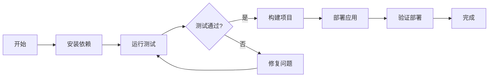

# 11 - 终端交互

## 📋 模块介绍

终端交互是 Claude Code 与操作系统对话的桥梁，可以通过命令行执行各种操作。本章将深入讲解终端操作的高级用法和技巧。

---

## 🟢 入门级：终端操作基础

### 🤔 什么是终端交互？

#### 简单理解

**终端交互就像"控制台"**，让Claude Code能够执行命令行操作。

**类比理解**：

```
传统方式：
1. 打开终端
2. 手动输入命令
3. 查看结果

使用终端交互：
1. 描述需求
2. Claude自动执行
3. 显示结果
```

**核心价值**：
- ⚡ 自动化 - 无需手动输入命令
- 🔄 批处理 - 可以执行多个命令
- 🔁 可重复 - 可以保存和重用
- 📊 可分析 - 可以分析输出结果

---

### 💻 基础操作

#### 1. 命令执行

```bash
# 运行测试
claude> 运行npm test

# 查看目录
claude> 列出当前目录

# 查看进程
claude> 查看进程

# 安装依赖
claude> 安装依赖
```

#### 2. 管道操作

```bash
# 管道输出到文件
claude> 将测试结果写入 test-results.txt

# 合并文件
claude> 合并 log1.txt 和 log2.txt

# 搜索日志
claude> 在日志中搜索 ERROR
```

#### 3. 后台任务

```bash
# 后台运行服务
claude> 后台运行 npm start

# 查看后台任务
claude> 查看后台任务

# 停止后台任务
claude> 停止服务
```

---

### 🎯 命令类型

| 类型 | 说明 | 示例 |
|------|------|------|
| **系统命令** | 操作系统命令 | `ls`, `cd`, `pwd` |
| **开发命令** | 开发工具命令 | `npm`, `pip`, `cargo` |
| **Git命令** | 版本控制命令 | `git commit`, `git push` |
| **管道操作** | 数据处理命令 | `grep`, `awk`, `sed` |

---

### 🌟 高级操作

#### 1. 命令链

```bash
# 顺序执行
claude> 运行npm test && npm run lint

# 失败时停止
claude> 构建项目；如果失败则停止

# 无论如何执行
claude> 运行npm build；无论如何执行部署
```

#### 2. 输出重定向

```bash
# 覆盖输出
claude> 将 npm test 的输出写入 test-results.txt

# 追加输出
claude> 将日志追加到 log.txt

# 错误输出
claude> 将错误写入 error.log
```

#### 3. 条件执行

```bash
# 文件存在则执行
claude> 如果 test.txt 存在则删除

# 目录不存在则创建
claude> 如果 logs 目录不存在则创建

# 环境变量检查
claude> 如果设置了 API_KEY 则运行部署
```

---

## 🟡 中级：终端工作流

### 🔄 开发工作流



**自动化脚本**：

```bash
#!/bin/bash
# .claude/scripts/dev.sh

# 1. 清理
echo "🧹 清理旧文件..."
rm -rf dist

# 2. 安装依赖
echo "📦 安装依赖..."
npm install

# 3. 运行测试
echo "🧪 运行测试..."
npm test

# 4. 构建
echo "🏗️ 构建项目..."
npm run build

# 5. 检查结果
if [ $? -eq 0 ]; then
    echo "✅ 构建成功"
else
    echo "❌ 构建失败"
    exit 1
fi

# 6. 启动服务
echo "🚀 启动服务..."
npm start
```

---

### 🔍 日志分析

#### 查看日志

```bash
# 查看最近日志
claude> 查看最近的100行日志

# 实时监控
claude> 实时监控日志

# 搜索错误
claude> 在日志中搜索 ERROR

# 统计错误类型
claude> 统计日志中的错误类型
```

#### 日志分析脚本

```bash
#!/bin/bash
# .claude/scripts/analyze-logs.sh

LOG_FILE="app.log"

echo "📊 日志分析报告"
echo "================"

# 统计错误
ERROR_COUNT=$(grep -c "ERROR" "$LOG_FILE")
echo "错误数量: $ERROR_COUNT"

# 统计警告
WARN_COUNT=$(grep -c "WARN" "$LOG_FILE")
echo "警告数量: $WARN_COUNT"

# 统计信息
INFO_COUNT=$(grep -c "INFO" "$LOG_FILE")
echo "信息数量: $INFO_COUNT"

# 显示最新错误
echo ""
echo "最新错误:"
grep "ERROR" "$LOG_FILE" | tail -5
```

---

## 🔴 专家级：终端交互深度剖析

### ⚙️ 命令执行引擎

```typescript
class TerminalEngine {
  async execute(command: string): Promise<ExecutionResult> {
    // 1. 解析命令
    const parsed = this.parseCommand(command);
    
    // 2. 检查权限
    if (!this.hasPermission(parsed)) {
      throw new Error('Permission denied');
    }
    
    // 3. 预处理命令
    const processed = this.preprocess(parsed);
    
    // 4. 执行命令
    const result = await this.runCommand(processed);
    
    // 5. 后处理结果
    const final = this.postprocess(result);
    
    return final;
  }
  
  private parseCommand(command: string): ParsedCommand {
    // 分解命令链
    const parts = command.split(/\s*[&|;]\s*/);
    
    return {
      commands: parts.map(p => ({
        command: p.trim(),
        args: p.trim().split(/\s+/)
      })),
      operator: this.detectOperator(command)
    };
  }
  
  private async runCommand(parsed: ParsedCommand): Promise<ExecutionResult> {
    const results: CommandResult[] = [];
    
    for (const cmd of parsed.commands) {
      const result = await this.exec(cmd);
      results.push(result);
      
      // 检查操作符
      if (parsed.operator === '&&' && result.code !== 0) {
        break;
      }
    }
    
    return {
      results,
      success: results.every(r => r.code === 0)
    };
  }
}
```

### 🔐 安全机制

```typescript
class TerminalSecurity {
  validate(command: string): ValidationResult {
    // 1. 检查危险命令
    const dangerous = this.checkDangerousCommands(command);
    if (dangerous) {
      return {
        valid: false,
        reason: 'Dangerous command detected',
        command: dangerous
      };
    }
    
    // 2. 检查路径遍历
    const pathTraversal = this.checkPathTraversal(command);
    if (pathTraversal) {
      return {
        valid: false,
        reason: 'Path traversal attempt detected',
        path: pathTraversal
      };
    }
    
    // 3. 检查命令注入
    const injection = this.checkCommandInjection(command);
    if (injection) {
      return {
        valid: false,
        reason: 'Command injection attempt detected',
        pattern: injection
      };
    }
    
    return { valid: true };
  }
  
  private checkDangerousCommands(command: string): string | null {
    const dangerous = [
      'rm -rf',
      'dd if=',
      ':(){:|:&};:',
      'mkfs'
    ];
    
    for (const d of dangerous) {
      if (command.includes(d)) {
        return d;
      }
    }
    
    return null;
  }
}
```

---

## 📚 实战案例：自动化部署系统

### 需求
创建一个完整的自动化部署系统，支持构建、测试、部署、监控。

### 实现

#### 1. 部署脚本

```bash
#!/bin/bash
# .claude/scripts/deploy.sh

set -e  # 遇到错误立即退出

ENVIRONMENT="${1:-staging}"
VERSION="${2:-latest}"

echo "🚀 开始部署到 $ENVIRONMENT 环境"

# 1. 运行测试
echo "🧪 运行测试..."
npm test

# 2. 构建
echo "🏗️ 构建应用..."
npm run build

# 3. 运行集成测试
echo "🔗 运行集成测试..."
npm run test:integration

# 4. 部署
echo "🚀 部署应用..."
if [ "$ENVIRONMENT" = "production" ]; then
    kubectl apply deployment-prod.yaml
else
    kubectl apply deployment-$ENVIRONMENT.yaml
fi

# 5. 等待部署完成
echo "⏳ 等待部署完成..."
kubectl rollout status deployment/myapp -n $ENVIRONMENT

# 6. 健康检查
echo "🏥 健康检查..."
curl -f http://myapp-$ENVIRONMENT.example.com/health || {
    echo "❌ 健康检查失败"
    exit 1
}

echo "✅ 部署成功！"
```

#### 2. 回滚脚本

```bash
#!/bin/bash
# .claude/scripts/rollback.sh

ENVIRONMENT="${1:-staging}"
VERSION="${2}"

echo "🔄 回滚到版本 $VERSION"

# 1. 停止当前版本
echo "⏹️ 停止当前版本..."
kubectl rollout undo deployment/myapp -n $ENVIRONMENT

# 2. 等待回滚完成
echo "⏳ 等待回滚完成..."
kubectl rollout status deployment/myapp -n $ENVIRONMENT

# 3. 健康检查
echo "🏥 健康检查..."
curl -f http://myapp-$ENVIRONMENT.example.com/health || {
    echo "❌ 健康检查失败"
    exit 1
}

echo "✅ 回滚成功！"
```

---

## ✅ 章节总结

### 入门级要点
- ✅ 理解终端交互的概念
- 掌握基本命令执行
- 了解管道和重定向

### 中级要点
- ✅ 掌握命令链和条件执行
- 掌握日志分析
- 学会自动化脚本
- 掌握开发工作流

### 专家级要点
- ✅ 深入命令执行引擎
- 掌握安全机制
- 掌握性能优化
- 理解命令解析算法

### 📊 相关图表

- **终端执行流程图**：展示命令解析→验证→执行的完整流程
- **开发工作流图**：展示开发到部署的完整流程
- **安全检查流程图**：展示危险命令检测的逻辑

**详细图表**：[📊 可视化图表集](./VISUAL_GUIDE.md#终端交互)

---

**下一步：** 学习 [12 - 安全机制](./12-security.md) 🚀
