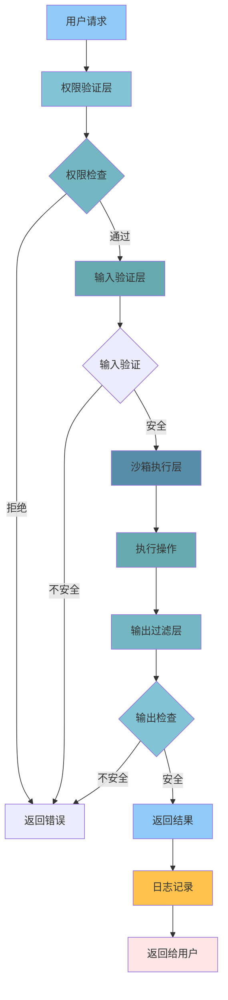

# 12 - 安全机制

## 📋 模块介绍

安全机制是 Claude Code 的重要保障，确保在使用过程中的安全性和隐私保护。本章将详细讲解权限控制、数据保护和安全最佳实践。

---

## 🟢 入门级：安全基础认知

### 🤔 为什么需要安全机制？

#### 潜在风险

```markdown
**如果没有安全机制：**

1. 文件安全
   - 意外删除重要文件
   - 修改敏感配置文件
   - 泄露密码和密钥

2. 系统安全
   - 执行危险命令
   - 感染恶意软件
   - 损坏系统文件

3. 数据安全
   - 代码泄露
   - 敏感信息暴露
   - 隐私数据泄露
```

---

### 🛡️ Claude Code 的安全措施

#### 1. 权限控制

```json
{
  "permissions": {
    "file:read": true,
    "file:write": ["./src/**", "./tests/**"],
    "bash:run": true,
    "git:read": true,
    "git:write": true
  }
}
```

**权限类型**：
- `file:read` - 读取文件
- `file:write` - 写入文件
- `bash:run` - 执行命令
- `git:read` - 读取Git
- `git:write` - 写入Git

#### 2. 沙箱隔离

```typescript
class Sandbox {
  create(plugin: Plugin): SandboxContext {
    return {
      // 受限的API
      fs: this.restrictedFS(plugin),
      http: this.restrictedHTTP(plugin),
      child_process: this.restrictedProcess(plugin),
      
      // 插件专用存储
      storage: this.pluginStorage(plugin.id),
      
      // 日志
      logger: this.createLogger(plugin.id)
    };
  }
}
```

#### 3. 敏感信息检测

```bash
# 检查敏感信息
claude> 检查代码中是否有敏感信息

# Claude会自动扫描：
- API密钥
- 密码
- Token
- 私钥
- 数据库连接字符串
```

---

### 🎯 常见安全威胁

| 威胁 | 说明 | 防护措施 |
|------|------|---------|
| **代码注入** | 恶意代码注入 | 输入验证、沙箱隔离 |
| **命令注入** | 注入恶意命令 | 命令白名单、参数验证 |
| **路径遍历** | 访问任意文件 | 路径规范化、权限检查 |
| **信息泄露** | 泄露敏感信息 | 敏感词检测、数据脱敏 |
| **权限提升** | 越权操作 | 权限隔离、最小权限原则 |

---

## 🟡 中级：安全配置与实践

### 🔧 权限配置

#### 1. 全局权限配置

```json
// ~/.claude/settings.json
{
  "permissions": {
    "file:read": true,
    "file:write": false,
    "bash:run": true,
    "git:read": true,
    "git:write": false
  }
}
```

#### 2. 项目权限配置

```json
// .claude/settings.json
{
  "permissions": {
    "file:read": true,
    "file:write": ["./src/**", "./tests/**"],
    "bash:run": true,
    "git:read": true,
    "git:write": true
  },
  "restrictedPaths": [
    "./config/**",
    "./.env/**",
    "./credentials/**"
  ]
}
```

**配置说明**：
- `file:write` 限制只能写入 src 和 tests 目录
- `restrictedPaths` 列表中的路径被保护

---

### 🔒 敏感信息保护

#### 1. 敏感词检测

```typescript
class SensitiveDataDetector {
  private patterns = [
    /api[_-]?key\s*[=:]\s*['"]?([a-zA-Z0-9_-]+)['"]?/i,
    /secret\s*[=:]\s*['"]?([a-zA-Z0-9_-]+)['"]?/i,
    /password\s*[=:]\s*['"]?([^\s'"]+)['"]?/i,
    /token\s*[=:]\s*['"]?([a-zA-Z0-9_-]+)['"]?/i,
    /private[_-]?key/i
  ];
  
  detect(content: string): SensitiveData[] {
    const findings: SensitiveData[] = [];
    
    for (const pattern of this.patterns) {
      const matches = content.match(pattern);
      if (matches) {
        findings.push({
          type: this.classifyPattern(pattern),
          value: matches[1],
          line: this.getLineNumber(content, matches.index)
        });
      }
    }
    
    return findings;
  }
  
  private classifyPattern(pattern: RegExp): string {
    if (pattern.toString().includes('api[_-]?key')) return 'API_KEY';
    if (pattern.toString().includes('secret')) return 'SECRET';
    if (pattern.toString().includes('password')) return 'PASSWORD';
    if (pattern.toString().includes('token')) return 'TOKEN';
    if (pattern.toString().includes('private[_-]?key')) return 'PRIVATE_KEY';
    return 'UNKNOWN';
  }
}
```

#### 2. 钩子检测

```bash
#!/bin/bash
# .claude/hooks/check-secrets.sh

FILES=$(git diff --cached --name-only)

for FILE in $FILES; do
  # 检查API密钥
  if git diff --cached "$FILE" | grep -iEi "api[_-]?key|secret|password|token" | grep -iEi "['\"]?[a-zA-Z0-9_-]{20,}['\"]?"; then
    echo "❌ $FILE 包含敏感信息"
    echo "请移除敏感信息后再提交"
    exit 1
  fi
  
  # 检查私钥
  if git diff --cached "$FILE" | grep -EiEi "BEGIN.*PRIVATE"; then
    echo "❌ $FILE 包含私钥"
    echo "请移除私钥后再提交"
    exit 1
  fi
done

echo "✅ 敏感信息检查通过"
exit 0
```

---

### 🔐 安全最佳实践

#### 1. 最小权限原则

```json
{
  "permissions": {
    "file:read": true,
    "file:write": ["./src/**"],  // 只允许写入src目录
    "bash:run": true,
    "git:read": true,
    "git:write": false  // 禁止写Git
  }
}
```

#### 2. 受保护路径

```json
{
  "protectedPaths": [
    "./config/**",
    "./.env/**",
    "./credentials/**",
    "./keys/**"
  ]
}
```

#### 3. 命令白名单

```json
{
  "allowedCommands": [
    "npm",
    "python",
    "git",
    "ls",
    "cat"
  ]
}
```

---

## 🔴 专家级：安全架构深度剖析

### 🏗️ 安全架构设计



---

### ⚙️ 权限验证引擎

```typescript
class PermissionEngine {
  private permissions: Map<string, Permission>;
  
  async check(
    operation: string,
    path?: string,
    user?: string
  ): Promise<boolean> {
    // 1. 获取操作权限
    const perm = this.permissions.get(operation);
    if (!perm) {
      return false;
    }
    
    // 2. 检查全局权限
    if (!perm.enabled) {
      return false;
    }
    
    // 3. 检查路径限制
    if (path && perm.allowedPaths) {
      const allowed = this.isPathAllowed(path, perm.allowedPaths);
      if (!allowed) {
        return false;
      }
    }
    
    // 4. 检查受保护路径
    if (path && this.protectedPaths.some(p => 
      this.isPathMatch(path, p)
    )) {
      return false;
    }
    
    // 5. 检查用户权限
    if (user && perm.users && !perm.users.includes(user)) {
      return false;
    }
    
    return true;
  }
  
  private isPathAllowed(path: string, allowed: string[]): boolean {
    return allowed.some(pattern => {
      const regex = new RegExp(
        '^' + pattern.replace(/\*\*/g, '.*').replace(/\*/g, '[^/]*') + '$'
      );
      return regex.test(path);
    });
  }
  
  private isPathMatch(path: string, pattern: string): boolean {
    const regex = new RegExp(
      '^' + pattern.replace(/\*\*/g, '.*').replace(/\*/g, '[^/]*') + '$'
    );
    return regex.test(path);
  }
}
```

---

### 🔐 沙箱实现

```typescript
class SandboxSecurity {
  createSecureContext(plugin: Plugin): SecureContext {
    // 1. 创建受限文件系统
    const fs = this.createRestrictedFS(plugin);
    
    // 2. 创建受限HTTP客户端
    const http = this.createRestrictedHTTP(plugin);
    
    // 3. 创建受限进程管理器
    const process = this.createRestrictedProcess(plugin);
    
    // 4. 创建受限Git操作
    const git = this.createRestrictedGit(plugin);
    
    return {
      fs,
      http,
      process,
      git,
      // 添加额外的安全限制
      logger: this.createSecureLogger(plugin),
      storage: this.createPluginStorage(plugin.id)
    };
  }
  
  private createRestrictedFS(plugin: Plugin): any {
    const allowedPaths = this.getAllowedPaths(plugin);
    
    return {
      readFile: (path: string) => {
        if (!this.isPathAllowed(path, allowedPaths)) {
          throw new SecurityError(`Access denied: ${path}`);
        }
        return fs.readFile(path);
      },
      
      writeFile: (path: string, data: any) => {
        if (!this.isPathAllowed(path, allowedPaths)) {
          throw new SecurityError(`Write denied: ${path}`);
        }
        return fs.writeFile(path, data);
      },
      
      readdir: (path: string) => {
        if (!this.isPathAllowed(path, allowedPaths)) {
          throw new SecurityError(`Read denied: ${path}`);
        }
        return fs.readdir(path);
      }
    };
  }
}
```

---

### 🚨 安全监控系统

```typescript
class SecurityMonitor {
  private alerts: SecurityAlert[] = [];
  
  async monitor(context: ExecutionContext): Promise<void> {
    // 1. 监控文件操作
    await this.monitorFileAccess(context);
    
    // 2. 监控命令执行
    await this.monitorCommandExecution(context);
    
    // 3. 监控网络请求
    await this.monitorNetworkRequests(context);
    
    // 4. 检查异常行为
    await this.detectAnomalies(context);
  }
  
  private async detectAnomalies(context: ExecutionContext): Promise<void> {
    // 检测异常的文件访问模式
    const fileAccessPattern = this.analyzeFileAccessPattern(context);
    if (fileAccessPattern.suspicious) {
      this.alert({
        type: 'SUSPICIOUS_FILE_ACCESS',
        severity: 'HIGH',
        pattern: fileAccessPattern
      });
    }
    
    // 检测异常的命令执行
    const commandPattern = this.analyzeCommandPattern(context);
    if (commandPattern.suspicious) {
      this.alert({
        type: 'SUSPICIOUS_COMMAND',
        severity: 'CRITICAL',
        pattern: commandPattern
      });
    }
  }
  
  private alert(alert: SecurityAlert): void {
    this.alerts.push({
      ...alert,
      timestamp: Date.now()
    });
    
    // 根据严重程度采取不同行动
    if (alert.severity === 'CRITICAL') {
      this.blockOperation();
    } else if (alert.severity === 'HIGH') {
      this.warnUser(alert);
    }
  }
}
```

---

## 📚 实战案例：完整安全防护系统

### 需求
创建一个完整的安全防护系统，包含权限控制、敏感信息检测、异常监控。

### 实现

#### 1. 安全配置

```json
{
  "security": {
    "permissions": {
      "file:read": true,
      "file:write": ["./src/**", "./tests/**"],
      "bash:run": true,
      "git:read": true,
      "git:write": true
    },
    "protectedPaths": [
      "./config/**",
      "./.env/**",
      "./credentials/**"
    ],
    "sensitivePatterns": [
      "api[_-]?key",
      "secret",
      "password",
      "token",
      "private[_-]?key"
    ],
    "allowedCommands": [
      "npm",
      "python",
      "git",
      "ls",
      "cat",
      "grep"
    ]
  }
}
```

#### 2. 安全钩子

```bash
#!/bin/bash
# .claude/hooks/security-check.sh

# 敏感信息检查
echo "🔍 检查敏感信息..."
if git diff --cached | grep -iEi "api[_-]?key|secret|password|token"; then
  echo "❌ 检测到敏感信息"
  exit 1
fi

# 受保护路径检查
echo "🔍 检查受保护路径..."
PROTECTED_FILES=$(git diff --cached --name-only | grep -EiEi "config/|\.env/|credentials/")
if [ -n "$PROTECTED_FILES" ]; then
  echo "❌ 尝试修改受保护路径：$PROTECTED_FILES"
  exit 1
fi

# 危险命令检查
echo "🔍 检查危险命令..."
if git diff --cached | grep -EiEi "rm -rf|dd if=|:(){:|:&};:"; then
  echo "❌ 检测到危险命令"
  exit 1
fi

echo "✅ 安全检查通过"
exit 0
```

#### 3. 监控脚本

```bash
#!/bin/bash
# .claude/scripts/security-monitor.sh

LOG_FILE="security.log"
ALERT_FILE="security-alerts.log"

# 监控文件访问
echo "📊 监控文件访问..."
inotifywait -m -r -e modify,create,delete ./src ./tests >> "$LOG_FILE" &

# 监控命令执行
echo "🔍 监控命令执行..."
strace -e trace=execve -p $(pgrep -f "claude") 2>&1 | \
  grep -vEiEi "(npm|python|git)" >> "$LOG_FILE" &

# 分析异常
echo "🚨 检测异常行为..."
tail -100 "$LOG_FILE" | awk '/suspicious|anomaly/ {print}' >> "$ALERT_FILE"

echo "✅ 安全监控已启动"
```

---

## ✅ 章节总结

### 入门级要点
- ✅ 理解安全机制的重要性
- 掌握基本权限控制
- 了解常见安全威胁

### 中级要点
- ✅ 掌握权限配置
- 理解敏感信息保护
- 学会安全最佳实践
- 掌握钩子安全检查

### 专家级要点
- ✅ 深入安全架构设计
- 掌握权限验证引擎
- 理解沙箱实现机制
- 掌握安全监控系统
- 理解异常检测算法

### 📊 相关图表

- **安全架构流程图**：展示多层安全防护的完整流程
- **权限验证流程图**：展示权限检查的详细步骤
- **沙箱隔离架构图**：展示沙箱的实现机制

**详细图表**：[📊 可视化图表集](./VISUAL_GUIDE.md#安全机制)

---

**下一步：** 学习 [13 - 官方插件详解](./13-official-plugins.md) 🚀
- 了解所有13个官方插件
- 掌握插件的最佳实践
- 提升开发效率

---

## 🎉 恭喜完成！

你已经学习了 Claude Code 的全部12个核心模块！

**下一步建议**：
1. 📚 查看 [学习路径指南](./LEARNING_PATH.md)
2. 💡 尝试 [实战项目](./PRACTICE_PROJECTS.md)
3. 🔍 参考 [常见问题](./FAQ.md)
4. 📖 查看 [术语表](./GLOSSARY.md)
5. ⚡ 使用 [快捷参考](./CHEATSHEET.md)

---

**开始实践吧！** 🚀
