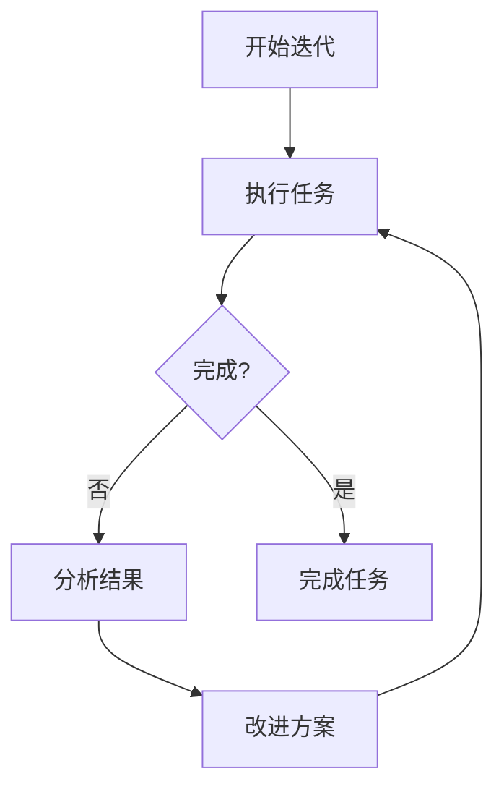

# 13 - 官方插件详解

## 📋 模块介绍

本章将详细介绍Claude Code的所有13个官方插件，包括它们的功能、使用方法、最佳实践和实际案例。掌握这些插件将极大提升你的开发效率。

---

## 🎯 官方插件概览

Claude Code提供了13个官方插件，覆盖了从开发到部署的完整工作流：

| 插件 | 功能 | 难度 | 推荐度 |
|------|------|------|--------|
| **agent-sdk-dev** | Agent SDK开发 | ⭐⭐⭐⭐⭐ | ⭐⭐⭐⭐ |
| **claude-opus-4-5-migration** | 模型迁移 | ⭐⭐ | ⭐⭐⭐⭐⭐ |
| **code-review** | 代码审查 | ⭐⭐⭐⭐ | ⭐⭐⭐⭐⭐ |
| **commit-commands** | Git自动化 | ⭐⭐⭐ | ⭐⭐⭐⭐⭐ |
| **explanatory-output-style** | 解释性输出 | ⭐⭐⭐ | ⭐⭐⭐⭐ |
| **feature-dev** | 功能开发 | ⭐⭐⭐⭐ | ⭐⭐⭐⭐⭐ |
| **frontend-design** | 前端设计 | ⭐⭐⭐⭐⭐ | ⭐⭐⭐⭐ |
| **hookify** | Hook创建 | ⭐⭐⭐⭐ | ⭐⭐⭐⭐⭐ |
| **learning-output-style** | 学习模式 | ⭐⭐⭐ | ⭐⭐⭐⭐ |
| **plugin-dev** | 插件开发 | ⭐⭐⭐⭐⭐ | ⭐⭐⭐⭐ |
| **pr-review-toolkit** | PR审查工具包 | ⭐⭐⭐⭐ | ⭐⭐⭐⭐⭐ |
| **ralph-wiggum** | 迭代循环 | ⭐⭐⭐⭐ | ⭐⭐⭐⭐ |
| **security-guidance** | 安全指导 | ⭐⭐⭐ | ⭐⭐⭐⭐⭐ |

---

## 13.1 agent-sdk-dev - Agent SDK开发工具

### 📋 功能介绍

`agent-sdk-dev` 是Agent SDK开发工具包，用于创建、验证和测试Agent SDK应用程序。

### 🎯 核心功能

#### 1. 创建新SDK应用

```bash
claude> /new-sdk-app
```

**交互式向导**：
1. 选择项目类型（Python/TypeScript）
2. 设置项目名称
3. 配置依赖和工具
4. 生成项目模板
5. 创建初始代理

#### 2. 验证SDK应用

```bash
claude> 验证我的Agent SDK应用

# Claude会自动使用agent-sdk-verifier代理
```

### 🔧 代理列表

| 代理 | 功能 |
|------|------|
| `agent-sdk-verifier-py` | 验证Python SDK应用 |
| `agent-sdk-verifier-ts` | 验证TypeScript SDK应用 |

### 📚 详细使用

#### 安装

```bash
# 克隆官方仓库
git clone https://github.com/anthropics/claude-code.git
cd claude-code/plugins/agent-sdk-dev

# 复制到项目
cp -r .claude-plugin ~/.claude/plugins/

# 或项目级安装
cp -r .claude-plugin .claude/plugins/
```

#### 使用示例

**创建新的Python Agent SDK应用**：

```bash
claude> 创建一个新的Agent SDK应用
```

Claude会询问：
```
1. 选择语言：Python / TypeScript
2. 项目名称：my-agent
3. 描述：我的第一个Agent应用
4. 初始代理：assistant
```

生成的项目结构：
```
my-agent/
├── .claude/
│   └── plugin.json
├── agents/
│   └── assistant.md
├── requirements.txt
├── main.py
└── README.md
```

#### 验证SDK应用

```bash
claude> 验证这个Agent SDK应用的正确性

# 验证内容：
- ✅ SDK依赖版本
- ✅ 代理配置格式
- ✅ 工具集成
- ✅ 错误处理
- ✅ 最佳实践
```

### ⚠️ 注意事项

- 需要了解Agent SDK的基本概念
- 适用于需要创建自定义代理的场景
- 建议先阅读Agent SDK文档

### 📊 最佳实践

- 使用验证器确保代码质量
- 遵循SDK最佳实践
- 定期更新SDK版本
- 编写完整的测试

---

## 13.2 claude-opus-4-5-migration - 模型迁移工具

### 📋 功能介绍

自动将代码和提示词从Sonnet 4.x和Opus 4.1迁移到Opus 4.5。

### 🎯 核心功能

#### 1. 模型字符串迁移

```bash
claude> 迁移代码到Claude Opus 4.5

# 自动替换：
- "claude-sonnet-4" → "claude-opus-4.5"
- "claude-opus-4.1" → "claude-opus-4.5"
```

#### 2. Beta头迁移

```bash
claude> 迁移API调用中的beta头
```

#### 3. 提示词调整

```bash
claude> 调整提示词以适应Opus 4.5
```

### 🔧 技能触发

```markdown
---
name: "claude-opus-4-5-migration"
triggers:
  - "迁移到opus-4.5"
  - "模型迁移"
  - "升级模型"
  - "opus迁移"
---
```

### 📚 详细使用

#### 自动迁移

```bash
# 1. 安装插件
claude> /plugin install claude-opus-4-5-migration

# 2. 迁移项目
claude> 将项目迁移到Claude Opus 4.5

# Claude会自动：
# 1. 扫描所有配置文件
# 2. 替换模型字符串
# 3. 更新API调用
# 4. 调整提示词
# 5. 生成迁移报告
```

#### 迁移报告示例

```markdown
## Opus 4.5 迁移报告

### 已修改的文件
- package.json: 模型字符串已更新
- config/settings.json: API配置已更新
- prompts/generate.md: 提示词已优化

### 变更详情
1. 模型字符串: 12处
2. API头: 5处
3. 提示词: 3处

### 建议
- 测试所有功能
- 更新文档
- 通知团队
```

### ⚠️ 注意事项

- 迁移前请备份代码
- 测试所有受影响的功能
- Opus 4.5可能有不同的行为
- 更新相关文档

### 📊 迁移检查清单

- [ ] 备份当前代码
- [ ] 运行迁移工具
- [ ] 检查迁移报告
- [ ] 运行完整测试套件
- [ ] 更新文档
- [ ] 部署到测试环境
- [ ] 验证功能正常
- [ ] 部署到生产环境

---

## 13.3 explanatory-output-style - 解释性输出风格

### 📋 功能介绍

为AI输出添加教育性见解，解释实现选择和代码库模式。

### 🎯 核心功能

#### 1. 注入教育性上下文

在每个会话开始时自动注入教育性内容，帮助用户理解代码背后的原理。

#### 2. 解释实现选择

Claude会主动解释为什么选择某种实现方式，以及最佳实践。

### 🔧 Hook配置

```json
{
  "hooks": {
    "SessionStart": [
      {
        "matcher": "*",
        "hooks": [".claude/plugins/explanatory-output-style/hooks/session-start.js"]
      }
    ]
  }
}
```

### 📚 详细使用

#### 安装

```bash
# 启用解释性输出风格
claude> 启用解释性输出风格
```

#### 效果示例

**普通输出**：
```typescript
function fetchData(url: string): Promise<Data> {
  return fetch(url).then(res => res.json());
}
```

**解释性输出**：
```typescript
function fetchData(url: string): Promise<Data> {
  // 使用fetch API进行HTTP请求
  // - 原因：现代浏览器支持，不需要额外依赖
  // - 最佳实践：使用async/await简化错误处理
  // - 模式：Promise链式调用
  
  return fetch(url).then(res => res.json());
  
  // 为什么要用fetch？
  // 1. 原生支持，无需安装
  // 2. 返回Promise，易于使用
  // 3. 支持流式传输
  // 4. 现代标准
}
```

### ⚠️ 注意事项

- 会增加输出的长度
- 适合学习和教学场景
- 生产环境可能需要禁用

### 📊 适用场景

- ✅ 学习新语言/框架
- ✅ 代码审查和理解
- ✅ 团队培训
- ❌ 快速原型开发
- ❌ 生产环境

---

## 13.4 frontend-design - 前端设计

### 📋 功能介绍

为前端工作提供设计指导，避免通用AI美学，创建独特且生产级别的界面。

### 🎯 核心功能

#### 1. 设计选择指导

Claude会主动建议：
- 大胆的设计选择
- 专业的排版
- 流畅的动画
- 精致的视觉细节

#### 2. 避免通用模板

不使用标准的Bootstrap、Tailwind默认主题，而是创建独特的视觉风格。

### 🔧 技能触发

```markdown
---
name: "frontend-design"
triggers:
  - "设计界面"
  - "前端设计"
  - "UI设计"
  - "组件设计"
  - "样式设计"
---
```

### 📚 详细使用

#### 自动触发

```bash
# 任何前端相关工作都会触发
claude> 创建一个用户列表组件

# Claude会自动：
# 1. 提供设计建议
# 2. 推荐颜色方案
# 3. 建议排版布局
# 4. 添加动画效果
```

#### 设计建议示例

```markdown
## 设计建议

### 颜色方案
- 主色：#2E7D32（自然绿色）
- 辅助色：#FF6F00（橙色）
- 背景色：#FAFAFA（浅灰）
- 文本色：#212121（深灰）

### 排版
- 标题：Roboto Bold, 24px
- 正文：Roboto Regular, 16px
- 行高：1.6

### 动画
- 列表项：slide-in, 0.3s
- 按钮：scale, 0.2s
- 模态框：fade-in, 0.4s

### 视觉细节
- 卡片：圆角 8px, 阴影 2px
- 按钮：圆角 4px, 渐变背景
- 图标：Material Icons, 24px
```

### ⚠️ 注意事项

- 需要前端设计知识
- 会增加开发时间
- 适合注重用户体验的项目

### 📊 设计原则

- 🎨 独特性：避免通用模板
- 🎯 一致性：保持视觉一致性
- 📱 响应式：支持多设备
- ♿ 可访问性：考虑无障碍设计
- ⚡ 性能：优化加载速度

---

## 13.5 hookify - Hook创建工具

### 📋 功能介绍

轻松创建自定义Hook，防止不想要的行为。

### 🎯 核心功能

#### 1. 创建Hook

```bash
claude> /hookify
```

#### 2. 列出Hook

```bash
claude> /hookify:list
```

#### 3. 配置Hook

```bash
claude> /hookify:configure
```

### 🔧 可用命令

| 命令 | 功能 |
|------|------|
| `/hookify` | 创建新Hook |
| `/hookify:list` | 列出所有Hook |
| `/hookify:configure` | 配置Hook |
| `/hookify:help` | 显示帮助 |

### 🤝 代理

| 代理 | 功能 |
|------|------|
| `conversation-analyzer` | 分析对话模式 |
| `writing-rules` | Hook规则语法指导 |

### 📚 详细使用

#### 创建Hook

```bash
claude> 创建一个Hook，防止删除node_modules目录

# Claude会：
# 1. 询问Hook名称
# 2. 定义规则
# 3. 生成Hook代码
# 4. 安装Hook
```

生成的Hook：
```javascript
// .claude/hooks/pre-delete.js
module.exports = async (context) => {
  const path = context.toolPath;
  
  if (path.includes('node_modules')) {
    throw new Error('删除node_modules是不被允许的');
  }
};
```

#### Hook规则示例

```markdown
## Hook规则示例

### 防止删除重要文件
```
如果工具是Delete且路径包含敏感文件名，则阻止
```

### 防止危险命令
```
如果命令包含"rm -rf"，则阻止并警告
```

### 记录所有写操作
```
如果工具是Write，则记录到日志
```

### ⚠️ 注意事项

- Hook规则需要仔细测试
- 阻止操作前要给出明确警告
- 定期审查Hook配置

### 📊 最佳实践

- 使用描述性的Hook名称
- 提供清晰的错误消息
- 记录Hook执行日志
- 定期审查Hook规则

---

## 13.6 learning-output-style - 学习输出风格

### 📋 功能介绍

交互式学习模式，在决策点请求有意义的代码贡献。

### 🎯 核心功能

#### 1. 互动学习

在关键的决策点，Claude会请求用户编写5-10行有意义的代码，同时提供教育性见解。

#### 2. 教育性反馈

用户编写代码后，Claude会提供反馈和改进建议。

### 🔧 Hook配置

```json
{
  "hooks": {
    "SessionStart": [
      {
        "matcher": "*",
        "hooks": [".claude/plugins/learning-output-style/hooks/session-start.js"]
      }
    ]
  }
}
```

### 📚 详细使用

#### 学习流程

```bash
# 1. Claude到达决策点
Claude: 我们需要实现用户认证功能。

# 2. 请求用户代码
Claude: 请你编写登录函数的代码（5-10行）。

# 3. 用户编写代码
用户: async function login(username, password) {
  const user = await db.findUser(username);
  if (user && await bcrypt.compare(password, user.password)) {
    return { token: generateToken(user) };
  }
  throw new Error('Invalid credentials');
}

# 4. Claude提供反馈
Claude: 代码结构很好！建议：
- 添加错误处理
- 考虑登录尝试限制
- 添加日志记录

# 5. 继续开发
Claude: 让我们完善这个函数...
```

#### 学习建议示例

```markdown
## 学习建议

### 你的代码
✅ 使用async/await
✅ 正确的错误处理
✅ 使用bcrypt比较密码

### 改进建议
⚠️ 添加登录尝试限制
⚠️ 记录登录日志
⚠️ 使用更友好的错误消息

### 最佳实践
1. 使用速率限制
2. 验证输入参数
3. 使用常量定义错误消息
```

### ⚠️ 注意事项

- 需要用户积极参与
- 适合学习新技能
- 可能会降低开发速度

### 📊 适用场景

- ✅ 学习新语言/框架
- ✅ 团队培训
- ✅ 代码审查教学
- ❌ 紧急开发
- ❌ 大型项目

---

## 13.7 pr-review-toolkit - PR审查工具包

### 📋 功能介绍

全面的PR审查代理，专精于评论、测试、错误处理、类型设计、代码质量、代码简化。

### 🎯 核心功能

#### 1. 多维度审查

```bash
claude> /pr-review-toolkit:review-pr
```

可选审查维度：
- `comments` - 代码评论
- `tests` - 测试覆盖率
- `errors` - 错误处理
- `types` - 类型设计
- `code` - 代码质量
- `simplify` - 代码简化
- `all` - 全部审查

### 🔧 代理列表

| 代理 | 功能 |
|------|------|
| `comment-analyzer` | 分析代码评论 |
| `pr-test-analyzer` | 分析测试覆盖率 |
| `silent-failure-hunter` | 查找静默失败 |
| `type-design-analyzer` | 分析类型设计 |
| `code-reviewer` | 审查代码质量 |
| `code-simplifier` | 简化复杂代码 |

### 📚 详细使用

#### 全面审查

```bash
# 审查PR #123的所有方面
claude> /pr-review-toolkit:review-pr --pr=123 --aspect=all

# Claude会使用6个代理并行审查：
# 1. comment-analyzer: 分析代码评论质量
# 2. pr-test-analyzer: 检查测试覆盖率
# 3. silent-failure-hunter: 查找静默失败
# 4. type-design-analyzer: 评估类型设计
# 5. code-reviewer: 审查代码质量
# 6. code-simplifier: 识别可简化的代码
```

#### 审查报告示例

```markdown
## PR #123 审查报告

### 代码评论
✅ 评论清晰明确
✅ 建议有建设性
⚠️ 部分评论缺少上下文

### 测试覆盖率
✅ 核心功能有测试
❌ 边缘情况缺少测试
建议覆盖率：从70%提升到85%

### 错误处理
✅ 主要路径有错误处理
⚠️ 异步错误处理不够完善
建议：添加try/catch包裹

### 类型设计
✅ 类型定义完整
✅ 接口设计合理
建议：使用联合类型

### 代码质量
✅ 命名规范
✅ 代码可读性良好
建议：减少函数长度

### 代码简化
建议简化的函数：
- processUserData() - 50行 → 拆分为3个函数
- validateInput() - 30行 → 简化验证逻辑

### 总体评分
⭐⭐⭐⭐☆ (4/5)
```

### ⚠️ 注意事项

- 审查可能需要较长时间
- 建议在CI中运行
- 适合大型项目

### 📊 审查最佳实践

- 定期运行审查
- 设置CI集成
- 记录审查结果
- 跟踪改进进度

---

## 13.8 ralph-wiggum - 迭代循环

### 📋 功能介绍

交互式自引用AI循环，用于迭代开发。Claude在同一个任务上反复工作，直到完成。

### 🎯 核心功能

#### 1. 启动迭代循环

```bash
claude> /ralph-loop
```

#### 2. 停止迭代

```bash
claude> /cancel-ralph
```

### 🔧 工作原理



### 📚 详细使用

#### 迭代开发示例

```bash
# 1. 启动迭代
claude> /ralph-loop 创建一个用户注册功能

# 2. Claude开始工作
Claude: 正在实现用户注册功能...
Claude: 创建了基本模型...
Claude: 添加了表单验证...

# 3. 自动检查和改进
Claude: 检查代码质量...
Claude: 发现安全问题，正在修复...
Claude: 添加了单元测试...

# 4. 继续迭代
Claude: 优化性能...
Claude: 添加错误处理...

# 5. 完成时停止
Claude> /cancel-ralph
Claude: ✅ 用户注册功能已完成！
```

### ⚠️ 注意事项

- 可能无限循环
- 需要手动停止
- 适合复杂任务

### 📊 适用场景

- ✅ 复杂功能开发
- ✅ 代码重构
- ✅ 性能优化
- ❌ 简单任务
- ❌ 时间紧迫

---

## 13.9 security-guidance - 安全指导

### 📋 功能介绍

安全提醒Hook，在编辑文件时警告潜在的安全问题。

### 🎯 核心功能

#### 1. 安全模式检查

在编辑文件前检查9种安全模式：
- 命令注入
- XSS漏洞
- eval使用
- 危险HTML
- pickle反序列化
- os.system调用

### 🔧 Hook配置

```json
{
  "hooks": {
    "PreToolUse": [
      {
        "matcher": "Write",
        "hooks": [".claude/plugins/security-guidance/hooks/pre-write.js"]
      }
    ]
  }
}
```

### 📚 详细使用

#### 安全检查示例

```bash
# 尝试编辑包含eval的文件
claude> 编辑这个文件：eval(user_input)

# Claude会警告：
⚠️ 警告：检测到eval使用！
- eval可以执行任意代码
- 存在安全风险
- 建议使用更安全的替代方案

你想继续吗？(y/n)
```

#### 安全模式列表

| 模式 | 描述 | 风险等级 |
|------|------|---------|
| **命令注入** | 动态执行命令 | 🔴 高 |
| **XSS漏洞** | 跨站脚本攻击 | 🔴 高 |
| **eval使用** | 动态代码执行 | 🔴 高 |
| **危险HTML** | 不安全的HTML渲染 | 🟡 中 |
| **pickle反序列化** | Python对象反序列化 | 🟡 中 |
| **os.system调用** | 系统命令执行 | 🟡 中 |
| **SQL注入** | SQL注入漏洞 | 🔴 高 |
| **路径遍历** | 文件路径遍历 | 🟡 中 |
| **敏感信息泄露** | 密码/密钥泄露 | 🔴 高 |

### ⚠️ 注意事项

- 可能误报
- 可以配置忽略特定文件
- 建议启用以提高安全性

### 📊 安全最佳实践

- ✅ 始终启用安全检查
- ✅ 审查安全警告
- ✅ 使用参数化查询
- ✅ 验证用户输入
- ✅ 最小权限原则

---

## 🎯 插件选择指南

### 开发阶段

| 阶段 | 推荐插件 |
|------|---------|
| **项目初始化** | agent-sdk-dev, plugin-dev |
| **功能开发** | feature-dev, frontend-design |
| **代码审查** | code-review, pr-review-toolkit |
| **测试** | learning-output-style |
| **部署** | commit-commands, security-guidance |

### 团队协作

| 角色 | 推荐插件 |
|------|---------|
| **新手开发者** | learning-output-style, explanatory-output-style |
| **经验开发者** | hookify, ralph-wiggum |
| **技术负责人** | code-review, security-guidance |
| **架构师** | feature-dev, pr-review-toolkit |

### 项目类型

| 项目类型 | 推荐插件 |
|---------|---------|
| **前端项目** | frontend-design, explanatory-output-style |
| **后端项目** | feature-dev, security-guidance |
| **全栈项目** | pr-review-toolkit, hookify |
| **Agent应用** | agent-sdk-dev |

---

## 📊 插件组合推荐

### 基础开发组合

```json
{
  "plugins": [
    "commit-commands",
    "code-review",
    "security-guidance"
  ]
}
```

### 高级开发组合

```json
{
  "plugins": [
    "feature-dev",
    "pr-review-toolkit",
    "hookify",
    "ralph-wiggum"
  ]
}
```

### 学习组合

```json
{
  "plugins": [
    "learning-output-style",
    "explanatory-output-style",
    "plugin-dev"
  ]
}
```

### 专业开发组合

```json
{
  "plugins": [
    "agent-sdk-dev",
    "frontend-design",
    "code-review",
    "security-guidance",
    "pr-review-toolkit",
    "hookify"
  ]
}
```

---

## ✅ 章节总结

### 📚 学习要点
- ✅ 了解所有13个官方插件
- ✅ 掌握插件的核心功能
- ✅ 学会插件的最佳实践
- ✅ 理解插件的适用场景

### 🎯 实践建议
- 根据项目需求选择插件
- 从基础插件开始使用
- 逐步添加高级插件
- 定期更新插件

### 🔧 进阶技巧
- 组合使用多个插件
- 自定义插件配置
- 创建自己的插件
- 分享插件给团队

---

**下一步：** 学习 [14 - 大模型选择与配置指南](./14-model-selection.md) 🚀
- 了解Claude Code支持的所有大模型
- 掌握模型选择方法和配置技巧
- 根据任务需求和预算选择最合适的模型
