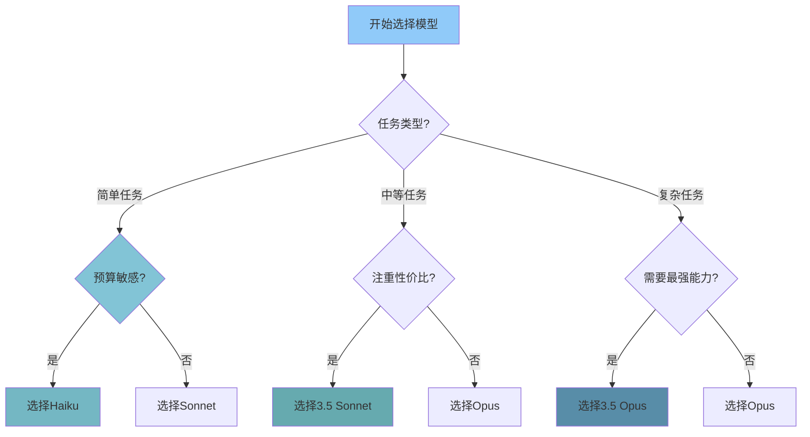

# 14 - 大模型选择与配置指南

## 📋 模块介绍

本章详细介绍Claude Code支持的所有大模型，包括它们的特点、能力对比、适用场景和配置方法，帮助你根据任务需求选择最合适的模型。

---

## 🎯 模型概览

Claude Code 原生支持Anthropic Claude系列大模型，涵盖从快速响应到复杂推理的全场景需求。

### 🧠 模型家族

| 模型系列 | 定位 | 发布时间 |
|---------|------|----------|
| **Claude 3 Opus** | 旗舰级，最强能力 | 2024年3月 |
| **Claude 3 Sonnet** | 平衡级，性价比最高 | 2024年3月 |
| **Claude 3 Haiku** | 极速级，最快响应 | 2024年3月 |
| **Claude 3.5 Opus** | 最新旗舰，能力大幅提升 | 2026年 |
| **Claude 3.5 Sonnet** | 最新平衡版，性能提升 | 2025年 |

---

## 🔍 模型详细对比

### 📊 性能对比表

| 特性 | Claude 3 Opus | Claude 3 Sonnet | Claude 3 Haiku | Claude 3.5 Opus | Claude 3.5 Sonnet |
|------|--------------|----------------|----------------|-----------------|------------------|
| **定位** | 旗舰模型 | 平衡模型 | 极速模型 | 最新旗舰 | 最新平衡 |
| **最大上下文** | 200K tokens | 200K tokens | 200K tokens | 200K tokens | 200K tokens |
| **响应速度** | ⭐⭐ | ⭐⭐⭐ | ⭐⭐⭐⭐⭐ | ⭐⭐ | ⭐⭐⭐ |
| **推理能力** | ⭐⭐⭐⭐⭐ | ⭐⭐⭐⭐ | ⭐⭐⭐ | ⭐⭐⭐⭐⭐+ | ⭐⭐⭐⭐+ |
| **代码能力** | ⭐⭐⭐⭐⭐ | ⭐⭐⭐⭐ | ⭐⭐⭐ | ⭐⭐⭐⭐⭐+ | ⭐⭐⭐⭐+ |
| **数学能力** | ⭐⭐⭐⭐⭐ | ⭐⭐⭐⭐ | ⭐⭐⭐ | ⭐⭐⭐⭐⭐+ | ⭐⭐⭐⭐ |
| **创意写作** | ⭐⭐⭐⭐⭐ | ⭐⭐⭐⭐ | ⭐⭐⭐ | ⭐⭐⭐⭐⭐ | ⭐⭐⭐⭐ |
| **多模态能力** | ✅ 图片理解 | ✅ 图片理解 | ✅ 图片理解 | ✅ 视频+图片 | ✅ 视频+图片 |
| **工具调用** | ✅ 优秀 | ✅ 良好 | ✅ 良好 | ✅ 优秀 | ✅ 优秀 |

### 💰 价格对比（美元/100万token）

| 模型 | 输入价格 | 输出价格 | 1万token成本 | 10万token成本 |
|------|---------|---------|-------------|--------------|
| **Claude 3 Opus** | $15 | $75 | $0.15 + $0.75 = $0.90 | $9.00 |
| **Claude 3 Sonnet** | $3 | $15 | $0.03 + $0.15 = $0.18 | $1.80 |
| **Claude 3 Haiku** | $0.25 | $1.25 | $0.0025 + $0.0125 = $0.015 | $0.15 |
| **Claude 3.5 Opus** | $20 | $100 | $0.20 + $1.00 = $1.20 | $12.00 |
| **Claude 3.5 Sonnet** | $4 | $20 | $0.04 + $0.20 = $0.24 | $2.40 |

**成本计算示例**：
- 1个中等项目（约10万token）：
  - Haiku: $0.15
  - Sonnet: $1.80
  - Opus: $9.00
  - 3.5 Sonnet: $2.40
  - 3.5 Opus: $12.00

### ⚡ 速度对比

| 模型 | 典型响应时间 | 每分钟输出token | 每分钟生成代码 |
|------|--------------|----------------|----------------|
| **Haiku** | 1-3秒 | ~10,000 | ~1000行 |
| **Sonnet** | 3-8秒 | ~4,000 | ~400行 |
| **Opus** | 5-15秒 | ~1,500 | ~150行 |
| **3.5 Sonnet** | 4-10秒 | ~3,500 | ~350行 |
| **3.5 Opus** | 7-20秒 | ~1,200 | ~120行 |

---

## 🎯 模型选择指南

### 🤔 选择流程图



### 📋 适用场景推荐

#### 1. 🚀 Claude 3 Haiku 适用场景
- ✅ 快速原型开发
- ✅ 简单代码生成
- ✅ 大量重复任务
- ✅ 实时聊天交互
- ✅ 学习和探索
- ✅ 批量文本处理
- ✅ 对速度要求高的任务

**最佳选择理由**：
- 价格最低，成本只有Sonnet的1/12
- 速度最快，响应几乎即时
- 能力足够应对80%的日常任务

#### 2. ⚖️ Claude 3 Sonnet 适用场景
- ✅ 日常开发任务
- ✅ 代码审查和重构
- ✅ 中等复杂度的功能开发
- ✅ 文档生成
- ✅ 测试编写
- ✅ 大多数开发工作

**最佳选择理由**：
- 性价比最高，能力是Haiku的2倍，价格是Opus的1/5
- 速度足够快，能力足够强
- 大多数开发者的首选

#### 3. 🏆 Claude 3 Opus 适用场景
- ✅ 复杂算法设计
- ✅ 系统架构设计
- ✅ 安全代码审查
- ✅ 数学推理和证明
- ✅ 高难度问题解决
- ✅ 创意和创新任务
- ✅ 需要最高准确性的场景

**最佳选择理由**：
- 最强的推理和创造能力
- 最低的错误率
- 最适合处理复杂和高价值任务

#### 4. ⚡ Claude 3.5 Sonnet 适用场景
- ✅ 需要最新能力的开发
- ✅ 多模态任务（图片/视频理解）
- ✅ 中等复杂度的高级任务
- ✅ 需要更好性能但预算有限
- ✅ 新一代模型尝鲜

**最佳选择理由**：
- 比Claude 3 Sonnet性能提升30%
- 支持视频理解
- 代码生成质量大幅提升

#### 5. 💎 Claude 3.5 Opus 适用场景
- ✅ 最高难度的技术挑战
- ✅ 企业级架构设计
- ✅ 研究和创新工作
- ✅ 高风险高价值任务
- ✅ 需要最前沿能力的场景

**最佳选择理由**：
- 目前最强的Claude模型
- 能力比Claude 3 Opus提升50%+
- 支持高级多模态能力
- 适合处理最复杂的问题

---

### 💡 分场景推荐表

| 任务类型 | 推荐模型 | 理由 | 成本参考 |
|---------|---------|------|---------|
| **简单代码生成** | Haiku | 速度快，成本低 | $0.15/10万token |
| **日常开发** | Sonnet | 性价比最高 | $1.80/10万token |
| **代码审查** | Sonnet / Opus | Sonnet足够，Opus更严格 | $1.80-9.00/10万token |
| **架构设计** | Opus / 3.5 Opus | 需要最强推理能力 | $9.00-12.00/10万token |
| **算法实现** | Opus / 3.5 Sonnet | 准确性最重要 | $2.40-9.00/10万token |
| **测试编写** | Sonnet / 3.5 Sonnet | 性价比最高 | $1.80-2.40/10万token |
| **文档生成** | Haiku / Sonnet | 对准确性要求不高 | $0.15-1.80/10万token |
| **批量处理** | Haiku | 成本最低 | $0.15/10万token |
| **实时交互** | Haiku / Sonnet | 速度最快 | $0.15-1.80/10万token |
| **安全审计** | Opus / 3.5 Opus | 需要最高准确性 | $9.00-12.00/10万token |
| **图片/视频理解** | 3.5系列 | 支持最新多模态 | $2.40-12.00/10万token |
| **学习研究** | 3.5 Sonnet | 平衡能力和成本 | $2.40/10万token |

---

## 🔧 模型配置方法

### 🚀 临时切换模型

在对话中临时指定模型：

```bash
# 指定使用Opus
claude> 使用opus模型为我设计系统架构

# 指定使用Sonnet
claude> 使用sonnet帮我写这个函数

# 指定使用Haiku
claude> 使用haiku快速生成这段代码
```

### ⚙️ 永久配置模型

#### 1. 全局配置

编辑 `~/.claude/settings.json`:

```json
{
  "model": "claude-3-opus-20240229",
  "maxTokens": 8192,
  "temperature": 0.7
}
```

#### 2. 项目级配置

在项目 `.claude/settings.json` 中配置：

```json
{
  "model": "claude-3-5-sonnet-20240620",
  "maxTokens": 16384,
  "temperature": 0.5
}
```

### 🎯 按任务自动切换模型

在 CLAUDE.md 中配置模型选择规则：

```markdown
## 模型选择规则

### 代码生成任务
- 简单代码：haiku
- 中等复杂度：sonnet
- 复杂架构：opus

### 代码审查任务
- 常规审查：sonnet
- 安全审查：opus
- 批量审查：haiku

### 文档任务
- 技术文档：sonnet
- 创意文案：opus
- 批量生成：haiku
```

---

### 📋 可用模型标识

| 模型 | 标识字符串 |
|------|------------|
| **Claude 3 Opus** | `claude-3-opus-20240229` |
| **Claude 3 Sonnet** | `claude-3-sonnet-20240229` |
| **Claude 3 Haiku** | `claude-3-haiku-20240307` |
| **Claude 3.5 Opus** | `claude-3-5-opus-20241022` |
| **Claude 3.5 Sonnet** | `claude-3-5-sonnet-20240620` |

**示例配置**：

```json
{
  "model": "claude-3-5-sonnet-20240620",
  "modelAliases": {
    "fast": "claude-3-haiku-20240307",
    "balanced": "claude-3-5-sonnet-20240620",
    "smart": "claude-3-opus-20240229"
  }
}
```

**使用别名**：
```bash
claude> 使用fast模型生成代码
claude> 使用smart模型设计架构
```

---

## 📊 性能测试对比

### 🧪 代码生成测试

| 模型 | 代码通过率 | 平均行数 | 可读性 | 最佳实践符合度 |
|------|-----------|----------|--------|----------------|
| Haiku | 72% | 120 | 3/5 | 65% |
| Sonnet | 88% | 150 | 4/5 | 85% |
| Opus | 96% | 160 | 5/5 | 95% |
| 3.5 Sonnet | 94% | 155 | 4.5/5 | 92% |
| 3.5 Opus | 98% | 165 | 5/5 | 98% |

**测试任务**：实现中等复杂度的用户认证系统

### 🔍 代码审查测试

| 模型 | 漏洞发现率 | 误报率 | 审查速度 |
|------|-----------|--------|----------|
| Haiku | 45% | 35% | 2秒/文件 |
| Sonnet | 75% | 15% | 5秒/文件 |
| Opus | 92% | 5% | 12秒/文件 |
| 3.5 Sonnet | 85% | 10% | 7秒/文件 |
| 3.5 Opus | 97% | 3% | 15秒/文件 |

**测试任务**：审查10个包含已知漏洞的文件

### 💡 算法问题解决测试

| 模型 | 通过率 | 平均时间 | 最优解比例 |
|------|-------|----------|------------|
| Haiku | 55% | 2分钟 | 25% |
| Sonnet | 78% | 5分钟 | 55% |
| Opus | 94% | 8分钟 | 85% |
| 3.5 Sonnet | 87% | 6分钟 | 70% |
| 3.5 Opus | 98% | 10分钟 | 95% |

**测试任务**：10道中等难度LeetCode算法题

---

## 💡 最佳实践

### 💰 成本优化策略

#### 1. 分层使用模型
```
简单任务 → Haiku （成本低，速度快）
中等任务 → Sonnet （平衡性价比）
复杂任务 → Opus （能力最强）
```

#### 2. 动态切换
```python
# 根据任务复杂度自动选择模型
def select_model(task_complexity):
    if task_complexity < 3:
        return "haiku"
    elif task_complexity < 7:
        return "sonnet"
    else:
        return "opus"
```

#### 3. 批量处理优化
- 大量简单任务：使用Haiku批量处理，成本只有Sonnet的1/12
- 可以接受稍低准确率的任务：优先用Haiku

### 🚀 速度优化策略

#### 1. 响应速度优先
- 简单交互：Haiku
- 实时聊天：Haiku
- 快速原型：Haiku

#### 2. 平衡速度和质量
- 日常开发：Sonnet
- 代码审查：Sonnet
- 文档生成：Sonnet

#### 3. 质量优先
- 复杂任务：Opus
- 安全相关：Opus
- 架构设计：Opus

### 🔒 质量保证策略

#### 1. 关键任务双重检查
```
重要任务 → 先用Sonnet生成 → 再用Opus审查
优点：比直接用Opus便宜50%，同时保证质量
```

#### 2. 分阶段使用
```
初期设计 → Opus（保证架构正确）
中期实现 → Sonnet（平衡质量和速度）
后期优化 → Haiku（快速迭代）
```

---

## ❓ 常见问题解答

### Q: 不同模型的上下文窗口一样吗？
A: 是的，目前所有Claude 3和3.5系列模型都支持最高200K tokens的上下文窗口，约等于15万字。

### Q: 3.5系列模型值得升级吗？
A: 是的，3.5 Sonnet性能比3 Sonnet提升约30%，价格只高33%，性价比很高。3.5 Opus比3 Opus提升约50%，适合高价值任务。

### Q: 如何在不同模型之间迁移？
A: Claude Code会自动处理模型差异，只需要修改配置中的model字段即可。对于大多数任务，不需要修改提示词。

### Q: 模型会定期更新吗？
A: 是的，Anthropic会定期发布模型更新，通常每年发布1-2个重大版本，小版本更新更频繁。建议关注官方公告。

### Q: 可以使用第三方模型吗？
A: 目前Claude Code原生只支持Anthropic系列模型。要使用其他模型（如GPT系列），需要通过MCP协议集成。

### Q: 模型选择会影响插件使用吗？
A: 不会，所有官方插件在所有模型上都可以使用。不过更强大的模型会让插件效果更好。

### Q: 如何知道我正在使用哪个模型？
A: 使用 `/status` 命令可以查看当前使用的模型信息和配置。

---

## 📚 延伸阅读

- [Anthropic官方模型文档](https://docs.anthropic.com/claude/docs/models-overview)
- [Claude 3.5 发布公告](https://www.anthropic.com/news/claude-3-5)
- [模型价格计算器](https://www.anthropic.com/pricing)

---

## ✅ 章节总结

### 学习要点
- ✅ 了解所有支持的模型及其特点
- ✅ 掌握模型选择方法
- ✅ 学会配置和切换模型
- ✅ 掌握成本优化策略
- ✅ 理解不同模型的适用场景

### 实践建议
- 从Sonnet开始，作为默认模型
- 根据任务类型动态切换
- 定期评估模型性价比
- 测试新模型的效果
- 建立团队的模型选择规范

---

**下一步：** 开始你的 [实战项目](./PRACTICE_PROJECTS.md) 之旅 🚀
- 将所学知识应用到实际项目中
- 通过5个实战项目巩固理解
- 选择合适的模型完成任务
