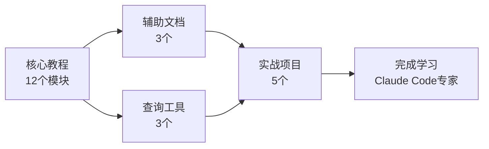

# 📘 Claude Code 源码深度学习指南

> 从入门到精通，成为Claude Code使用和修改专家

[](https://github.com/haorenlei457/claudecode-book)
[](LICENSE)
[](https://github.com/haorenlei457/claudecode-book)
[](https://github.com/haorenlei457/claudecode-book)

<div align="center">
  <h3>🚀 超过130,000字的完整教程</h3>
  <p>从入门到专家级，200+代码示例，5个实战项目</p>
</div>

---

## 🎯 关于本指南

本指南是对 [Claude Code](https://github.com/anthropics/claude-code) 开源项目的深度解析，旨在帮助开发者：

- 🔰 **快速上手** Claude Code 的使用
- 🔧 **深入理解** 各个模块的工作原理
- 🛠️ **开发** 自定义插件、命令、代理和技能
- 🔬 **修改和扩展** 源码以满足特定需求
- 🤝 **贡献** 代码到 Claude Code 社区

---

## 📚 完整文档导航

### 📖 核心教程（12个模块）

从基础到进阶，系统性学习所有核心功能：

| 模块 | 标题 | 难度 | 时间 |
|------|------|------|------|
| 01 | [项目概述与架构](./01-project-overview.md) | ⭐⭐⭐ | 45min |
| 02 | [插件系统](./02-plugin-system.md) | ⭐⭐⭐⭐ | 60min |
| 03 | [命令系统](./03-command-system.md) | ⭐⭐⭐ | 45min |
| 04 | [代理系统](./04-agent-system.md) | ⭐⭐⭐⭐⭐ | 60min |
| 05 | [技能系统](./05-skill-system.md) | ⭐⭐⭐⭐ | 45min |
| 06 | [钩子系统](./06-hook-system.md) | ⭐⭐⭐⭐ | 60min |
| 07 | [MCP协议集成](./07-mcp-protocol.md) | ⭐⭐⭐⭐ | 45min |
| 08 | [配置系统](./08-configuration.md) | ⭐⭐ | 30min |
| 09 | [文件操作与上下文管理](./09-file-context.md) | ⭐⭐⭐ | 45min |
| 10 | [Git集成](./10-git-integration.md) | ⭐⭐⭐ | 45min |
| 11 | [终端交互](./11-terminal-interaction.md) | ⭐⭐ | 30min |
| 12 | [安全机制](./12-security.md) | ⭐⭐⭐ | 30min |

### 🚀 辅助文档

- **[🛠️ 环境搭建指南](./SETUP_GUIDE.md)** - 快速开始安装配置
- **[🎯 学习路径指南](./LEARNING_PATH.md)** - 3天系统化学习计划
- **[💡 实战项目集](./PRACTICE_PROJECTS.md)** - 5个完整实战项目

### 📖 查询工具

- **[❓ 常见问题解答](./FAQ.md)** - 26个常见问题及解决方案
- **[📖 词汇表](./GLOSSARY.md)** - 50+术语详细解释
- **[⚡ 速查手册](./CHEATSHEET.md)** - 命令、配置、快捷速查

---

## 🎓 推荐学习路径

### 第1天：基础入门（2-3小时）
```
01 → 02 → 03
```
- 了解 Claude Code 是什么
- 掌握插件和命令系统
- 学会创建第一个插件

### 第2天：进阶学习（3-4小时）
```
04 → 05 → 06 → 07
```
- 理解代理和技能系统
- 掌握钩子和MCP集成
- 学会创建专业化代理

### 第3天：高级深入（4-5小时）
```
08 → 09 → 10 → 11 → 12
```
- 理解配置和上下文管理
- 掌握Git和终端集成
- 深入安全机制

📝 **详细学习计划**：[学习路径指南](./LEARNING_PATH.md)

---

## 💡 内容特色

### 三级难度体系

每个模块都包含三个难度级别：

| 级别 | 颜色 | 内容 | 适合人群 |
|------|------|------|----------|
| 🟢 入门级 | 绿色 | 快速上手，基本概念 | 初学者 |
| 🟡 中级 | 黄色 | 深入理解，实际应用 | 有经验者 |
| 🔴 专家级 | 红色 | 源码分析，架构设计 | 高级用户 |

### 丰富的代码示例

- 💻 **200+ 代码示例** - 可直接运行
- 🔧 **完整配置文件** - 开箱即用
- 📊 **架构图和流程图** - 可视化理解
- 🎯 **实战案例分析** - 真实场景应用

---

## 📊 内容统计

| 项目 | 数量 |
|------|------|
| 📄 核心模块 | 12个 |
| 📝 总字数 | 约130,000字 |
| 💻 代码示例 | 200+ |
| 🎯 实战项目 | 5个 |
| 📖 词汇条目 | 50+ |
| ❓ 常见问题 | 26个 |
| 🌈 可视化图表 | 15+ |

---

## 🛠️ 快速开始

### 1. 环境搭建（15分钟）

查看 [环境搭建指南](./SETUP_GUIDE.md) 完成安装配置：

```bash
# macOS/Linux
curl -fsSL https://claude.ai/install.sh | bash

# 配置 API 密钥
export ANTHROPIC_API_KEY="your-api-key"

# 验证安装
claude --version
```

### 2. 开始学习（3天）

从 [01-项目概述与架构](./01-project-overview.md) 开始，按照 [学习路径](./LEARNING_PATH.md) 系统学习。

### 3. 动手实践（可选）

完成 [实战项目集](./PRACTICE_PROJECTS.md) 中的5个项目，巩固所学知识。

---

## 🎯 学习目标

完成本指南后，你将能够：

- ✅ **熟练使用** Claude Code 的所有核心功能
- ✅ **理解** 各模块的工作原理和设计思想
- ✅ **开发** 自定义插件、命令、代理和技能
- ✅ **修改** 源码以满足特定需求
- ✅ **优化** 性能和用户体验
- ✅ **贡献** 代码到 Claude Code 社区

---

## 🔗 相关资源

### 官方资源
- [Claude Code 官方文档](https://code.claude.com/docs/en/overview)
- [Claude Code GitHub](https://github.com/anthropics/claude-code)
- [Anthropic 官网](https://www.anthropic.com)
- [Claude API 文档](https://docs.anthropic.com)

### 社区资源
- [Discord 社区](https://anthropic.com/discord) - 实时讨论
- [GitHub Issues](https://github.com/anthropics/claude-code/issues) - 问题报告
- [官方插件示例](https://github.com/anthropics/claude-code/tree/main/plugins)
- [Awesome Claude Code](https://github.com/hesreallyhim/awesome-claude-code) - 资源集合

---

## 🤝 贡献指南

欢迎提交 Issue 和 PR！

1. Fork 本仓库
2. 创建特性分支 (`git checkout -b feature/AmazingFeature`)
3. 提交更改 (`git commit -m 'Add some AmazingFeature'`)
4. 推送分支 (`git push origin feature/AmazingFeature`)
5. 创建 Pull Request

### 贡献类型
- 📝 文档改进
- 🐛 Bug 修复
- ✨ 新功能
- 🎨 代码优化
- 📖 示例补充

---

## 📊 项目概览



---

## 🎉 开始学习

**准备好了吗？开始你的 Claude Code 深度学习之旅！**

从 [01-项目概述与架构](./01-project-overview.md) 开始吧！🚀

---

<div align="center">

**⭐ 如果这个项目对你有帮助，请给它一个 Star！**

[](https://star-history.com/#haorenlei457/claudecode-book&Date)

**Made with ❤️ by Claude Code Community**

</div>
