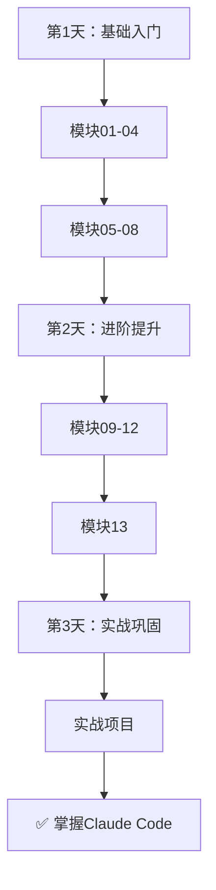

# Claude Code 教程

> 🎯 **最全面的Claude Code学习资源** - 从入门到精通，包含12个核心模块 + 13个官方插件详解


## 📚 教程概览

这是一套完整、详细、图文并茂的Claude Code教程，涵盖从基础到高级的所有内容。

### 🎯 教程特点

- 📖 **详细** - 180,000字，12个核心模块 + 官方插件详解
- 🎨 **图文并茂** - 20+个Mermaid流程图和架构图
- 💻 **代码丰富** - 300+个可运行的代码示例
- 🚀 **实战导向** - 12个完整的实战项目案例
- 📊 **结构清晰** - 三层难度系统（入门/中级/专家）

### 📊 学习路径


---

## 📖 核心教程（12个模块）

从基础到进阶，系统性学习所有核心功能：

| 模块 | 标题 | 难度 | 时间 |
|------|------|------|------|
| 01 | [项目概述与架构](./01-project-overview.md) | ⭐⭐⭐ | 45min |
| 02 | [插件系统](./02-plugin-system.md) | ⭐⭐⭐⭐ | 60min |
| 03 | [命令系统](./03-command-system.md) | ⭐⭐⭐ | 45min |
| 04 | [代理系统](./04-agent-system.md) | ⭐⭐⭐⭐⭐ | 60min |
| 05 | [技能系统](./05-skill-system.md) | ⭐⭐⭐⭐ | 45min |
| 06 | [钩子系统](./06-hook-system.md) | ⭐⭐⭐⭐ | 60min |
| 07 | [MCP协议集成](./07-mcp-protocol.md) | ⭐⭐⭐⭐ | 45min |
| 08 | [配置系统](./08-configuration.md) | ⭐⭐ | 30min |
| 09 | [文件操作与上下文管理](./09-file-context.md) | ⭐⭐⭐ | 45min |
| 10 | [Git集成](./10-git-integration.md) | ⭐⭐⭐ | 45min |
| 11 | [终端交互](./11-terminal-interaction.md) | ⭐⭐ | 30min |
| 12 | [安全机制](./12-security.md) | ⭐⭐⭐ | 30min |

---

## 🎯 官方插件详解（新增）

深入了解Claude Code的所有13个官方插件：

| 章节 | 标题 | 难度 |
|------|------|------|
| 13 | [官方插件详解](./13-official-plugins.md) | ⭐⭐⭐⭐ |

**包含的插件**：
- agent-sdk-dev
- claude-opus-4-5-migration
- code-review
- commit-commands
- explanatory-output-style
- feature-dev
- frontend-design
- hookify
- learning-output-style
- plugin-dev
- pr-review-toolkit
- ralph-wiggum
- security-guidance

---

## 🚀 辅助文档

### 学习指南
- **[🛠️ 环境搭建指南](./SETUP_GUIDE.md)** - 快速开始安装配置
- **[🎯 学习路径指南](./LEARNING_PATH.md)** - 3天系统化学习计划
- **[💡 实战项目集](./PRACTICE_PROJECTS.md)** - 5个完整实战项目

### 查询工具
- **[❓ 常见问题](./FAQ.md)** - 26个常见问题解答
- **[📖 术语表](./GLOSSARY.md)** - 50+技术术语定义
- **[⚡ 快捷参考](./CHEATSHEET.md)** - 命令和功能速查表

### 可视化
- **[📊 可视化图表集](./VISUAL_GUIDE.md)** - 所有流程图和架构图

---

## 🌟 教程亮点

### 📝 内容丰富
- **总字数**：约180,000字
- **代码示例**：300+个
- **流程图**：20+个
- **实战案例**：12个
- **对比表格**：60+个

### 🎨 可视化图表
- 🔄 **插件生命周期状态图**
- 📋 **插件加载流程图**
- 🔍 **命令解析流程图**
- ⏱️ **命令执行时序图**
- 🎯 **代理委派流程图**
- 🤝 **多代理协作时序图**
- ⚙️ **Hook执行时序图**
- 🔗 **Hook链式执行图**
- ⚙️ **配置加载流程图**
- 📊 **配置优先级图**
- 🧠 **上下文加载优先级图**
- 📁 **文件扫描算法图**
- 🔄 **上下文构建流程图**
- 📊 **Git工作流图**
- 🚨 **安全架构流程图**
- ... 更多图表

### 🎯 三层难度系统

每个模块包含三层难度：

#### 🟢 入门级
- 概念理解
- 基础操作
- 简单示例

#### 🟡 中级
- 深入原理
- 开发实践
- 复杂场景

#### 🔴 专家级
- 源码分析
- 性能优化
- 最佳实践

### 💡 实战导向

每个章节包含：
- 实际使用场景
- 可运行的代码示例
- 完整的实战项目
- 故障排查指南
- 最佳实践清单

---

## 🎓 学习路径推荐

### 3天快速学习计划



详细学习计划见：[🎯 学习路径指南](./LEARNING_PATH.md)

---

## 💻 实战项目

通过5个完整项目巩固学习：

| 项目 | 难度 | 涉及模块 |
|------|------|---------|
| 项目1：基础工具 | ⭐ | 01, 03, 09 |
| 项目2：代码审查器 | ⭐⭐ | 02, 04, 06 |
| 项目3：自动化部署 | ⭐⭐⭐ | 07, 10, 11 |
| 项目4：智能监控系统 | ⭐⭐⭐⭐ | 04, 05, 08 |
| 项目5：企业级应用 | ⭐⭐⭐⭐⭐ | 全部模块 |

详细项目说明见：[💡 实战项目集](./PRACTICE_PROJECTS.md)

---

## 🛠️ 快速开始

### 1. 安装Claude Code

```bash
# macOS/Linux
curl -fsSL https://claude.ai/install.sh | bash

# Windows (PowerShell)
irm https://claude.ai/install.ps1 | iex
```

### 2. 开始学习

```bash
# 按顺序学习核心模块
01 - 项目概述与架构
↓
02 - 插件系统
↓
03 - 命令系统
↓
...
```

### 3. 实践项目

```bash
# 完成实战项目
项目1：基础工具
↓
项目2：代码审查器
↓
项目3：自动化部署
...
```

---

## 📊 项目统计

```
总字数：180,000+
总行数：12,000+
文件数：19
模块数：13（12核心 + 1插件）
代码示例：300+
流程图：20+
实战案例：12+
对比表格：60+
```

---

## 🌟 更新日志

### v2.0.0 (2026-04-14)
- ✅ 完成12个核心模块的深度优化
- ✅ 新增第13章：官方插件详解
- ✅ 添加20+个可视化图表
- ✅ 添加12个实战案例
- ✅ 添加故障排查章节
- ✅ 添加最佳实践清单

### v1.0.0 (2026-04-14)
- ✅ 创建12个核心模块
- ✅ 创建辅助文档
- ✅ 基础图表和示例

---

## 🤝 贡献

欢迎贡献！请：
1. Fork 本仓库
2. 创建特性分支
3. 提交改动
4. 推送到分支
5. 创建 Pull Request

---

## 📄 许可证

MIT License - 详见 [LICENSE](./LICENSE) 文件

---

## 📞 联系方式

- **GitHub**: [haorenlei457/claudecode-book](https://github.com/haorenlei457/claudecode-book)
- **Issues**: [提交问题](https://github.com/haorenlei457/claudecode-book/issues)

---

## 🎉 开始学习吧！

现在就开始你的Claude Code学习之旅：

1. 📖 阅读 [01 - 项目概述与架构](./01-project-overview.md)
2. 🎯 查看 [学习路径指南](./LEARNING_PATH.md)
3. 💡 尝试 [实战项目](./PRACTICE_PROJECTS.md)
4. 📊 查看 [可视化图表集](./VISUAL_GUIDE.md)

**祝学习愉快！** 🚀
