# Claude Code 可视化图表补充

本文档包含各模块的详细流程图、架构图和时序图，帮助您更直观地理解 Claude Code 的工作原理。

---

## 📊 模块图表索引

- [插件系统](#插件系统)
- [命令系统](#命令系统)
- [代理系统](#代理系统)
- [钩子系统](#钩子系统)
- [配置系统](#配置系统)
- [文件操作与上下文](#文件操作与上下文)

---

## 插件系统

### 插件生命周期

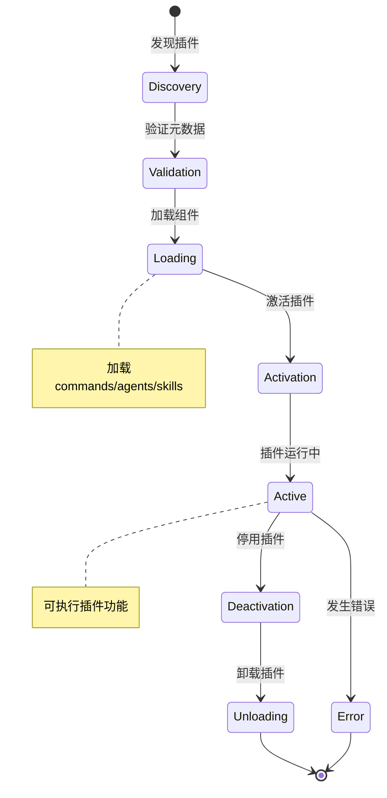

### 插件加载流程

```mermaid
graph TD
    A[扫描插件目录] --> B{读取plugin.json}
    B --> C{验证JSON格式}
    C -->|验证失败| E[返回错误]
    C -->|验证成功| D[检查依赖]
    D -->{依赖缺失}
    D -->|有缺失| F[安装依赖]
    D -->|依赖完整| G[加载组件]
    F --> G
    G --> H{加载Commands}
    H --> I{加载Agents}
    I --> J{加载Skills}
    J --> K[注册到系统]
    K --> L[插件就绪]
    E --> M[加载失败]
```

---

## 命令系统

### 命令解析流程

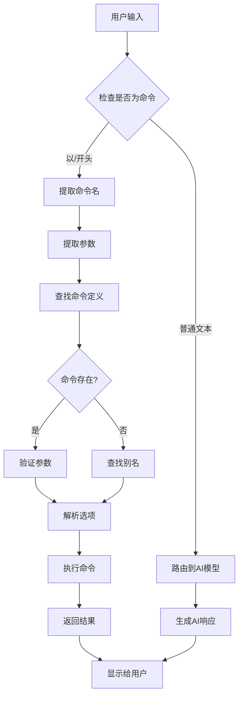

### 命令执行流程

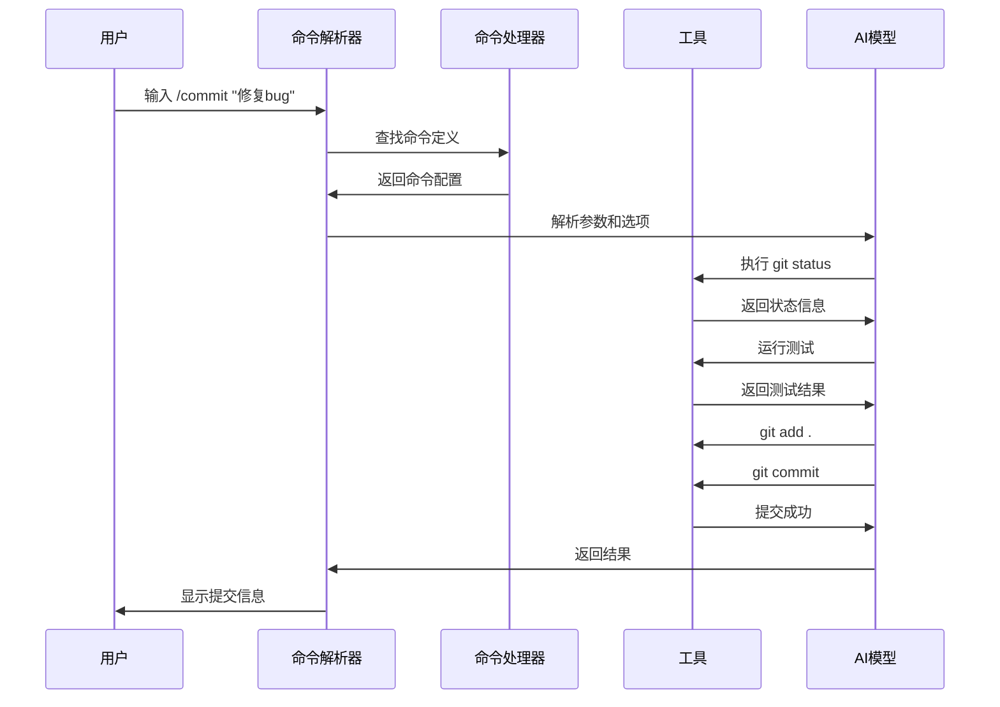

---

## 代理系统

### 代理委派流程

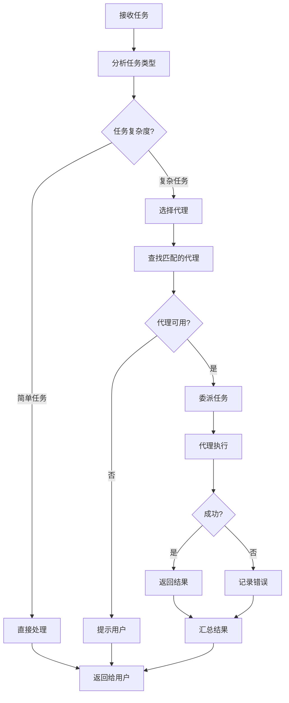

### 多代理协作流程

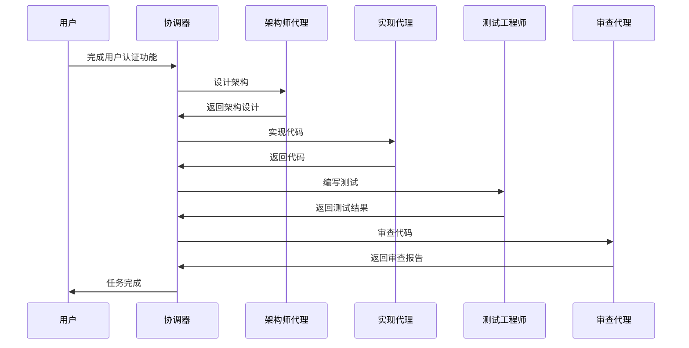

---

## 钩子系统

### Hook执行流程

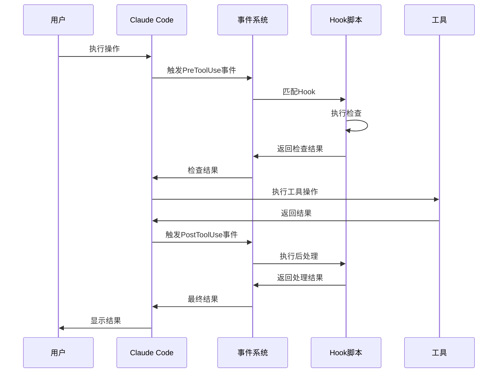

### Hook链式执行

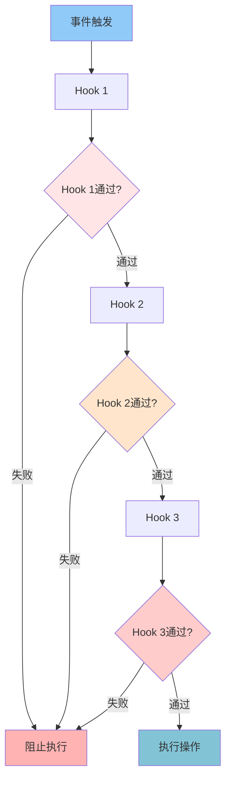

---

## 配置系统

### 配置加载流程

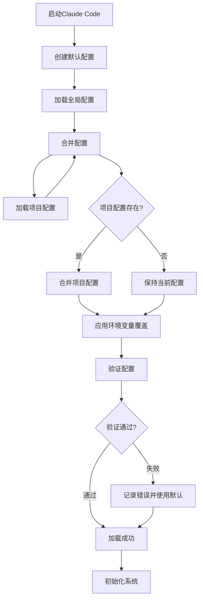

### 配置优先级

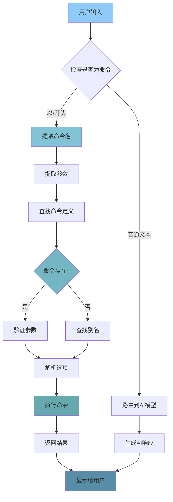

---

## 文件操作与上下文

### 上下文构建流程

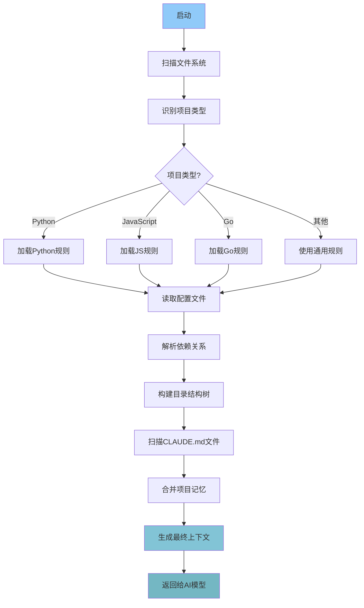

### 文件扫描算法

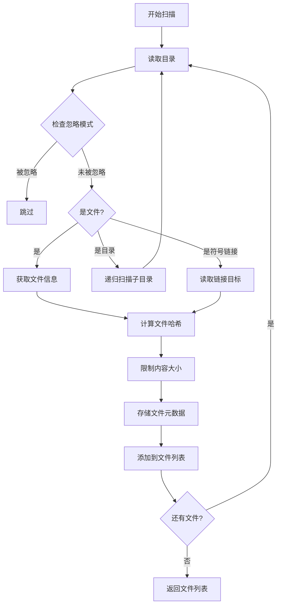

---

## 使用说明

### 如何使用这些图表

1. **学习时参考**：在阅读相应模块时，查看对应的流程图
2. **理解工作原理**：通过图表快速理解复杂流程
3. **调试问题**：通过流程图定位问题发生的阶段
4. **分享交流**：用图表向他人解释系统架构

### 图表类型说明

- **流程图** (graph TD): 展示流程和步骤
- **时序图** (sequenceDiagram): 展示交互和时序
- **状态图** (stateDiagram): 展示状态转换
- **类图** (classDiagram): 展示类和关系
- **甘特图** (gantt): 展示时间线

---

**提示**：这些图表是对正文内容的补充，建议与原文档配合阅读！📊
