# Claude Code 可视化图表补充

本文档包含各模块的详细流程图、架构图和时序图，帮助您更直观地理解 Claude Code 的工作原理。

---

## 📊 模块图表索引

- [插件系统](#插件系统)
- [命令系统](#命令系统)
- [代理系统](#代理系统)
- [技能系统](#技能系统)
- [钩子系统](#钩子系统)
- [MCP协议](#mcp协议)
- [配置系统](#配置系统)
- [文件操作与上下文](#文件操作与上下文)
- [Git集成](#git集成)
- [终端交互](#终端交互)
- [安全机制](#安全机制)

---

## 插件系统

### 插件生命周期

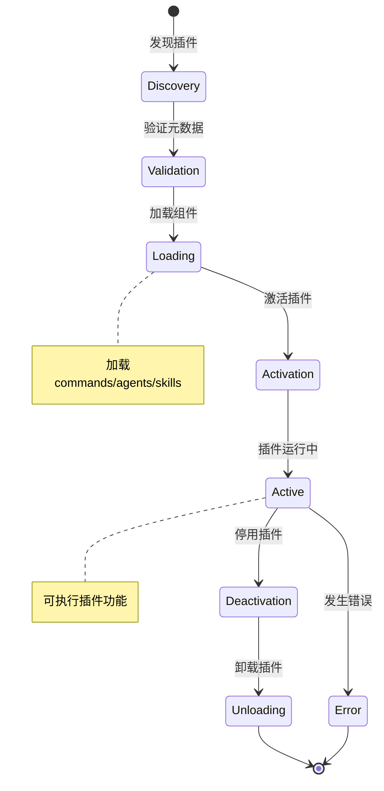

### 插件加载流程

```mermaid
graph TD
    A[扫描插件目录] --> B{读取plugin.json}
    B --> C{验证JSON格式}
    C -->|验证失败| E[返回错误]
    C -->|验证成功| D[检查依赖]
    D -->{依赖缺失}
    D -->|有缺失| F[安装依赖]
    D -->|依赖完整| G[加载组件]
    F --> G
    G --> H{加载Commands}
    H --> I{加载Agents}
    I --> J{加载Skills}
    J --> K[注册到系统]
    K --> L[插件就绪]
    E --> M[加载失败]
```

### 插件沙箱架构

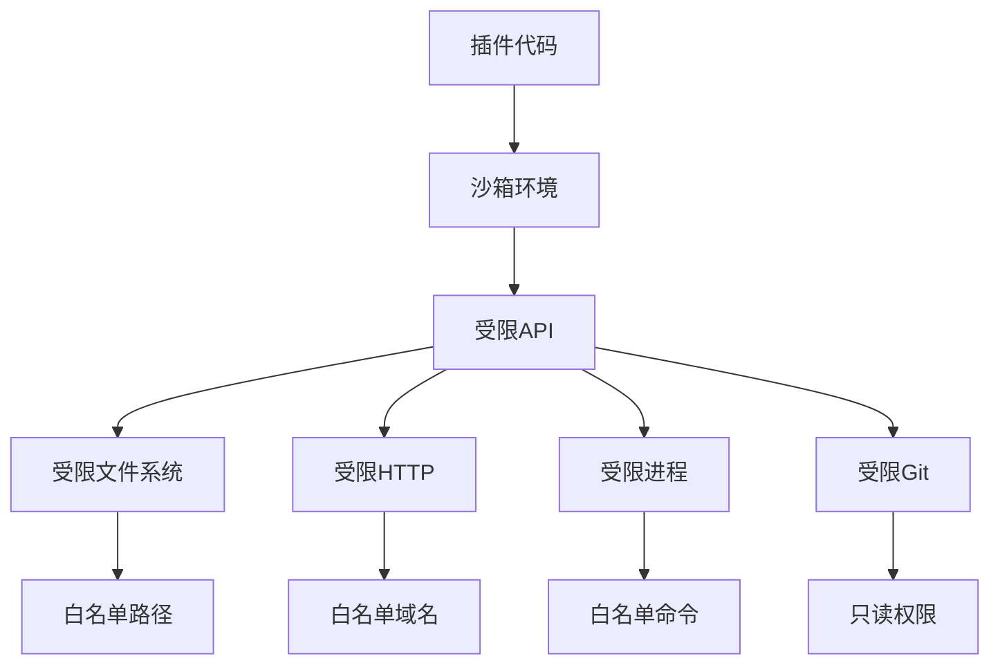

### 代理协作机制

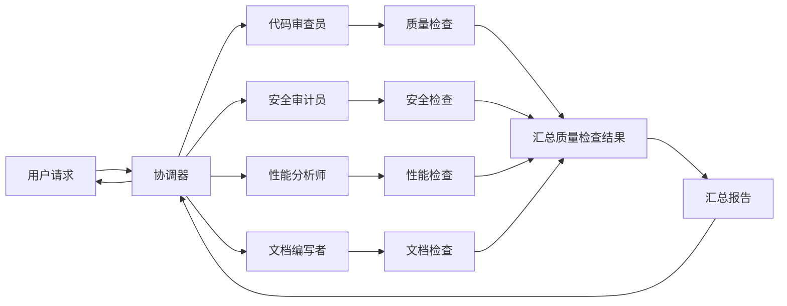

---

## 命令系统

### 命令解析流程

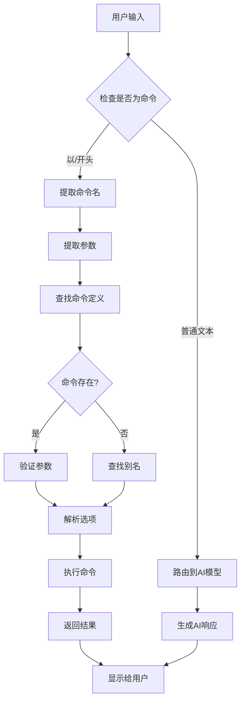

### 命令执行时序图

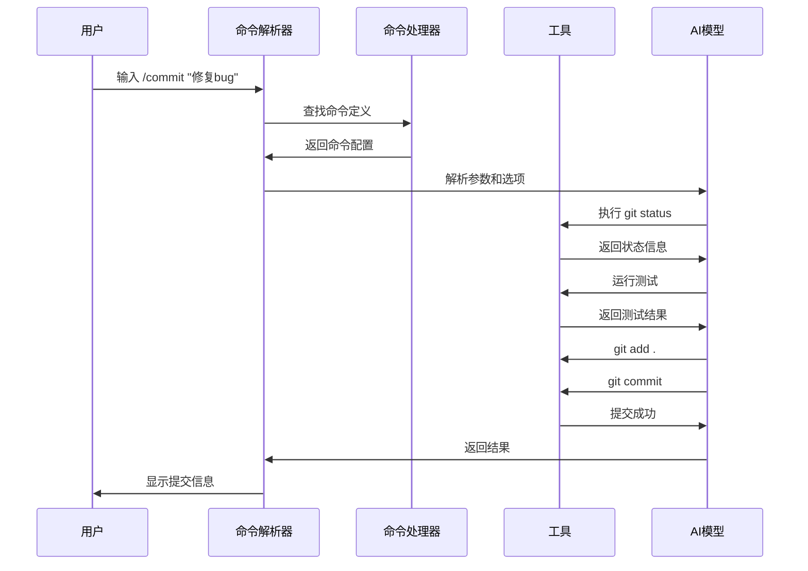

### 命令执行流程图


---

## 代理系统

### 代理委派流程

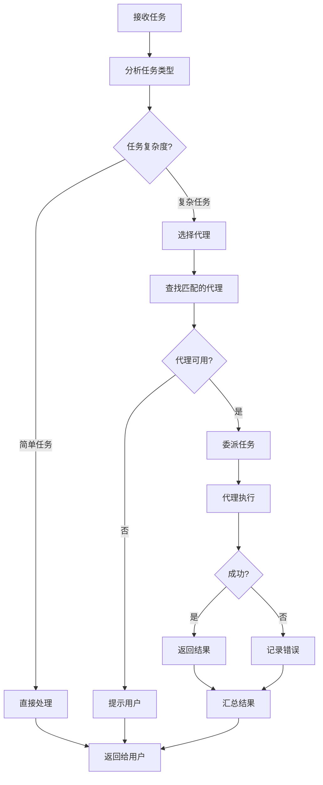

### 多代理协作流程

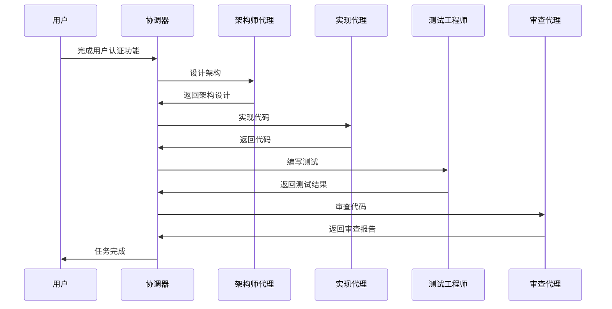

### 代理评分算法

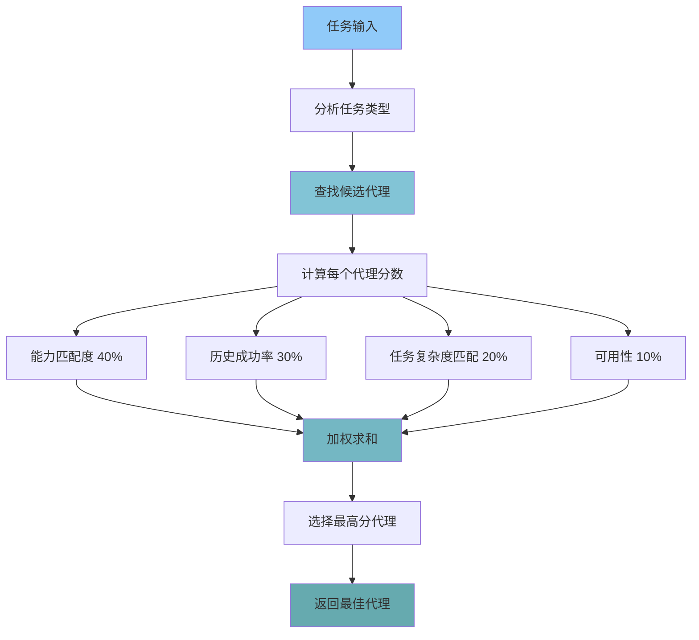

---

## 技能系统

### 技能触发机制

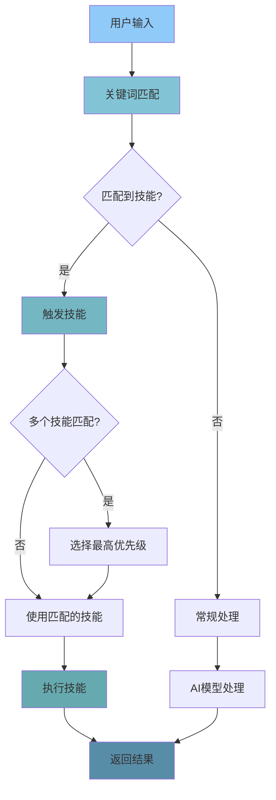

### 技能匹配算法

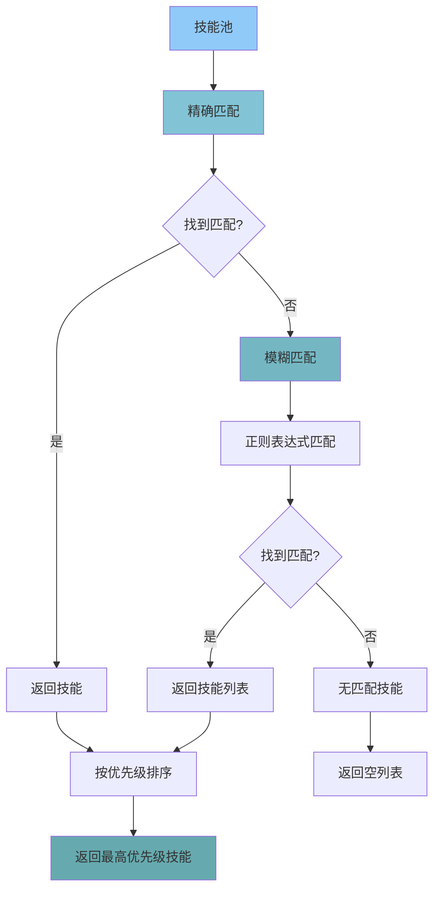

### 技能组合架构

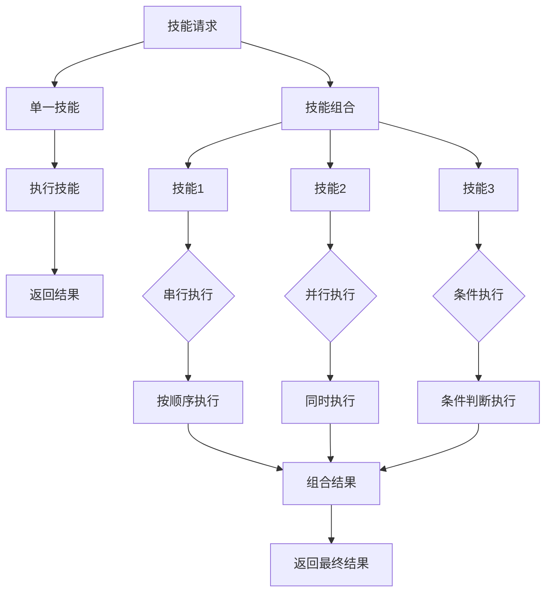

---

## 钩子系统

### Hook执行流程

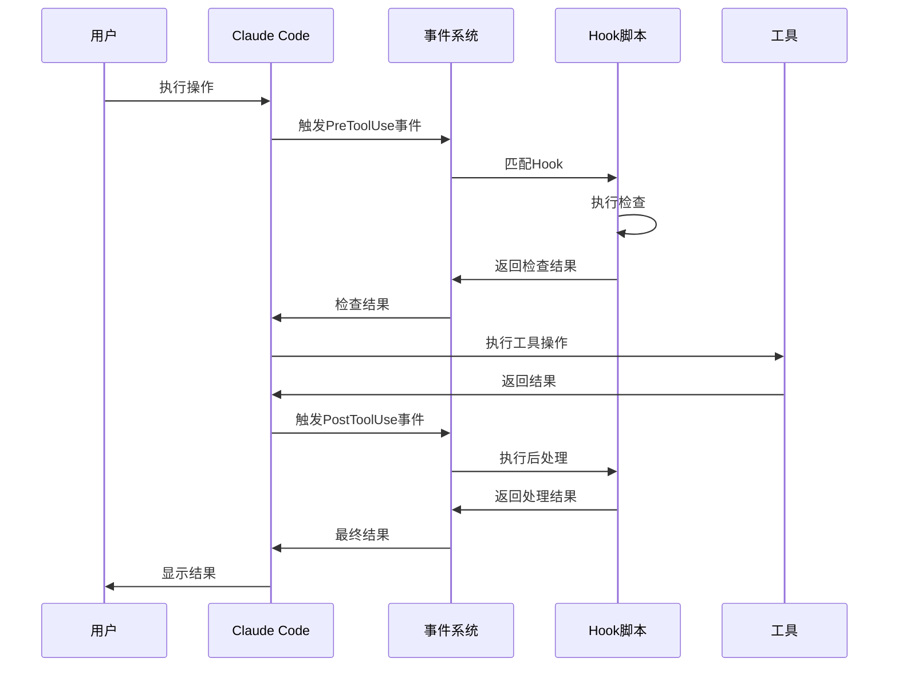

### Hook链式执行

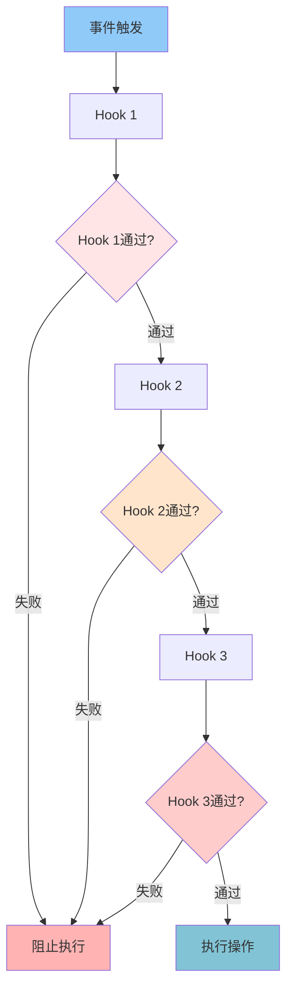

### Hook安全防护流程

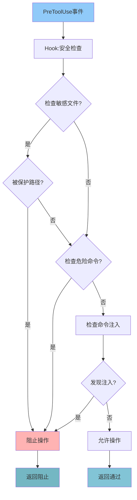

---

## MCP协议

### MCP客户端架构

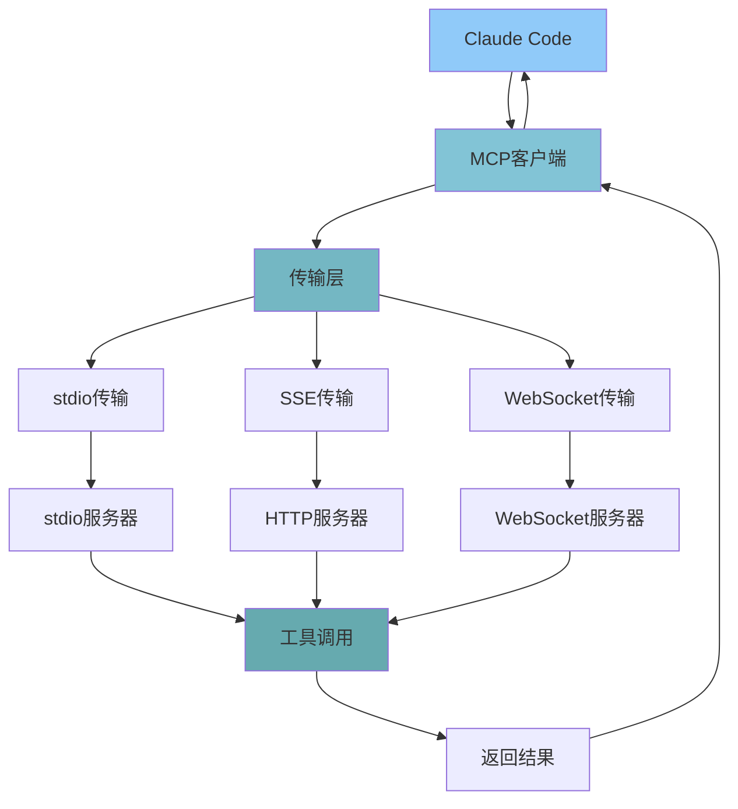

### 工具调用流程

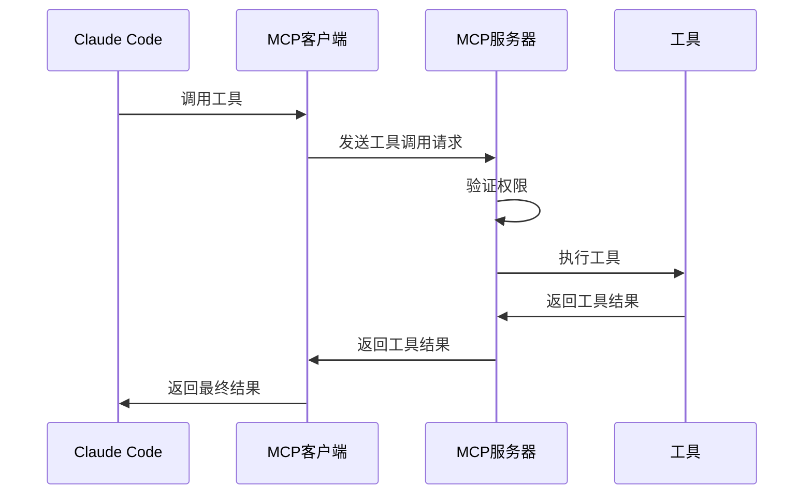

### 连接池管理

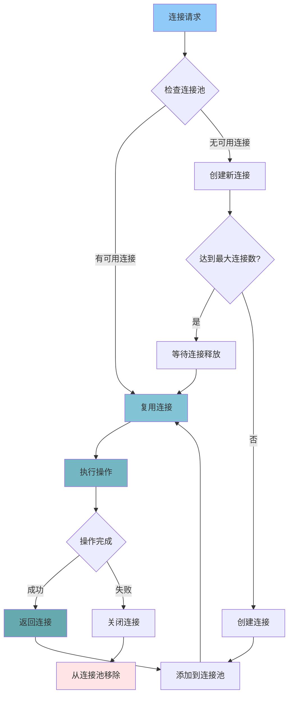

---

## 配置系统

### 配置加载流程

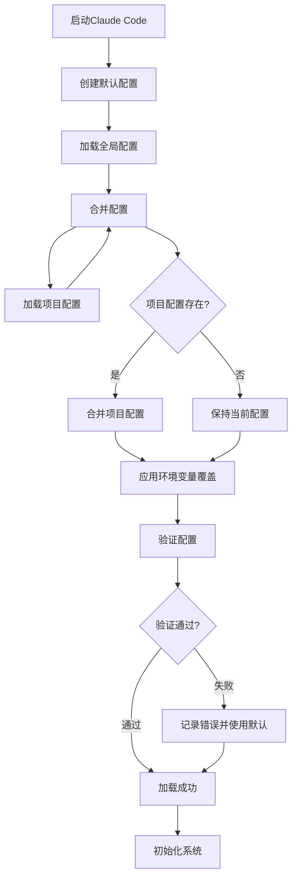

### 配置优先级

```mermaid
graph TD
    A[用户输入] -->|优先级1| B[当前目录 CLAUDE.md]
    A -->|优先级2| C[父目录 CLAUDE.md]
    A -->|优先级3| D[全局 CLAUDE.md]
    A -->|优先级4| E[默认配置]
    A -->|优先级5| F[插件默认配置]
    
    style A fill:#90CAF9
    style B fill:#82C4D6
    style C fill:#74B7C3
    style D fill:#66AAAF
    style E fill:#588DA8
    style F fill:#FFC24C
```

### 动态配置更新

```mermaid
graph TD
    A[配置文件修改] --> B[文件监控器]
    B --> C[检测到变化]
    C --> D[读取新配置]
    D --> E[验证新配置]
    E --> F{验证通过?}
    F -->|是| G[应用新配置]
    F -->|否| H[保持旧配置]
    G --> I[通知配置更新]
    H --> J[记录验证失败]
    I --> K[重启受影响组件]
    J --> L[记录日志]
```

---

## 文件操作与上下文

### 上下文构建流程

```mermaid
graph TD
    A[启动] --> B[扫描文件系统]
    B --> C[识别项目类型]
    C --> D{项目类型?}
    D -->|Python| E[加载Python规则]
    D -->|JavaScript| F[加载JS规则]
    D -->|Go| G[加载Go规则]
    D -->|其他| H[使用通用规则]
    
    E --> I[读取pyproject.toml]
    F --> I[读取package.json]
    G --> I[读取go.mod]
    H --> I[读取配置文件]
    
    I --> J[解析依赖关系]
    J --> K[构建目录结构树]
    K --> L[扫描CLAUDE.md文件]
    L --> M[合并项目记忆]
    M --> N[生成最终上下文]
    
    N --> O[返回给AI模型]
    
    style A fill:#90CAF9
    style N fill:#82C4D6
    style O fill:#74B7C3
```

### 上下文加载优先级

```mermaid
graph TD
    A[用户进入目录] --> B[扫描当前目录]
    B --> C{找到CLAUDE.md?}
    C -->|找到| D[加载项目级配置]
    C -->|未找到| E[向上查找]
    
    D --> F[扫描文件结构]
    E --> E[扫描父目录]
    
    F --> G[识别项目类型]
    G --> H[Python项目?]
    G --> I[JavaScript项目?]
    G --> J[Go项目?]
    
    H --> K[加载Python规范]
    I --> L[加载JS规范]
    J --> M[加载Go规范]
    
    K --> N[分析代码依赖]
    L --> N
    M --> N
    
    N --> O[提取类型信息]
    O --> P[生成项目上下文]
    E --> P
    
    style A fill:#90CAF9
    style C fill:#82C4D6
    style F fill:#74B7C3
    style O fill:#66AAAF
    style P fill:#588DA8
```

### 文件扫描算法

```mermaid
graph TD
    A[开始扫描] --> B[读取目录]
    B --> C{检查忽略模式}
    C -->|被忽略| D[跳过]
    C -->|未被忽略| E{文件类型?}
    
    E -->|文件| F[获取文件信息]
    E -->|目录| G[递归扫描子目录]
    E -->|符号链接| H[读取链接目标]
    
    F --> I[计算文件哈希]
    I --> J[限制内容大小]
    J --> K[存储文件元数据]
    
    G --> B
    H --> I
    
    K --> L[添加到文件列表]
    L --> M{还有文件?}
    M -->|是| B
    M -->|否| N[返回文件列表]
    
    style A fill:#90CAF9
    style E fill:#82C4D6
    style F fill:#74B7C3
    style J fill:#66AAAF
    style L fill:#588DA8
    style N fill:#FFC24C
```

### 文件缓存机制

```mermaid
graph TD
    A[请求文件] --> B{检查缓存}
    B -->|命中| C[返回缓存内容]
    B -->|未命中| D[读取文件]
    
    D --> E[计算哈希]
    E --> F[更新缓存]
    F --> G[返回文件内容]
    
    G --> H{缓存已满?}
    H -->|是| I[淘汰最旧]
    H -->|否| J[缓存未满]
    
    I --> F
    J --> F
    
    style A fill:#90CAF9
    style B fill:#82C4D6
    style D fill:#74B7C3
    style F fill:#66AAAF
    style I fill:#FFE5E5
```

---

## Git集成

### Git工作流

```mermaid
graph TD
    A[开始] --> B[创建feature分支]
    B --> C[开发功能]
    C --> D[提交代码]
    D --> E[运行测试]
    E --> F{测试通过?}
    F -->|是| G[创建PR]
    F -->|否| H[修复问题]
    H --> C
    G --> I[代码审查]
    I --> J{审查通过?}
    J -->|是| K[合并到main]
    J -->|否| H
    K --> L[删除feature分支]
    
    style A fill:#90CAF9
    style B fill:#82C4D6
    style C fill:#74B7C3
    style E fill:#66AAAF
    style G fill:#588DA8
    style I fill:#66AAAF
    style K fill:#82C4D6
```

### PR创建流程

```mermaid
sequenceDiagram
    participant D as 开发者
    participant G as Git
    participant PR as PR系统
    participant R as 审查者

    D->>G: 推送分支
    G->>PR: 创建PR
    PR->>D: PR已创建
    D->>R: 请求审查
    R->>D: 审查意见
    D->>G: 更新代码
    G->>PR: 更新PR
    R->>PR: 批准PR
    PR->>G: 合并到main
    G->>D: 合并完成
```

### 智能提交引擎

```mermaid
graph TD
    A[用户提交请求] --> B[分析变更]
    B --> C[检测变更类型]
    C --> D[确定提交类型]
    D --> E[生成主题]
    E --> F[生成详细描述]
    F --> G[组装提交信息]
    G --> H[执行git add]
    H --> I[执行git commit]
    I --> J[返回提交结果]
    
    style A fill:#90CAF9
    style B fill:#82C4D6
    style D fill:#74B7C3
    style G fill:#66AAAF
    style J fill:#588DA8
```

---

## 终端交互

### 开发工作流

```mermaid
graph LR
    A[开始] --> B[更新依赖]
    B --> C[运行测试]
    C --> D{测试通过?}
    D -->|是| E[构建项目]
    D -->|否| F[修复问题]
    F --> C
    E --> G[部署应用]
    G --> H[验证部署]
    H --> I[完成]
    
    style A fill:#90CAF9
    style E fill:#82C4D6
    style G fill:#74B7C3
    style I fill:#66AAAF
```

### 日志分析流程

```mermaid
graph TD
    A[日志文件] --> B[扫描日志]
    B --> C[识别错误模式]
    C --> D[统计错误类型]
    D --> E[分析错误频率]
    E --> F[识别趋势]
    F --> G[生成分析报告]
    
    style A fill:#90CAF9
    style B fill:#82C4D6
    style D fill:#74B7C3
    style G fill:#66AAAF
```

---

## 安全机制

### 安全架构

```mermaid
graph TB
    A[用户请求] --> B[权限验证层]
    B --> C{权限检查}
    C -->|通过| D[输入验证层]
    C -->|拒绝| E[返回错误]
    
    D --> F{输入验证}
    F -->|安全| G[沙箱执行层]
    F -->|不安全| E
    
    G --> H[执行操作]
    H --> I[输出过滤层]
    I --> J{输出检查}
    J -->|安全| K[返回结果]
    J -->|不安全| E
    
    K --> L[日志记录]
    L --> M[返回给用户]
    
    style A fill:#90CAF9
    style B fill:#82C4D6
    style G fill:#66AAAF
    style K fill:#82C4D6
    style M fill:#FFE5E5
    style E fill:#FFB3B3
```

### 权限验证流程

```mermaid
graph TD
    A[请求操作] --> B[检查操作类型]
    B --> C{读取操作?}
    C -->|是| D{文件路径白名单?}
    C -->|否| E{写入操作?}
    
    D -->|在白名单| F[允许]
    D -->|不在白名单| G[拒绝]
    
    E --> H{文件路径白名单?}
    H -->|在白名单| F
    H -->|不在白名单| I{受保护路径?}
    I -->|是| G
    I -->|否| F
    
    F --> J[执行操作]
    G --> K[拒绝操作]
    
    style A fill:#90CAF9
    style F fill:#82C4D6
    style G fill:#FFB3B3
    style J fill:#74B7C3
    style K fill:#FFB3B3
```

### 安全监控系统

```mermaid
graph TD
    A[监控开始] --> B[文件操作监控]
    B --> C[命令执行监控]
    C --> D[网络请求监控]
    
    B --> E{检测异常?}
    C --> F{检测异常?}
    D --> G{检测异常?}
    
    E -->|是| H[记录警告]
    F -->|是| H
    G -->|是| H
    
    H --> I[分析异常模式]
    I --> J{严重程度?}
    J -->|高| K[阻断操作]
    J -->|中| L[警告用户]
    J -->|低| M[记录日志]
    
    K --> N[阻止操作]
    L --> O[询问确认]
    M --> P[继续监控]
    
    O --> Q{用户确认?}
    Q -->|是| R[允许操作]
    Q -->|否| N
    
    R --> P
    N --> P
    
    style A fill:#90CAF9
    style B fill:#82C4D6
    style H fill:#FFE5CC
    style I fill:#74B7C3
    style K fill:#FFB3B3
    style P fill:#66AAAF
```

---

## 使用说明

### 如何使用这些图表

1. **学习时参考**：在阅读相应模块时，查看对应的流程图
2. **理解工作原理**：通过图表快速理解复杂流程
3. **调试问题**：通过流程图定位问题发生的阶段
4. **分享交流**：用图表向他人解释系统架构

### 图表类型说明

- **流程图** (graph TD/LR): 展示流程和步骤
- **时序图** (sequenceDiagram): 展示交互和时序
- **状态图** (stateDiagram): 展示状态转换
- **甘特图** (gantt): 展示时间线

### 图表索引

| 系统模块 | 图表数量 | 主要图表类型 |
|---------|---------|------------|
| 插件系统 | 4 | 生命周期、加载流程、沙箱架构、协作机制 |
| 命令系统 | 3 | 解析流程、执行时序、执行流程 |
| 代理系统 | 3 | 委派流程、协作流程、评分算法 |
| 技能系统 | 3 | 触发机制、匹配算法、组合架构 |
| 钩子系统 | 3 | 执行流程、链式执行、安全防护 |
| MCP协议 | 3 | 客户端架构、调用流程、连接池 |
| 配置系统 | 3 | 加载流程、优先级、动态更新 |
| 文件操作 | 4 | 上下文构建、加载优先级、扫描算法、缓存机制 |
| Git集成 | 3 | 工作流、PR创建、智能提交 |
| 终端交互 | 2 | 开发工作流、日志分析 |
| 安全机制 | 3 | 安全架构、权限验证、监控系统 |

---

**提示**：这些图表是对正文内容的补充，建议与原文档配合阅读！📊
